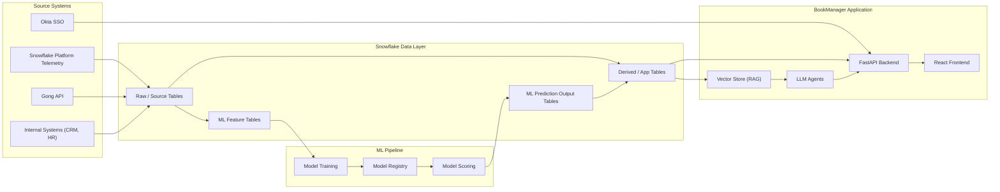
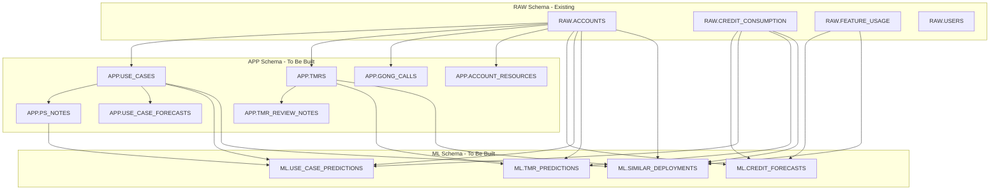

# BookManager -- Data Sources and Requirements

> **Version:** 1.0  
> **Last updated:** 2026-03-31  
> **Status:** Draft

---

## Table of Contents

1. [Overview and Architecture](#1-overview-and-architecture)
2. [Snowflake Source Tables (Existing)](#2-snowflake-source-tables-existing)
3. [Snowflake Derived / App-Specific Tables (To Be Built)](#3-snowflake-derived--app-specific-tables-to-be-built)
4. [ML Models -- Training Data and Requirements](#4-ml-models----training-data-and-requirements)
5. [LLM Agents -- Data and Training Requirements](#5-llm-agents----data-and-training-requirements)
6. [Data Gaps and Frontend/Backend Alignment](#6-data-gaps-and-frontendbackend-alignment)
7. [Appendix: Dependency Matrix](#7-appendix-dependency-matrix)

---

## 1. Overview and Architecture

BookManager is an internal account book management tool for ACE (Account Cloud Engineer) and ACEM (ACE Manager) personas. It surfaces account health, use case progress, credit consumption, forecasts, TMRs (Technical/Managed Resource requests), and AI-powered insights.

The application is currently running on mock data. This document defines the data sources, Snowflake tables, ML models, and LLM agents required to transition to production data.

### 1.1 Data Flow



### 1.2 Snowflake Namespace Convention

All tables follow the naming convention:

```
BOOKMANAGER.<schema>.<table_name>
```

| Schema | Purpose |
|--------|---------|
| `RAW` | Ingested source data, minimal transformation |
| `APP` | Derived tables serving the application directly |
| `ML` | Feature tables and prediction outputs |

### 1.3 Connection Configuration

The backend already defines Snowflake connection parameters in `backend/app/config.py` and `.env.example`:

| Setting | Env Var | Description |
|---------|---------|-------------|
| Account | `SNOWFLAKE_ACCOUNT` | Snowflake account identifier |
| User | `SNOWFLAKE_USER` | Service account username |
| Password | `SNOWFLAKE_PASSWORD` | Service account password |
| Warehouse | `SNOWFLAKE_WAREHOUSE` | Compute warehouse for queries |
| Database | `SNOWFLAKE_DATABASE` | Target database (e.g., `BOOKMANAGER`) |
| Schema | `SNOWFLAKE_SCHEMA` | Default schema |
| Role | `SNOWFLAKE_ROLE` | Snowflake role with read access |

---

## 2. Snowflake Source Tables (Existing)

These tables are expected to already exist in the Snowflake environment, populated by upstream platform telemetry, CRM syncs, or HR systems.

### 2.1 `RAW.ACCOUNTS`

Account master data from CRM / internal systems.

| Column | Type | Description |
|--------|------|-------------|
| `ACCOUNT_ID` | `VARCHAR` (PK) | Unique account identifier |
| `ACCOUNT_NAME` | `VARCHAR` | Customer account name |
| `INDUSTRY` | `VARCHAR` | Industry vertical |
| `ACE_ASSIGNED` | `VARCHAR` | User ID of the assigned ACE |
| `ENGAGEMENT_STATUS` | `VARCHAR` | One of: `Pre-Activation`, `Active`, `Completed` |
| `STATUS` | `VARCHAR` | Account health status |
| `USE_CASE_COUNT` | `INTEGER` | Number of active use cases |
| `TOTAL_CREDITS_ALLOCATED` | `FLOAT` | Total credit allocation for the account |
| `ACTIVATION_START_DATE` | `DATE` | Date the account entered activation |
| `REGION` | `VARCHAR` | Geographic region (nullable) |
| `ACV` | `FLOAT` | Annual contract value |
| `CONSUMPTION_YTD` | `FLOAT` | Year-to-date credit consumption |

- **Grain:** One row per account
- **Refresh cadence:** Daily (incremental upsert on `ACCOUNT_ID`)
- **Owner:** CRM / Revenue Operations

### 2.2 `RAW.CREDIT_CONSUMPTION`

Daily credit consumption telemetry from the Snowflake platform.

| Column | Type | Description |
|--------|------|-------------|
| `ACCOUNT_ID` | `VARCHAR` (FK) | References `RAW.ACCOUNTS` |
| `MEASUREMENT_DATE` | `DATE` | Date of measurement |
| `CREDITS_USED` | `FLOAT` | Total credits consumed on this date |
| `CREDITS_ALLOCATED` | `FLOAT` | Total credits available |
| `WAREHOUSE_NAME` | `VARCHAR` | Warehouse name (nullable) |
| `COMPUTE_CREDITS` | `FLOAT` | Credits from compute usage |
| `STORAGE_CREDITS` | `FLOAT` | Credits from storage |
| `CLOUD_SERVICES_CREDITS` | `FLOAT` | Credits from cloud services layer |
| `DAILY_TREND` | `FLOAT` | Day-over-day change percentage |
| `MONTHLY_TREND` | `FLOAT` | Month-over-month change percentage |

- **Grain:** One row per account per date (optionally per warehouse)
- **Refresh cadence:** Daily append
- **Owner:** Platform Telemetry / Data Engineering
- **Composite PK:** (`ACCOUNT_ID`, `MEASUREMENT_DATE`, `WAREHOUSE_NAME`)

### 2.3 `RAW.FEATURE_USAGE`

Snowflake feature adoption telemetry.

| Column | Type | Description |
|--------|------|-------------|
| `ACCOUNT_ID` | `VARCHAR` (FK) | References `RAW.ACCOUNTS` |
| `FEATURE_NAME` | `VARCHAR` | Name of the Snowflake feature |
| `USAGE_COUNT` | `INTEGER` | Number of times the feature was used |
| `FIRST_USED` | `DATE` | Date of first usage (nullable) |
| `LAST_USED` | `DATE` | Date of most recent usage (nullable) |
| `MEASUREMENT_PERIOD` | `VARCHAR` | Period granularity (e.g., `monthly`, `weekly`) |

- **Grain:** One row per account per feature per measurement period
- **Refresh cadence:** Weekly
- **Owner:** Platform Telemetry

### 2.4 `RAW.USERS`

Internal user / team roster from HR or identity systems.

| Column | Type | Description |
|--------|------|-------------|
| `USER_ID` | `VARCHAR` (PK) | Unique user identifier |
| `EMAIL` | `VARCHAR` | Corporate email |
| `DISPLAY_NAME` | `VARCHAR` | Full name |
| `ROLE` | `VARCHAR` | One of: `ace`, `acem` |
| `TEAM_ID` | `VARCHAR` | Team or org unit identifier (nullable) |

- **Grain:** One row per user
- **Refresh cadence:** Daily (full refresh from identity provider)
- **Owner:** IT / HR Systems

---

## 3. Snowflake Derived / App-Specific Tables (To Be Built)

These tables do not exist today. They are currently represented as mock data in the application and must be created in Snowflake.

### 3.1 `APP.USE_CASES`

Tracks customer use case deployments.

| Column | Type | Nullable | Description |
|--------|------|----------|-------------|
| `USE_CASE_ID` | `VARCHAR` | No (PK) | Unique use case identifier |
| `ACCOUNT_ID` | `VARCHAR` | No (FK) | References `RAW.ACCOUNTS` |
| `ACCOUNT_NAME` | `VARCHAR` | No | Denormalized for query convenience |
| `USE_CASE_NAME` | `VARCHAR` | No | Short name for the use case |
| `DESCRIPTION` | `TEXT` | No | Detailed description |
| `STATUS` | `VARCHAR` | No | Current status (e.g., `In Progress`, `Completed`, `Blocked`) |
| `STAGE` | `VARCHAR` | No | Deployment stage (e.g., `Discovery`, `POC`, `Production`) |
| `COMPLEXITY` | `VARCHAR` | Yes | Complexity rating (e.g., `Low`, `Medium`, `High`) |
| `GO_LIVE_DATE` | `DATE` | Yes | Actual go-live date (null if not yet live) |
| `TARGET_GO_LIVE_DATE` | `DATE` | Yes | Planned go-live date |
| `LEAD_SE` | `VARCHAR` | No | Solutions Engineer leading the use case |
| `ACE_ASSIGNED` | `VARCHAR` | No | ACE assigned to the account |
| `CREATED_DATE` | `DATE` | No | Date the use case was created |
| `LAST_MODIFIED_DATE` | `TIMESTAMP_NTZ` | No | Last modification timestamp |

- **Grain:** One row per use case
- **Update strategy:** Upsert on `USE_CASE_ID`
- **System of record:** Yes -- application writes back to this table
- **Source lineage:** Initially seeded from internal project tracker; ongoing writes from BookManager UI

### 3.2 `APP.PS_NOTES`

Professional Services notes attached to use cases.

| Column | Type | Nullable | Description |
|--------|------|----------|-------------|
| `NOTE_ID` | `VARCHAR` | No (PK) | Unique note identifier |
| `USE_CASE_ID` | `VARCHAR` | No (FK) | References `APP.USE_CASES` |
| `AUTHOR` | `VARCHAR` | No | Author name or user ID |
| `CONTENT` | `TEXT` | No | Full note content |
| `CREATED_AT` | `TIMESTAMP_NTZ` | No | Timestamp of creation |

- **Grain:** One row per note
- **Update strategy:** Append-only (notes are immutable once created)
- **System of record:** Yes -- BookManager is the authoring system
- **Source lineage:** Created in-app by ACEs / PS engineers

### 3.3 `APP.TMRS`

Technical / Managed Resource requests.

| Column | Type | Nullable | Description |
|--------|------|----------|-------------|
| `TMR_ID` | `VARCHAR` | No (PK) | Unique TMR identifier |
| `ACCOUNT_ID` | `VARCHAR` | No (FK) | References `RAW.ACCOUNTS` |
| `ACCOUNT_NAME` | `VARCHAR` | No | Denormalized account name |
| `REQUESTOR` | `VARCHAR` | No | Person who submitted the TMR |
| `REQUEST_TYPE` | `VARCHAR` | No | Category of the request |
| `STATUS` | `VARCHAR` | No | Current status (e.g., `Pending`, `Approved`, `In Progress`, `Completed`) |
| `PRIORITY` | `VARCHAR` | No | Priority level (e.g., `Low`, `Medium`, `High`, `Critical`) |
| `REQUESTED_DATE` | `DATE` | No | Date the TMR was submitted |
| `START_DATE` | `DATE` | Yes | Date work began |
| `END_DATE` | `DATE` | Yes | Date work was completed |
| `ESTIMATED_HOURS` | `FLOAT` | Yes | Estimated effort in hours |
| `ACTUAL_HOURS` | `FLOAT` | Yes | Actual effort recorded |
| `USE_CASE_ID` | `VARCHAR` | Yes (FK) | Associated use case, if any |
| `OUTCOME` | `TEXT` | Yes | Summary of outcome upon completion |
| `ASSIGNED_TO` | `VARCHAR` | Yes | User ID of the assigned resource |

- **Grain:** One row per TMR
- **Update strategy:** Upsert on `TMR_ID`
- **System of record:** Yes

### 3.4 `APP.TMR_REVIEW_NOTES`

Review notes and comments on TMRs. This is a child table of `APP.TMRS`.

| Column | Type | Nullable | Description |
|--------|------|----------|-------------|
| `NOTE_ID` | `VARCHAR` | No (PK) | Unique note identifier |
| `TMR_ID` | `VARCHAR` | No (FK) | References `APP.TMRS` |
| `AUTHOR_ID` | `VARCHAR` | No | User ID of the note author |
| `AUTHOR_NAME` | `VARCHAR` | No | Display name of the author |
| `CONTENT` | `TEXT` | No | Note content |
| `CREATED_AT` | `TIMESTAMP_NTZ` | No | Timestamp of creation |

- **Grain:** One row per review note
- **Update strategy:** Append-only
- **System of record:** Yes

### 3.5 `APP.GONG_CALLS`

Ingested and structured Gong call data.

| Column | Type | Nullable | Description |
|--------|------|----------|-------------|
| `CALL_ID` | `VARCHAR` | No (PK) | Unique call identifier (from Gong) |
| `ACCOUNT_ID` | `VARCHAR` | No (FK) | References `RAW.ACCOUNTS` |
| `CALL_DATE` | `TIMESTAMP_NTZ` | No | Date/time of the call |
| `DURATION_MINUTES` | `INTEGER` | No | Call duration |
| `SUMMARY` | `TEXT` | No | LLM-generated or Gong-provided summary |
| `TOPICS` | `ARRAY` | No | List of topics discussed |
| `ACTION_ITEMS` | `ARRAY` | No | Extracted action items |
| `NEXT_STEPS` | `ARRAY` | No | Extracted next steps |
| `PARTICIPANTS_INTERNAL` | `ARRAY` | No | Internal attendees |
| `PARTICIPANTS_EXTERNAL` | `ARRAY` | No | External attendees |

- **Grain:** One row per call
- **Update strategy:** Upsert on `CALL_ID` (summaries/topics may be updated by LLM re-extraction)
- **System of record:** No -- Gong is the system of record; this is a derived copy
- **Source lineage:** Gong API &rarr; ingestion pipeline &rarr; LLM extraction &rarr; Snowflake

### 3.6 `APP.ACCOUNT_RESOURCES`

Links and notes attached to accounts (Google Drive docs, Confluence pages, Slack threads, etc.).

| Column | Type | Nullable | Description |
|--------|------|----------|-------------|
| `RESOURCE_ID` | `VARCHAR` | No (PK) | Unique resource identifier |
| `ACCOUNT_ID` | `VARCHAR` | No (FK) | References `RAW.ACCOUNTS` |
| `RESOURCE_TYPE` | `VARCHAR` | No | One of: `note`, `link` |
| `TITLE` | `VARCHAR` | No | Display title |
| `CONTENT` | `TEXT` | No | Note body or link URL |
| `LINK_TYPE` | `VARCHAR` | Yes | One of: `google_drive`, `confluence`, `email`, `slack`, `other` (null for notes) |
| `CREATED_BY` | `VARCHAR` | No | User ID of creator |
| `CREATED_AT` | `TIMESTAMP_NTZ` | No | Timestamp of creation |

- **Grain:** One row per resource
- **Update strategy:** Upsert on `RESOURCE_ID`
- **System of record:** Yes

### 3.7 `APP.USE_CASE_FORECASTS`

ACE forecast overrides and ML-generated auto-categorizations for use cases.

| Column | Type | Nullable | Description |
|--------|------|----------|-------------|
| `USE_CASE_ID` | `VARCHAR` | No (FK, part of composite PK) | References `APP.USE_CASES` |
| `ACCOUNT_ID` | `VARCHAR` | No (FK) | References `RAW.ACCOUNTS` |
| `QUARTER` | `VARCHAR` | No (part of composite PK) | Fiscal quarter (e.g., `FY26-Q1`) |
| `AUTO_CATEGORY` | `VARCHAR` | No | ML-generated category: `Commit`, `Most Likely`, `Stretch` |
| `OVERRIDE_CATEGORY` | `VARCHAR` | Yes | ACE manual override category |
| `OVERRIDE_NOTE` | `TEXT` | Yes | Justification for the override |
| `OVERRIDE_BY` | `VARCHAR` | Yes | User ID who made the override |
| `OVERRIDE_AT` | `TIMESTAMP_NTZ` | Yes | Timestamp of the override |
| `PENDING_APPROVAL` | `BOOLEAN` | No | Whether the override needs ACEM approval |

- **Grain:** One row per use case per quarter
- **Composite PK:** (`USE_CASE_ID`, `QUARTER`)
- **Update strategy:** Upsert on composite PK
- **System of record:** Yes -- auto-category from ML, overrides from BookManager UI

---

## 4. ML Models -- Training Data and Requirements

The application surfaces predictions that are currently served from mock fixtures. Four models must be built and operationalized.

### 4.1 Credit Forecast Model

**Purpose:** Predict credit consumption 30, 60, and 90 days forward with confidence intervals.

**Output table: `ML.CREDIT_FORECASTS`**

| Column | Type | Description |
|--------|------|-------------|
| `ACCOUNT_ID` | `VARCHAR` (FK) | Target account |
| `FORECAST_DATE` | `DATE` | Date the forecast was generated |
| `PREDICTED_CREDITS_30D` | `FLOAT` | Predicted consumption, next 30 days |
| `PREDICTED_CREDITS_60D` | `FLOAT` | Predicted consumption, next 60 days |
| `PREDICTED_CREDITS_90D` | `FLOAT` | Predicted consumption, next 90 days |
| `CONFIDENCE_INTERVAL_LOWER` | `FLOAT` | Lower bound of 95% CI |
| `CONFIDENCE_INTERVAL_UPPER` | `FLOAT` | Upper bound of 95% CI |
| `TREND_DIRECTION` | `VARCHAR` | `increasing`, `stable`, `decreasing` |
| `MODEL_VERSION` | `VARCHAR` | Version tag for reproducibility |

**Training data:**

| Feature Source | Table | Key Columns |
|----------------|-------|-------------|
| Credit time series | `RAW.CREDIT_CONSUMPTION` | `CREDITS_USED`, `COMPUTE_CREDITS`, `STORAGE_CREDITS`, `CLOUD_SERVICES_CREDITS` (daily grain, 12+ months history) |
| Account metadata | `RAW.ACCOUNTS` | `INDUSTRY`, `ACV`, `ENGAGEMENT_STATUS`, `TOTAL_CREDITS_ALLOCATED` |
| Feature adoption | `RAW.FEATURE_USAGE` | `FEATURE_NAME`, `USAGE_COUNT` (as adoption signals) |

**Label definition:** Actual credit consumption in the 30/60/90-day windows following the training cutoff date.

**Training/validation strategy:**
- Time-series split: train on months M-12 through M-2, validate on M-1, test on M
- Walk-forward validation to avoid data leakage

**Cadence:**
- Retrain: Monthly
- Score: Daily (all active accounts)
- Output: Overwrite `ML.CREDIT_FORECASTS` per run

### 4.2 Use Case Completion Prediction Model

**Purpose:** Predict when a use case will go live, its risk level, and potential blockers.

**Output table: `ML.USE_CASE_PREDICTIONS`**

| Column | Type | Description |
|--------|------|-------------|
| `USE_CASE_ID` | `VARCHAR` (FK) | Target use case |
| `ACCOUNT_ID` | `VARCHAR` (FK) | Parent account |
| `PREDICTED_GO_LIVE_DATE` | `DATE` | Predicted go-live date |
| `CONFIDENCE_SCORE` | `FLOAT` | 0.0 -- 1.0 confidence |
| `RISK_FACTORS` | `ARRAY` | Identified risk factors |
| `PREDICTED_STATUS` | `VARCHAR` | Expected status at prediction horizon |
| `DAYS_REMAINING_ESTIMATE` | `INTEGER` | Estimated days to completion |
| `SIMILAR_USE_CASE_REFS` | `ARRAY` | IDs of similar historical use cases |
| `MODEL_VERSION` | `VARCHAR` | Version tag |

**Training data:**

| Feature Source | Table | Key Columns |
|----------------|-------|-------------|
| Use case metadata | `APP.USE_CASES` | `STAGE`, `COMPLEXITY`, `CREATED_DATE`, `TARGET_GO_LIVE_DATE`, age-derived features |
| PS note volume and recency | `APP.PS_NOTES` | Note count, last note date, average note frequency per use case |
| Credit trajectory | `RAW.CREDIT_CONSUMPTION` | 30-day rolling average, trend for the parent account |
| Account context | `RAW.ACCOUNTS` | `INDUSTRY`, `ACV`, `ENGAGEMENT_STATUS` |
| Historical outcomes | `APP.USE_CASES` (completed) | `GO_LIVE_DATE` vs `TARGET_GO_LIVE_DATE`, final `STATUS` |

**Label definition:** Completed use cases where `GO_LIVE_DATE` is known. Label = `GO_LIVE_DATE` and final status. For classification, label = on-time vs delayed vs blocked.

**Training/validation strategy:**
- Train on use cases completed before cutoff date; validate on next quarter's completions
- Minimum training set: 200+ completed use cases with known outcomes

**Cadence:**
- Retrain: Monthly
- Score: Weekly (all in-progress use cases)
- Output: Overwrite `ML.USE_CASE_PREDICTIONS` per run

### 4.3 TMR Success Prediction Model

**Purpose:** Predict the probability a TMR will be completed successfully and on time.

**Output table: `ML.TMR_PREDICTIONS`**

| Column | Type | Description |
|--------|------|-------------|
| `TMR_ID` | `VARCHAR` (FK) | Target TMR |
| `PREDICTED_SUCCESS_PROBABILITY` | `FLOAT` | 0.0 -- 1.0 probability |
| `PREDICTED_COMPLETION_DATE` | `DATE` | Estimated completion date (nullable) |
| `RISK_LEVEL` | `VARCHAR` | `low`, `medium`, `high` |
| `RECOMMENDED_ACTIONS` | `ARRAY` | Suggested interventions |
| `COMPARABLE_TMR_OUTCOMES` | `ARRAY` | IDs of similar historical TMRs |
| `MODEL_VERSION` | `VARCHAR` | Version tag |

**Training data:**

| Feature Source | Table | Key Columns |
|----------------|-------|-------------|
| TMR metadata | `APP.TMRS` | `REQUEST_TYPE`, `PRIORITY`, `ESTIMATED_HOURS`, age (days since `REQUESTED_DATE`) |
| TMR outcomes | `APP.TMRS` (completed) | `OUTCOME`, `ACTUAL_HOURS`, `END_DATE` - `START_DATE` duration |
| Account health | `RAW.ACCOUNTS` | `ENGAGEMENT_STATUS`, `ACV` |
| Credit trajectory | `RAW.CREDIT_CONSUMPTION` | Account-level consumption trend |

**Label definition:** Completed TMRs. Binary label: success = `OUTCOME` is positive and `ACTUAL_HOURS <= ESTIMATED_HOURS * 1.25`. Regression label: actual duration in days.

**Training/validation strategy:**
- Train on TMRs completed before cutoff; validate on next quarter
- Minimum training set: 100+ completed TMRs

**Cadence:**
- Retrain: Monthly
- Score: On-demand (when a new TMR is created or status changes)
- Output: Upsert into `ML.TMR_PREDICTIONS`

### 4.4 Similar Deployments Index

**Purpose:** Find historically similar deployments to inform expectations on timeline, effort, and potential blockers.

**Output table: `ML.SIMILAR_DEPLOYMENTS`**

| Column | Type | Description |
|--------|------|-------------|
| `DEPLOYMENT_ID` | `VARCHAR` (PK) | Unique deployment record |
| `USE_CASE_TYPE` | `VARCHAR` | Category of use case |
| `INDUSTRY` | `VARCHAR` | Customer industry |
| `ACCOUNT_SIZE` | `VARCHAR` | Account size tier |
| `DAYS_TO_GO_LIVE` | `INTEGER` | Actual days from start to go-live |
| `CREDITS_CONSUMED` | `FLOAT` | Total credits consumed during deployment |
| `FEATURES_USED` | `ARRAY` | Snowflake features leveraged |
| `SUCCESS_RATING` | `FLOAT` | 0.0 -- 5.0 post-deployment rating (nullable) |
| `BLOCKERS_ENCOUNTERED` | `ARRAY` | Categorized blockers |
| `RESOURCES_USED` | `FLOAT` | Total resource hours invested |

**Training data:**

| Feature Source | Table | Key Columns |
|----------------|-------|-------------|
| Completed use cases | `APP.USE_CASES` | `USE_CASE_NAME` (as type), `GO_LIVE_DATE`, `CREATED_DATE` |
| Account context | `RAW.ACCOUNTS` | `INDUSTRY`, `ACV` (for size tier derivation) |
| Credit history | `RAW.CREDIT_CONSUMPTION` | Aggregated consumption over deployment window |
| Feature adoption | `RAW.FEATURE_USAGE` | Features used by the account during deployment |
| TMR effort | `APP.TMRS` | Total `ACTUAL_HOURS` for TMRs linked to the use case |

**Approach:** Feature-based similarity using use case type, industry, and account size as primary dimensions. Build an embedding index (or structured nearest-neighbor lookup) over completed deployments. Refresh monthly.

### 4.5 Model Infrastructure Requirements

| Requirement | Details |
|-------------|---------|
| **Training environment** | Snowpark ML or external compute (e.g., SageMaker, Vertex AI) |
| **Model registry** | Snowflake Model Registry or MLflow |
| **Scoring pipeline** | Snowflake Tasks + Stored Procedures or external orchestrator (Airflow, Dagster) |
| **Feature store** | Snowflake feature tables in `ML` schema |
| **Monitoring** | Model drift detection on prediction distributions; data quality checks on input features |

---

## 5. LLM Agents -- Data and Training Requirements

The application currently has a mock AI chat panel (`AIChatPanel`) that generates rule-based responses. The following LLM-powered agents must be built to replace it and power additional intelligent features.

### 5.1 Account Intelligence Agent

**Purpose:** Answer natural-language questions about an account's health, history, engagement trajectory, and recommended next steps.

**Data context required:**

| Data Source | Table | Usage |
|-------------|-------|-------|
| Account metadata | `RAW.ACCOUNTS` | Ground truth for ACV, engagement status, region, industry |
| Credit consumption | `RAW.CREDIT_CONSUMPTION` | Time-series context for "how is consumption trending?" |
| Use case status | `APP.USE_CASES` | Current deployment landscape |
| Gong call summaries | `APP.GONG_CALLS` | Recent meeting context, action items, next steps |
| PS notes | `APP.PS_NOTES` | Deployment progress notes and blockers |
| TMR history | `APP.TMRS` | Resource requests, outcomes, pending items |
| Account resources | `APP.ACCOUNT_RESOURCES` | Linked docs, notes, Confluence pages |
| Credit forecasts | `ML.CREDIT_FORECASTS` | Forward-looking consumption predictions |
| Use case predictions | `ML.USE_CASE_PREDICTIONS` | Risk and timeline predictions |

**RAG Architecture:**

- **Chunking strategy:** Per-document chunking. PS notes and Gong summaries are natural chunks. Account resources are chunked by content type (notes as single chunks, links as metadata records).
- **Embedding model:** Text embedding model (e.g., `snowflake-arctic-embed` or `text-embedding-3-small`)
- **Vector store:** Snowflake Cortex Search, or an external vector DB (Pinecone, Weaviate) indexed by `account_id`
- **Retrieval scope:** Always scoped to a single `account_id` -- retrieve top-k relevant chunks for the account in context
- **Structured data injection:** Account metadata, credit summaries, and ML predictions are injected as structured context in the system prompt, not embedded

**LLM Provider:** Snowflake Cortex (Mistral/Llama) or OpenAI GPT-4o

**Evaluation criteria:**
- Factual accuracy against source data (no hallucinated metrics)
- Appropriate citation of source records (PS note IDs, Gong call dates)
- Response latency under 5 seconds

**Refresh cadence:** Vector index rebuilt daily; structured context is live-queried

### 5.2 PS Notes Summarizer

**Purpose:** Generate the `ps_notes_summary` field on use cases. This field exists in the data model (`UseCase.ps_notes_summary`) but is currently always null.

**Input:** Ordered list of `PS_NOTES.CONTENT` for a given `USE_CASE_ID`, sorted by `CREATED_AT` ascending.

**Output:** A concise 2--4 sentence summary capturing: current state of the deployment, key blockers or milestones, and most recent activity.

**Approach:**
- No fine-tuning required initially -- use a structured prompt with the ordered notes as context
- Prompt template includes instructions for temporal awareness (emphasize recent notes)
- Triggered on-demand when a user views a use case, or batch-generated nightly

**Data requirements:**
- `APP.PS_NOTES` filtered by `USE_CASE_ID`, ordered by `CREATED_AT`
- `APP.USE_CASES` for stage and status context

**Evaluation criteria:**
- Summary accurately reflects note content (no fabricated events)
- Summary updates meaningfully when new notes are added
- Latency under 3 seconds for on-demand generation

### 5.3 Gong Call Insight Extractor

**Purpose:** Extract structured fields (`topics`, `action_items`, `next_steps`) from raw Gong call transcripts and generate the `summary` field.

**Input:** Raw call transcript from the Gong API (full text or Gong-provided transcript segments).

**Output:** Structured fields written to `APP.GONG_CALLS`:
- `SUMMARY`: 3--5 sentence call summary
- `TOPICS`: Array of discussed topics
- `ACTION_ITEMS`: Array of action items with owners where identifiable
- `NEXT_STEPS`: Array of agreed next steps

**Approach:**
- LLM extraction pipeline triggered by the Gong data ingestion job
- Prompt includes output schema constraints (JSON mode) for reliable structured extraction
- Optionally leverage Gong's built-in summarization API as a baseline, with LLM enhancement for action item and next step extraction

**Data requirements:**
- Gong API access for raw transcripts (requires Gong API credentials, not yet in `.env`)
- `RAW.ACCOUNTS` for account name resolution from call metadata
- `RAW.USERS` for participant identification

**Evaluation criteria:**
- Action items match what was actually discussed (precision > 85%)
- No fabricated next steps or topics
- Handles multi-topic calls without conflation

**Refresh cadence:** Triggered per new call ingestion (event-driven)

### 5.4 Forecasting Narrative Agent

**Purpose:** Generate human-readable explanations of ML model predictions to help ACEs and ACEMs understand why a forecast is trending in a particular direction or why a use case is flagged as at-risk.

**Input:**
- Prediction output record (from `ML.CREDIT_FORECASTS`, `ML.USE_CASE_PREDICTIONS`, or `ML.TMR_PREDICTIONS`)
- Underlying feature values that drove the prediction
- Historical context (trend direction changes, comparable past outcomes)

**Output:** 2--4 sentence natural language narrative. Examples:
- "Credit consumption is predicted to increase 23% over the next 30 days, driven by a recent 40% spike in compute credits. This pattern is consistent with pre-production workload scaling seen in similar Financial Services accounts."
- "This use case is flagged as At Risk due to 45 days of inactivity in PS notes and a downward credit consumption trend. Similar deployments in Healthcare took an average of 30 additional days when this pattern occurred."

**Approach:**
- Template-augmented LLM generation: core narrative structure is templated, LLM fills in contextual reasoning
- Feature importance values from ML models are translated into natural language factors
- No fine-tuning required; few-shot examples in the prompt

**Data requirements:**
- ML prediction output tables (Section 4)
- Feature values used for scoring (stored alongside predictions or in feature tables)
- `ML.SIMILAR_DEPLOYMENTS` for comparable outcome references

**Evaluation criteria:**
- Narrative is consistent with the numerical prediction (no contradictions)
- Causal claims are grounded in actual feature values
- Readable by non-technical users

---

## 6. Data Gaps and Frontend/Backend Alignment

The frontend TypeScript types and backend Pydantic models have diverged in several areas. These gaps must be resolved when building the Snowflake tables and updating the backend.

### 6.1 Model Mismatches

| Entity | Frontend Field | Backend Model | Gap |
|--------|---------------|---------------|-----|
| `Account` | `acv: number` | Not present in `account.py` | Backend model needs `acv` field; source from `RAW.ACCOUNTS.ACV` |
| `Account` | `consumption_ytd: number` | Not present in `account.py` | Backend model needs `consumption_ytd` field; source from `RAW.ACCOUNTS.CONSUMPTION_YTD` |
| `TMR` | `assigned_to: string` | Not present in `tmr.py` | Backend model needs `assigned_to` field; source from `APP.TMRS.ASSIGNED_TO` |
| `TMR` | `review_notes: TMRReviewNote[]` | Not present in `tmr.py` | Backend model needs `review_notes` list; source from `APP.TMR_REVIEW_NOTES` joined on `TMR_ID` |
| `UseCaseForecast` | Full interface defined | No backend model exists | New Pydantic model needed; source from `APP.USE_CASE_FORECASTS` |
| `TMRReviewNote` | Full interface defined | No backend model exists | New Pydantic model needed; source from `APP.TMR_REVIEW_NOTES` |

### 6.2 Missing API Routes

The following data is served by `MockDataService` but has no corresponding HTTP routes in the FastAPI routers:

| Data | Service Method | Missing Router |
|------|---------------|----------------|
| Gong calls | `list_gong_calls()` | No route in `routers/` -- needs `GET /api/accounts/{id}/gong-calls` |
| Account resources | `list_account_resources()` | No route in `routers/` -- needs `GET /api/accounts/{id}/resources` |
| Use case forecasts | Not implemented | Needs new service method + `GET /api/forecasts/use-cases` |
| TMR review notes | Not implemented | Needs CRUD routes under `GET/POST /api/tmrs/{id}/review-notes` |

### 6.3 Frontend Data Source

The React frontend currently uses local TypeScript mock data and does **not** call the FastAPI backend. The frontend must be wired to consume the API via the existing Vite proxy (`/api` &rarr; `http://backend:8000`).

---

## 7. Appendix: Dependency Matrix

### 7.1 Table Dependencies



### 7.2 Agent-to-Table Dependencies

| Agent | Required Tables |
|-------|----------------|
| Account Intelligence Agent | `RAW.ACCOUNTS`, `RAW.CREDIT_CONSUMPTION`, `APP.USE_CASES`, `APP.GONG_CALLS`, `APP.PS_NOTES`, `APP.TMRS`, `APP.ACCOUNT_RESOURCES`, `ML.CREDIT_FORECASTS`, `ML.USE_CASE_PREDICTIONS` |
| PS Notes Summarizer | `APP.PS_NOTES`, `APP.USE_CASES` |
| Gong Call Insight Extractor | Gong API (external), `RAW.ACCOUNTS`, `RAW.USERS` |
| Forecasting Narrative Agent | `ML.CREDIT_FORECASTS`, `ML.USE_CASE_PREDICTIONS`, `ML.TMR_PREDICTIONS`, `ML.SIMILAR_DEPLOYMENTS` |

### 7.3 Model-to-Table Dependencies

| ML Model | Training Inputs | Output Table |
|----------|----------------|--------------|
| Credit Forecast | `RAW.CREDIT_CONSUMPTION`, `RAW.ACCOUNTS`, `RAW.FEATURE_USAGE` | `ML.CREDIT_FORECASTS` |
| Use Case Completion | `APP.USE_CASES`, `APP.PS_NOTES`, `RAW.CREDIT_CONSUMPTION`, `RAW.ACCOUNTS` | `ML.USE_CASE_PREDICTIONS` |
| TMR Success | `APP.TMRS`, `RAW.ACCOUNTS`, `RAW.CREDIT_CONSUMPTION` | `ML.TMR_PREDICTIONS` |
| Similar Deployments | `APP.USE_CASES`, `RAW.ACCOUNTS`, `RAW.CREDIT_CONSUMPTION`, `RAW.FEATURE_USAGE`, `APP.TMRS` | `ML.SIMILAR_DEPLOYMENTS` |
