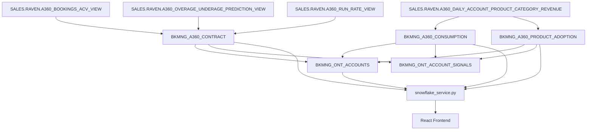

# Plan: A360 Integration — Replace Broken Data Sources

## Overview

Three data sources in BookManager are broken or have limited coverage. This plan replaces them with three new A360-backed materialized tables.

| Current (broken/limited) | Problem | Replacement |
|---|---|---|
| `BKMNG_CONTRACT_REVENUE` | 0 rows, task suspended | `BKMNG_A360_CONTRACT` |
| `BKMNG_CONSUMPTION_TRENDS` | 0 rows, task suspended | `BKMNG_A360_CONSUMPTION` |
| `BKMNG_ADOPTION_SIGNALS` | 109/455 accounts | `BKMNG_A360_PRODUCT_ADOPTION` |
| `BKMNG_ADOPTION_FEATURE_FIRST_USE` | 109/455 accounts | (same table) |

**Expected coverage after migration:** ~183–220 accounts with contract/consumption/adoption data (up from 0–109).

---

## Data Flow



---

## Step 1: Validate A360 Field Names Before Writing SPs

**Critical check before any SP creation:**

The `SP_REFRESH_BKMNG_A360_CONTRACT` QUALIFY clause references `ORDER BY RN DESC` — verify this column exists on `A360_BOOKINGS_ACV_VIEW`. Also confirm `VALUE_TYPE = 'actual'` is a valid filter value, and confirm the 6 `PRODUCT_CATEGORY` string values in `A360_DAILY_ACCOUNT_PRODUCT_CATEGORY_REVENUE`.

```sql
-- Spot check bookings view columns
SELECT COLUMN_NAME FROM INFORMATION_SCHEMA.COLUMNS
WHERE TABLE_SCHEMA = 'RAVEN' AND TABLE_NAME = 'A360_BOOKINGS_ACV_VIEW'
ORDER BY ORDINAL_POSITION;

-- Spot check product categories
SELECT DISTINCT PRODUCT_CATEGORY
FROM SALES.RAVEN.A360_DAILY_ACCOUNT_PRODUCT_CATEGORY_REVENUE
LIMIT 100;
```

---

## Step 2–4: Create 3 New SPs and Tables

SQL is fully specified in [docs/platform-adoption-signals-plan.md](docs/platform-adoption-signals-plan.md). Create SPs and immediately run them. Create daily refresh tasks.

| SP | Table | Expected Rows | Task CRON |
|---|---|---|---|
| `SP_REFRESH_BKMNG_A360_CONTRACT` | `BKMNG_A360_CONTRACT` | 455 (191 with contract) | `0 4 * * *` UTC |
| `SP_REFRESH_BKMNG_A360_CONSUMPTION` | `BKMNG_A360_CONSUMPTION` | 455 (220 with WoW data) | `15 4 * * *` UTC |
| `SP_REFRESH_BKMNG_A360_PRODUCT_ADOPTION` | `BKMNG_A360_PRODUCT_ADOPTION` | 5,000+ rows | `30 4 * * *` UTC |

All SPs must use `EXECUTE AS CALLER` to access `SALES.RAVEN` views.

---

## Step 5: Update SP_REFRESH_BKMNG_ONT_ACCOUNTS

Replace broken LEFT JOINs. The ONT_ACCOUNTS SP is already structured as `CREATE OR REPLACE TABLE` (fixed in prior session), so editing is safe.

- Contract columns: `CONTRACT_UTILIZATION_PCT`, `PREDICTED_OVERAGE_DATE`, `CONTRACT_CAPACITY`, `CAPACITY_REMAINING`, `TOTAL_CONSUMED_CREDITS` — source from `BKMNG_A360_CONTRACT`
- Trend columns: `WOW_PCT_CHANGE`, `MOM_PCT_CHANGE` — source from `BKMNG_A360_CONSUMPTION`
- Adoption columns: `SIG_PIPELINE` through `SIG_SPCS`, `ADOPTION_SIGNAL_COUNT`, `ADOPTION_PROFILE`, `MISSING_CATEGORIES`, `NEW_ADOPTION_30D` — derive from `BKMNG_A360_PRODUCT_ADOPTION` using the category mapping:

| A360 PRODUCT_CATEGORY | A360 USE_CASE filter | Signal column |
|---|---|---|
| Data Engineering | Ingestion | SIG_PIPELINE |
| Data Engineering | Transformation | SIG_TRANSFORMS |
| Analytics | (any) | SIG_BI |
| Platform | Cost Governance | SIG_COST |
| Applications & Collaboration | (any) | SIG_COLLAB |
| Platform | Observability | SIG_OBS |
| AI/ML | (any) | SIG_AIML |
| Transactions | (any) | SIG_SPCS |

---

## Step 6: Update SP_REFRESH_BKMNG_ONT_ACCOUNT_SIGNALS

Re-source existing CTEs and add two new signal types:

- `new_feature_adoption` — source from `BKMNG_A360_PRODUCT_ADOPTION` (was `BKMNG_ADOPTION_FEATURE_FIRST_USE`)
- `consumption_spike` and `consumption_dip` — source from `BKMNG_A360_CONSUMPTION` (currently fire 0 rows because WoW data is all NULL)
- **New:** `capacity_warning` — fires when `DAYS_UNTIL_OVERAGE <= 90`, priority high
- **New:** `contract_ending` — fires when `DAYS_UNTIL_CONTRACT_END <= 120`, priority high/medium

Also add `capacity_warning` and `contract_ending` to the `NBAItem.signal_type` Literal in the Python models (currently a pre-existing bug with `no_interaction_14d` also missing).

---

## Step 7: Update Backend Service Methods (NOT in original plan — REQUIRED)

The plan document omits this step. **Seven methods in [`backend/app/services/snowflake_service.py`](backend/app/services/snowflake_service.py) reference old tables and will break when those tables are dropped:**

| Method | Lines | Old Tables Referenced | Change Needed |
|---|---|---|---|
| `list_account_revenue_summaries()` | 358–445 | `BKMNG_CONTRACT_REVENUE`, `BKMNG_CONSUMPTION_TRENDS` | Query `BKMNG_A360_CONTRACT` + `BKMNG_A360_CONSUMPTION` |
| `get_account_revenue_summary()` | 446–500 | same | same |
| `get_consumption_projection()` | 1159–1260 | `BKMNG_CONSUMPTION_TRENDS` (3×), `BKMNG_CONTRACT_REVENUE` | Use `BKMNG_A360_CONSUMPTION` daily data |
| `get_recent_feature_adoptions()` | ~1761 | `BKMNG_ADOPTION_FEATURE_FIRST_USE` | Query `BKMNG_A360_PRODUCT_ADOPTION` |
| `get_account_adoption()` | 1785–1843 | `BKMNG_ADOPTION_SIGNALS`, `BKMNG_ADOPTION_FEATURE_FIRST_USE` | Derive signals from `BKMNG_A360_PRODUCT_ADOPTION` GROUP BY |
| `get_bookmanager_context()` | ~950, ~966 | Both adoption tables | Update schema string + context queries |
| `_cortex_complete_text_to_sql()` | ~1114 | Both adoption tables (schema string) | Update schema description |

**Key schema reconciliation for `get_account_adoption()`:** The existing response shape returns a `signals` dict with `sig_pipeline`, `sig_transforms`, etc. fields. To preserve the frontend component without changes, compute these dynamically from `BKMNG_A360_PRODUCT_ADOPTION`:

```sql
SELECT
    MAX(CASE WHEN PRODUCT_CATEGORY='Data Engineering' AND USE_CASE='Ingestion' AND IS_ACTIVE_30D THEN 1 ELSE 0 END) AS sig_pipeline,
    MAX(CASE WHEN PRODUCT_CATEGORY='Data Engineering' AND USE_CASE='Transformation' AND IS_ACTIVE_30D THEN 1 ELSE 0 END) AS sig_transforms,
    ...
FROM BKMNG_A360_PRODUCT_ADOPTION WHERE ACCOUNT_ID = %s
```

---

## Step 8: Reconcile Frontend RevenueSummary Type (NOT in original plan — REQUIRED)

The [`RevenueSummary` type in `bkmng-next/hooks/useApi.ts`](bkmng-next/hooks/useApi.ts) (line 53) and the `CreditUsageSidebar` component in [`bkmng-next/app/accounts/[id]/page.tsx`](bkmng-next/app/accounts/[id]/page.tsx) use fields that don't directly exist in A360:

| Old field | Used in | A360 equivalent |
|---|---|---|
| `total_consumed_credits` | CreditUsageSidebar display | Use `REV_90D` as proxy (revenue, not credits) |
| `total_consumed_revenue` | CreditUsageSidebar display | `REV_90D` from BKMNG_A360_CONTRACT |
| `contract_capacity` | CreditUsageSidebar + utilization bar | `NET_TCV` |
| `capacity_remaining` | Computed display | `NET_TCV - REV_180D` |
| `pct_consumed` | Utilization bar | `REV_90D * (365/90) / NET_ACV * 100` (annualized run-rate vs ACV) |
| `wow_credits_pct_change` | ACEDashboard.tsx line 213 | `WOW_PCT_CHANGE` from BKMNG_A360_CONSUMPTION |
| `mom_credits_pct_change` | ACEDashboard.tsx line 214 | `MOM_PCT_CHANGE` |

The backend `list_account_revenue_summaries()` and `get_account_revenue_summary()` should map A360 fields to the existing type names to minimize frontend changes, e.g. return `total_consumed_revenue: rev_90d`, `contract_capacity: net_tcv`, etc.

---

## Step 9: Update Semantic Model

Add `a360_contract`, `consumption`, and `product_adoption` table definitions plus 8 verified queries to `bookmanager_assistant.yaml`. Full YAML is specified in the plan doc. Upload to stage:

```sql
PUT file:///Users/jusdavis/.snowflake/cortex/playground/workspace/BookManager/backend/bookmanager_assistant.yaml
    @TEMP.JUSDAVIS.BKMNG_STAGE/ AUTO_COMPRESS=FALSE OVERWRITE=TRUE;
```

---

## Step 10: Update Agent Context

In `get_bookmanager_context()`, add:
- **Portfolio-level:** contracts ending in 120d count, predicted overage count, total ACV
- **Account-level:** CONTRACT section (ACV, start/end, revenue windows, overage alert) + PLATFORM USAGE section (feature list by category, NEW 30d callouts)

---

## Step 11: Cleanup + End-to-End Verification

**Suspend before drop** (tasks run daily — risk of failure between SP drop and task suspend):

```sql
ALTER TASK TEMP.JUSDAVIS.TASK_REFRESH_BKMNG_CONTRACT_REVENUE SUSPEND;
ALTER TASK TEMP.JUSDAVIS.TASK_REFRESH_BKMNG_CONSUMPTION_TRENDS SUSPEND;
ALTER TASK TEMP.JUSDAVIS.TASK_REFRESH_BKMNG_ADOPTION_SIGNALS SUSPEND;
ALTER TASK TEMP.JUSDAVIS.TASK_REFRESH_BKMNG_ADOPTION_FEATURE_FIRST_USE SUSPEND;
```

Then drop tasks, SPs, and tables after verification. 

**Verification checklist:**
- `BKMNG_ONT_ACCOUNTS`: `CONTRACT_UTILIZATION_PCT`, `PREDICTED_OVERAGE_DATE`, `WOW_PCT_CHANGE` no longer all NULL
- Adoption coverage: `SELECT COUNT(*) FROM BKMNG_A360_PRODUCT_ADOPTION` → 5,000+ rows across ~183 accounts
- NBA signals: `consumption_spike`, `capacity_warning`, `contract_ending` appear in `BKMNG_ONT_ACCOUNT_SIGNALS`
- Frontend: CreditUsageSidebar shows data for accounts with A360 coverage
- Agent chat: "what are the contract details for this account?" returns contract data

---

## Notes

- **~40-45% of accounts will still have NULL data**: This is expected and handled gracefully in the UI already
- **Revenue vs credits**: A360 reports USD revenue, not raw Snowflake credits. CreditUsageSidebar labels should be updated from "credits" to "revenue" for accuracy
- **A360 6-category system**: The SIG_* mapping is an approximation. The `Transactions` → `SIG_SPCS` mapping is loose (Transactions covers Unistore and Postgres, not just SPCS)
- **The plan doc's `RN` column**: Verify this exists before running Step 2
