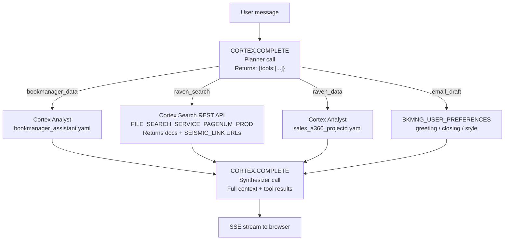

# Plan: Unified ACE — Automatic Routing + User Preferences

## The Right Tool: Cortex Agents

**Cortex Agents** (`POST /api/v2/cortex/agents:run`) is the Snowflake-native primitive for exactly this — define multiple tools and the LLM autonomously picks which to call per message. It's not enabled on Snowhouse (returned 404 in previous testing), so we replicate its behavior with `CORTEX.COMPLETE` as the planner.

When Cortex Agents becomes available on Snowhouse, swapping in `agents:run` would be a single-function replacement in the backend — the frontend and data model stay identical.

---

## How Automatic Routing Works

Two `CORTEX.COMPLETE` calls replace the manual mode selector:



**Phase 1 — Planner** (fast, ~300ms): Small CORTEX.COMPLETE call, input is just the user question, output is JSON:
```json
{"tools": ["bookmanager_data", "raven_search"], "is_email": false}
```

**Phase 2 — Parallel tool dispatch**: `asyncio.gather` runs all needed tools concurrently.

**Phase 3 — Synthesizer**: One CORTEX.COMPLETE call with all tool results, account context, and user preferences assembled into a single prompt. ACE is instructed to cite Raven search results as `[Title](URL)` using the `SEISMIC_LINK` column — no separate docs table needed since Raven already has this.

---

## What Changes vs. Current Code

| What exists now | What changes |
|---|---|
| Manual `mode` selector (3 tabs in AIChatPanel) | Removed — single ACE interface |
| `_stream_agent()` / `_stream_cortex_code()` separate paths | Replaced by `_stream_unified_agent()` |
| `mode` field on `ChatRequest` | Kept for backward compat with floating ACEChat widget, ignored internally |
| Raven tools defined but never called | `raven_search` now called via Cortex Search REST API when planner selects it |
| No user preferences | New table + settings page |

---

## Task 1: Planner + Unified Agent Backend

**File:** [`backend/app/routers/agent.py`](backend/app/routers/agent.py)

### 1a. Planner function

```python
_PLANNER_PROMPT = """You are a routing assistant. Given a user's question, decide which tools are needed.
Return ONLY valid JSON, no explanation.

Tools available:
- "bookmanager_data": query BookManager database (accounts, use cases, forecasts, consumption)  
- "raven_search": search Snowflake sales knowledge base, docs, Seismic enablement content
- "raven_data": query Raven sales analytics (A360, pipeline, territory data)
- "email_draft": generate a structured email or status update

Question: {question}

Return: {{"tools": [...], "is_email": bool}}"""

def _plan_tools(question: str, data) -> dict:
    cur = data._cursor()
    cur.execute(
        "SELECT SNOWFLAKE.CORTEX.COMPLETE('llama3.1-70b', %s) AS plan",
        (_PLANNER_PROMPT.format(question=question),)
    )
    raw = (cur.fetchone() or {}).get("PLAN") or '{"tools":["bookmanager_data"],"is_email":false}'
    try:
        return json.loads(raw.strip())
    except Exception:
        return {"tools": ["bookmanager_data"], "is_email": False}
```

### 1b. Raven search tool (new — currently defined but never called)

Calls the Cortex Search REST API directly (same PAT auth pattern as `call_cortex_analyst`):

```python
def _call_raven_search(question: str, data) -> list[dict]:
    """Calls SALES.KNOWLEDGE_ASSISTANT.FILE_SEARCH_SERVICE_PAGENUM_PROD
       Returns list of {title, snippet, url} using SEISMIC_LINK as url."""
    url = f"https://{settings.snowflake_account}.snowflakecomputing.com/api/v2/cortex/search/service/FILE_SEARCH_SERVICE_PAGENUM_PROD:query"
    # POST with PAT, returns results with SEISMIC_LINK column
    ...
```

If the Cortex Search REST API also returns errors, this gracefully falls back to empty results (the synthesizer proceeds without search context).

### 1c. `_stream_unified_agent()` replaces both `_stream_agent()` and `_stream_cortex_code()`

```python
async def _stream_unified_agent(messages, data, account_id, ace_filter, user_id):
    user_question = next((m["content"] for m in reversed(messages) if m.get("role") == "user"), "")
    
    # Phase 1: plan (sync, fast)
    plan = await asyncio.to_thread(_plan_tools, user_question, data)
    tools = plan.get("tools", ["bookmanager_data"])
    
    # Phase 2: parallel tool calls
    analyst_task  = asyncio.to_thread(data.call_cortex_analyst, ...) if "bookmanager_data" in tools else ...
    search_task   = asyncio.to_thread(_call_raven_search, ...)        if "raven_search" in tools else ...
    raven_task    = asyncio.to_thread(data.call_cortex_analyst, ...)  if "raven_data" in tools else ...
    prefs_task    = asyncio.to_thread(data.get_user_preferences, ...) if plan.get("is_email") else ...
    
    analyst_result, search_results, raven_result, user_prefs = await asyncio.gather(
        analyst_task, search_task, raven_task, prefs_task, return_exceptions=True
    )
    
    # Phase 3: synthesis prompt
    prompt = _build_synthesis_prompt(
        messages, user_question, analyst_result, search_results,
        raven_result, user_prefs, account_context
    )
    # Try capable models: claude-3-5-sonnet → llama3.1-70b
    text = await asyncio.to_thread(_complete_with_fallback, prompt, data)
    yield f"data: {json.dumps({'text': text})}\n\n"
    yield "data: [DONE]\n\n"
```

### 1d. Synthesis prompt instructs citation format

```
If you cite a document from search results, format as: [Title](URL)
If you cite data from the database, note the source naturally in prose.
If this is an email, use greeting: "{greeting}", closing: "{closing}", signed: "{signature}".
```

---

## Task 2: User Preferences Table + Backend

### Snowflake table (Snowhouse, `TEMP.JUSDAVIS`)
```sql
CREATE TABLE IF NOT EXISTS TEMP.JUSDAVIS.BKMNG_USER_PREFERENCES (
    user_id        VARCHAR(100) PRIMARY KEY,
    email_greeting VARCHAR(500)  DEFAULT 'Hi {first_name},',
    email_closing  VARCHAR(500)  DEFAULT 'Best regards,',
    ace_signature  VARCHAR(200)  DEFAULT '',
    writing_samples VARIANT,
    style_summary  VARCHAR(4000),
    updated_at     TIMESTAMP_NTZ DEFAULT CURRENT_TIMESTAMP()
);
```

### New service methods in [`backend/app/services/snowflake_service.py`](backend/app/services/snowflake_service.py)
- `get_user_preferences(user_id) -> dict` — SELECT with default fallback if no row
- `update_user_preferences(user_id, prefs: dict) -> None` — MERGE INTO
- `analyze_writing_style(samples: list[str]) -> str` — CORTEX.COMPLETE prompt: "Describe this person's email writing style in 2-3 sentences"

### New file: [`backend/app/routers/user.py`](backend/app/routers/user.py)
```
GET  /user/preferences          → get current user's preferences
PUT  /user/preferences          → update greeting / closing / signature
POST /user/writing-samples      → submit samples, store generated style summary
```

### Register in [`backend/app/main.py`](backend/app/main.py)
```python
from app.routers import ... user
app.include_router(user.router)
```

---

## Task 3: Remove Mode Selector from AIChatPanel

**File:** [`bkmng-next/components/account-detail/AIChatPanel.tsx`](bkmng-next/components/account-detail/AIChatPanel.tsx)

- Remove: `AgentMode` type, `selectedMode` state, 3-tab pill UI, `handleModeChange()`, all accent color maps
- Remove: `mode` from the `streamChat()` fetch body (backend ignores it now anyway)
- Keep: SSE streaming, "Open in Cortex Code" deep-link button, code block rendering
- Update suggested prompts to reflect unified capability:
  ```typescript
  const SUGGESTED_PROMPTS = [
    "What should I focus on next with this account?",
    "Draft a status update email",
    "Are there any Seismic resources for this use case?",  // triggers raven_search
    "Show me the consumption trend for this account",
  ];
  ```
- Add markdown link rendering: extend `renderMessageContent()` to parse `[text](url)` and render as `<a href target="_blank">`.

---

## Task 4: User Settings Page

### [`bkmng-next/components/layout/Sidebar.tsx`](bkmng-next/components/layout/Sidebar.tsx)
Wrap the existing user avatar + name in a `<Link href="/settings">` with a hover state.

### New file: [`bkmng-next/app/settings/page.tsx`](bkmng-next/app/settings/page.tsx)

Two cards:

**Email Preferences card:**
- Greeting input (e.g. `Hi {first_name},`)
- Closing input (e.g. `Best regards,`)
- Your name / signature (e.g. `Justin Davis, Snowflake SE`)
- Save button → `PUT /api/user/preferences`

**Writing Style card:**
- Instructions: "Paste 2-3 example emails you've written. ACE will match your style when drafting."
- Large textarea for samples
- "Analyze My Style" button → `POST /api/user/writing-samples` → shows returned style summary
- Style summary display with "Re-analyze" option

### New hooks in [`bkmng-next/hooks/useApi.ts`](bkmng-next/hooks/useApi.ts)
```typescript
useUserPreferences()          // GET /api/user/preferences
useUpdateUserPreferences()    // PUT /api/user/preferences
useSubmitWritingSamples()     // POST /api/user/writing-samples
```

---

## Task 5: Deploy to SPCS

After TypeScript check (`node_modules_darwin_backup/.bin/tsc --noEmit | grep -v graphql`):
```bash
docker build --platform linux/amd64 -f Dockerfile.spcs -t bkmng:latest .
docker tag bkmng:latest sfsenorthamerica-jdavis-aws1.registry.snowflakecomputing.com/bookmanager/demo/bkmng_repo/bkmng:latest
docker push ...
snow sql -c JDAVIS_AWS1 -q "ALTER SERVICE BOOKMANAGER.DEMO.BKMNG_SERVICE FROM SPECIFICATION \$\$...\$\$;"
```

---

## Migration Path to Native Cortex Agents

When `agents:run` is enabled on Snowhouse, the planner + dispatcher in `_stream_unified_agent()` collapses to a single API call with `_RAVEN_TOOLS + _BOOKMANAGER_TOOL` passed as the tool list. The frontend is unchanged. This is a backend-only swap of ~50 lines.

---

## Files Changed

| File | Change |
|---|---|
| `backend/app/routers/agent.py` | Unified planner + dispatcher, remove mode routing |
| `backend/app/routers/user.py` | New — preferences endpoints |
| `backend/app/services/snowflake_service.py` | Add `get_user_preferences`, `update_user_preferences`, `analyze_writing_style` |
| `backend/app/main.py` | Register user router |
| `bkmng-next/components/account-detail/AIChatPanel.tsx` | Remove mode selector, add markdown link rendering |
| `bkmng-next/components/layout/Sidebar.tsx` | Make username a link to /settings |
| `bkmng-next/app/settings/page.tsx` | New settings page |
| `bkmng-next/hooks/useApi.ts` | Add 3 preferences hooks |
| Snowflake (Snowhouse) | `BKMNG_USER_PREFERENCES` table |
