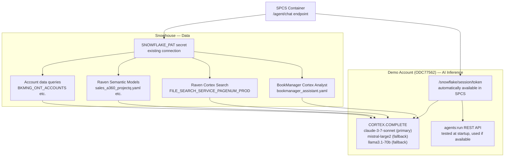

# Plan: Unified ACE — Split Connections + claude-3-7-sonnet

## Connection Architecture

The SPCS container already runs on the demo account. It gets a local Snowflake token at `/snowflake/session/token` with zero additional auth — no new secrets, no new SPCS secrets, no new EAI.



For local development: `JDAVIS_AWS1` named connection is the fallback when `/snowflake/session/token` doesn't exist. The existing `SNOWHOUSE_AWS_US_WEST_2` connection handles Snowhouse access as before.

---

## Task 1: Add Demo Account Connection to Backend

### New file: `backend/app/db/local_connection.py`

```python
import os
import snowflake.connector

_local_connection = None

def get_local_connection():
    """Returns a connection to the hosting Snowflake account (demo).
    In SPCS: uses /snowflake/session/token (OAuth, no extra secrets).
    In local dev: falls back to JDAVIS_AWS1 named connection."""
    global _local_connection
    if _local_connection is None or _local_connection.is_closed():
        token_path = "/snowflake/session/token"
        if os.path.exists(token_path):
            with open(token_path) as f:
                token = f.read().strip()
            _local_connection = snowflake.connector.connect(
                host=os.environ.get("SNOWFLAKE_HOST", "odc77562.us-east-1.snowflakecomputing.com"),
                authenticator="oauth",
                token=token,
                warehouse=os.environ.get("SNOWFLAKE_WAREHOUSE", "BKMNG_WH"),
            )
        else:
            # Local dev fallback
            _local_connection = snowflake.connector.connect(
                connection_name="JDAVIS_AWS1"
            )
    return _local_connection
```

### Update `SnowflakeDataService` in `backend/app/services/snowflake_service.py`

Add a `_local_cursor()` method alongside the existing `_cursor()` (Snowhouse):

```python
def _local_cursor(self):
    """Cursor to demo account for AI inference calls."""
    from app.db.local_connection import get_local_connection
    return get_local_connection().cursor(DictCursor)
```

All `CORTEX.COMPLETE` SQL calls (currently ~3 places in `agent.py`) switch from `_cursor()` to `_local_cursor()`. Data queries (`call_cortex_analyst`, account queries, `get_bookmanager_context`) remain on `_cursor()` (Snowhouse).

---

## Task 2: Upgrade Models

With `claude-3-7-sonnet` available on the demo account, update the model priority list in `agent.py`:

```python
_AI_MODELS = ["claude-3-7-sonnet", "mistral-large2", "llama3.1-70b"]
```

All CORTEX.COMPLETE calls try models in order, falling back on error. `claude-3-7-sonnet` is meaningfully better for:
- Intent planning (returning clean JSON)
- Synthesis with citations
- Email drafting with style matching

---

## Task 3: Unified Agent Pipeline

**File:** [`backend/app/routers/agent.py`](backend/app/routers/agent.py)

### Check Cortex Agents availability at startup

```python
_AGENTS_API_AVAILABLE: bool | None = None  # None = untested

def _check_agents_available(data) -> bool:
    global _AGENTS_API_AVAILABLE
    if _AGENTS_API_AVAILABLE is not None:
        return _AGENTS_API_AVAILABLE
    try:
        # Probe with minimal request — 200/400 = available, 404 = not available
        token = _get_local_token()
        resp = httpx.post(f"https://{_local_host()}/api/v2/cortex/agents:run", ...)
        _AGENTS_API_AVAILABLE = resp.status_code != 404
    except Exception:
        _AGENTS_API_AVAILABLE = False
    return _AGENTS_API_AVAILABLE
```

### Planner (CORTEX.COMPLETE on demo account)

```python
_PLANNER_PROMPT = """You are a routing assistant. Return ONLY valid JSON.
Tools: "bookmanager_data" (account/use case DB queries), "raven_search" (Seismic docs, sales knowledge), "raven_data" (sales analytics, A360, pipeline)
Question: {question}
Return: {{"tools": [...], "is_email": bool}}"""
```

Uses `_local_cursor()` + `claude-3-7-sonnet`.

### Tool dispatch (parallel, Snowhouse)

```python
async def _run_tools(question, data, plan, account_id, ace_filter):
    tasks = [
        asyncio.to_thread(data.call_cortex_analyst, ...) if "bookmanager_data" in plan["tools"] else _noop(),
        asyncio.to_thread(data.call_raven_search, question) if "raven_search" in plan["tools"] else _noop(),
        asyncio.to_thread(data.call_raven_analyst, ...) if "raven_data" in plan["tools"] else _noop(),
    ]
    return await asyncio.gather(*tasks, return_exceptions=True)
```

`call_raven_search()` is a new `SnowflakeDataService` method — calls `SALES.KNOWLEDGE_ASSISTANT.FILE_SEARCH_SERVICE_PAGENUM_PROD` Cortex Search REST API on Snowhouse. Returns results with `SEISMIC_LINK` URLs.

### Synthesizer (CORTEX.COMPLETE on demo account, claude-3-7-sonnet)

Synthesis prompt includes all tool results + account context + (if email) user preferences. ACE is instructed:
- Cite Raven search docs as `[Title](URL)` using the Seismic links
- Format SQL results as named lists
- For emails: use `{greeting}`, `{closing}`, `{signature}` from user prefs

### Single unified path — remove `_stream_agent()` and `_stream_cortex_code()`

Both replaced by `_stream_unified_agent()`. The `mode` field on `ChatRequest` is accepted for backward compat but has no effect on routing.

---

## Task 4: Raven Search Service Method

**File:** [`backend/app/services/snowflake_service.py`](backend/app/services/snowflake_service.py)

New method `call_raven_search(question: str) -> list[dict]`:

```python
def call_raven_search(self, question: str) -> list[dict]:
    """Calls Raven cortex search service on Snowhouse.
    Returns list of {title, snippet, url} using SEISMIC_LINK as url."""
    url = f"https://{settings.snowflake_account}.snowflakecomputing.com/api/v2/cortex/search/..."
    # POST with PAT, parse results, return [{title, snippet, url: seismic_link}]
```

If the Cortex Search REST API doesn't work (same concern as agents:run), gracefully returns `[]` — the synthesizer simply proceeds without search results.

---

## Task 5: User Preferences (unchanged from previous plan)

### Snowflake table on Snowhouse
```sql
CREATE TABLE IF NOT EXISTS TEMP.JUSDAVIS.BKMNG_USER_PREFERENCES (
    user_id        VARCHAR(100) PRIMARY KEY,
    email_greeting VARCHAR(500)  DEFAULT 'Hi {first_name},',
    email_closing  VARCHAR(500)  DEFAULT 'Best regards,',
    ace_signature  VARCHAR(200)  DEFAULT '',
    writing_samples VARIANT,
    style_summary  VARCHAR(4000),
    updated_at     TIMESTAMP_NTZ DEFAULT CURRENT_TIMESTAMP()
);
```

`analyze_writing_style()` uses `_local_cursor()` + `claude-3-7-sonnet` for better style analysis.

### New file: [`backend/app/routers/user.py`](backend/app/routers/user.py)
```
GET  /user/preferences
PUT  /user/preferences
POST /user/writing-samples
```

Register in [`backend/app/main.py`](backend/app/main.py).

---

## Task 6: Frontend Changes

### [`bkmng-next/components/account-detail/AIChatPanel.tsx`](bkmng-next/components/account-detail/AIChatPanel.tsx)
- Remove `AgentMode` type, 3-tab mode selector, per-mode state
- Remove `mode` from `streamChat()` body  
- Add markdown link rendering for `[text](url)` patterns → `<a target="_blank">`
- Update suggested prompts to reflect full capability:
  ```typescript
  "What should I focus on next with this account?",
  "Draft a status update email",
  "Find Seismic resources for this use case",
  "What's the consumption trend for this account?",
  ```

### [`bkmng-next/components/layout/Sidebar.tsx`](bkmng-next/components/layout/Sidebar.tsx)
Wrap username + avatar in `<Link href="/settings">` with hover state.

### New: [`bkmng-next/app/settings/page.tsx`](bkmng-next/app/settings/page.tsx)
Two-card layout:
1. **Email Preferences** — greeting, closing, signature fields + save button
2. **Writing Style** — sample textarea + "Analyze My Style" button → shows style summary

### New hooks in [`bkmng-next/hooks/useApi.ts`](bkmng-next/hooks/useApi.ts)
`useUserPreferences`, `useUpdateUserPreferences`, `useSubmitWritingSamples`

---

## Task 7: Deploy to SPCS

After TypeScript check with `node_modules_darwin_backup/.bin/tsc --noEmit | grep -v graphql`:
```bash
docker build --platform linux/amd64 -f Dockerfile.spcs -t bkmng:latest .
docker tag bkmng:latest sfsenorthamerica-jdavis-aws1.registry.snowflakecomputing.com/bookmanager/demo/bkmng_repo/bkmng:latest
docker push ...
snow sql -c JDAVIS_AWS1 -q "ALTER SERVICE BOOKMANAGER.DEMO.BKMNG_SERVICE FROM SPECIFICATION \$\$...\$\$;"
```

No spec changes needed — the demo account local token is available inside any SPCS container automatically.

---

## Files Changed

| File | Change |
|---|---|
| `backend/app/db/local_connection.py` | New — demo account connection via SPCS local token |
| `backend/app/routers/agent.py` | Unified planner + dispatcher, demo account for AI |
| `backend/app/routers/user.py` | New — preferences endpoints |
| `backend/app/services/snowflake_service.py` | Add `_local_cursor()`, `call_raven_search()`, preferences methods |
| `backend/app/main.py` | Register user router |
| `bkmng-next/components/account-detail/AIChatPanel.tsx` | Remove mode selector, add link rendering |
| `bkmng-next/components/layout/Sidebar.tsx` | Username links to /settings |
| `bkmng-next/app/settings/page.tsx` | New settings page |
| `bkmng-next/hooks/useApi.ts` | Add 3 preferences hooks |
| Snowflake (Snowhouse) | `BKMNG_USER_PREFERENCES` table |
