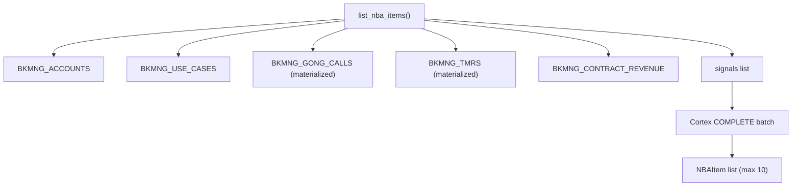
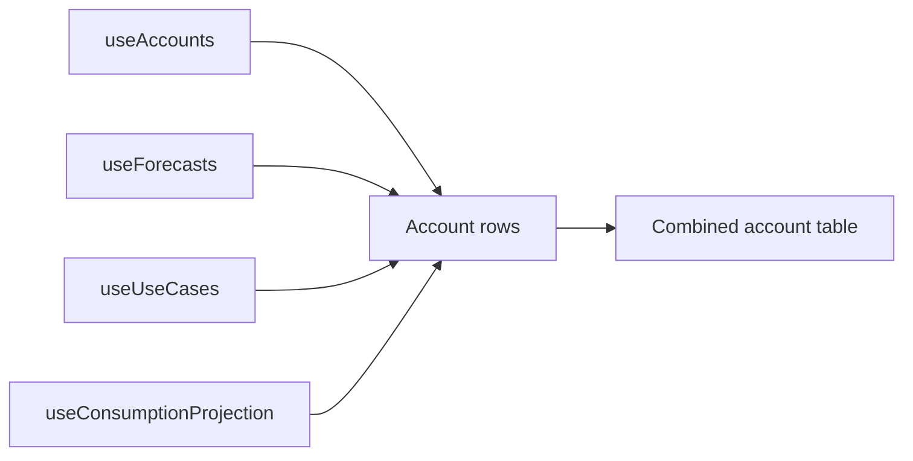

# Plan: Alerts, Data Refresh + Forecasts Redesign

## Overview

Three independent features from the last two sessions, plus a focused TMR assignment fix:
1. **Data Refresh** — fix broken tasks, materialize Gong + TMR live queries, tighten schedules
2. **Alert Signals** — implement 9 new NBA signals using the data now available
3. **Forecasts Redesign** — unified account-centric view, Full Year quarter option, override indicators
4. **TMR Assignment Display** — surface resolved specialist name/email in the "Assigned To" column

---

## Part 1: Data Refresh

### Current State

| Table | Task | Schedule | Status |
|---|---|---|---|
| `BKMNG_ACCOUNTS` | `TASK_REFRESH_BKMNG_ACCOUNTS` | `CRON 0 */4` | Running |
| `BKMNG_USE_CASES` | `TASK_REFRESH_BKMNG_USE_CASES` | `CRON 5 */4` | Running |
| `BKMNG_ACEM_TEAM` | `TASK_REFRESH_BKMNG_ACEM_TEAM` | `CRON 2 */4` | Running |
| `BKMNG_CONTRACT_REVENUE` | `TASK_REFRESH_BKMNG_CONTRACT_REVENUE` | `CRON 10 */4` | **SUSPENDED** |
| `BKMNG_CONSUMPTION_TRENDS` | `TASK_REFRESH_BKMNG_CONSUMPTION_TRENDS` | `CRON 15 */4` | **SUSPENDED** |
| Gong calls | `list_gong_calls()` | Live query | Expensive |
| TMR data | `list_tmrs()` | Live query | Missing assignment fields |

### Task 1 — Fix Suspended Tasks

Both `TASK_REFRESH_BKMNG_CONTRACT_REVENUE` and `TASK_REFRESH_BKMNG_CONSUMPTION_TRENDS` are `SUSPENDED_DUE_TO_ERRORS`. Steps:
1. Run `EXECUTE TASK TEMP.JUSDAVIS.TASK_REFRESH_BKMNG_CONTRACT_REVENUE` manually and capture error
2. Fix the underlying SP (`SP_REFRESH_BKMNG_CONTRACT_REVENUE`) based on error
3. Same for `SP_REFRESH_BKMNG_CONSUMPTION_TRENDS`
4. `ALTER TASK ... RESUME` on both

These are prerequisites for `capacity_warning` and `predicted_overage` alerts.

### Task 2 — Materialize BKMNG_GONG_CALLS

New table replacing the live `FIVETRAN.SALESFORCE.GONG_GONG_CALL_C` query in [`backend/app/services/snowflake_service.py`](backend/app/services/snowflake_service.py):

```sql
CREATE TABLE IF NOT EXISTS TEMP.JUSDAVIS.BKMNG_GONG_CALLS (
  CALL_ID VARCHAR, ACCOUNT_ID VARCHAR, ACCOUNT_NAME VARCHAR,
  TITLE VARCHAR, CALL_DATE TIMESTAMP_NTZ, DURATION_MINS NUMBER,
  TOPICS VARCHAR, NEXT_STEPS VARCHAR, RECORDING_URL VARCHAR,
  PARTICIPANTS VARCHAR, REFRESHED_AT TIMESTAMP_NTZ
);
```

Task: `TASK_REFRESH_BKMNG_GONG_CALLS` on `CRON 0 */2` (every 2h). Populates from `FIVETRAN.SALESFORCE.GONG_GONG_CALL_C JOIN BKMNG_ACCOUNTS`, keeping last 90 days.

### Task 3 — Materialize BKMNG_TMRS (upgrade from live query)

Current `list_tmrs()` at line 446 of [`backend/app/services/snowflake_service.py`](backend/app/services/snowflake_service.py) is a live join to `FIELD_SPECIALIST_REQUESTS_DX_ELEMENTUM` that does **not** select `ASSIGNED_RESOURCE_ID` or resolve it to an email. Upgrade to materialized with assignment resolved at refresh time:

```sql
CREATE OR REPLACE TABLE TEMP.JUSDAVIS.BKMNG_TMRS (
  TMR_ID                  VARCHAR, ACCOUNT_ID     VARCHAR, ACCOUNT_NAME   VARCHAR,
  STATUS                  VARCHAR, SPECIALIST_TYPE VARCHAR,
  ACTIVITY_REQUESTED      VARCHAR, ENGAGEMENT_TYPE VARCHAR,
  REQUESTOR               VARCHAR, REQUESTOR_EMAIL VARCHAR,
  REQUESTED_DATE          DATE,
  ASSIGNED_RESOURCE_ID    VARCHAR,
  ASSIGNED_RESOURCE_EMAIL VARCHAR,  -- resolved: JOIN FIVETRAN.SALESFORCE.USER ON ID = ASSIGNED_RESOURCE_ID
  ASSIGNED_RESOURCE_NAME  VARCHAR,  -- resolved: USER.NAME
  SECONDARY_MEMBER_ID     VARCHAR,
  SECONDARY_MEMBER_EMAIL  VARCHAR,  -- resolved: JOIN FIVETRAN.SALESFORCE.USER ON ID = SECONDARY_ASSIGNED_TEAM_MEMBER
  SPECIALIST_COMMENTS     VARCHAR,  REQUEST_REASON VARCHAR,
  MANAGER_APPROVER        VARCHAR,  CLOSE_DATE     DATE,
  REFRESHED_AT            TIMESTAMP_NTZ
);
```

The refresh task joins `FIVETRAN.SALESFORCE.USER` twice (once for assigned, once for secondary) so emails are pre-resolved. Task: `TASK_REFRESH_BKMNG_TMRS` on `CRON 30 * * * *` (every 30min).

### Task 4 — Update Service Methods + TMR Model

**[`backend/app/models/tmr.py`](backend/app/models/tmr.py)** — add two new fields:

```python
class TMR(BaseModel):
    ...
    assigned_resource_id: Optional[str] = None
    assigned_resource_email: Optional[str] = None   # NEW
    assigned_resource_name: Optional[str] = None    # NEW
    secondary_member_email: Optional[str] = None    # NEW
```

**[`backend/app/services/snowflake_service.py`](backend/app/services/snowflake_service.py)**:

- `list_gong_calls()` (line 217): change `FROM FIVETRAN.SALESFORCE.GONG_GONG_CALL_C` → `FROM TEMP.JUSDAVIS.BKMNG_GONG_CALLS`
- `list_tmrs()` (line 446): change source to `FROM TEMP.JUSDAVIS.BKMNG_TMRS` and populate the new fields. ACE filter: `WHERE ASSIGNED_RESOURCE_EMAIL = %s OR SECONDARY_MEMBER_EMAIL = %s`. ACEM filter: `JOIN BKMNG_ACEM_TEAM`.

**Interim (before materialization is ready)**: add `ASSIGNED_RESOURCE_ID` to the existing live query with a `LEFT JOIN FIVETRAN.SALESFORCE.USER res ON res.ID = t.ASSIGNED_RESOURCE_ID AND NOT res._FIVETRAN_DELETED` so the field is immediately available.

### Task 5 — Adjust Schedules

| Task | Current | New |
|---|---|---|
| `TASK_REFRESH_BKMNG_ACCOUNTS` | `CRON 0 */4` | `CRON 0 * * * *` (hourly) |
| `TASK_REFRESH_BKMNG_USE_CASES` | `CRON 5 */4` | `CRON 5 * * * *` (hourly) |
| `TASK_REFRESH_BKMNG_ACEM_TEAM` | `CRON 2 */4` | `CRON 0 6 * * *` (daily 6am UTC) |
| `TASK_REFRESH_BKMNG_CONTRACT_REVENUE` | `CRON 10 */4` | `CRON 0 2 * * *` (daily 2am UTC) |
| `TASK_REFRESH_BKMNG_CONSUMPTION_TRENDS` | `CRON 15 */4` | `CRON 30 2 * * *` (daily 2:30am UTC) |

---

## Part 2: TMR Page — Assignment Display Fix

### Task 6 — Fix TMR Page to Show Assigned Specialist

The current [`bkmng-next/app/tmrs/page.tsx`](bkmng-next/app/tmrs/page.tsx) has a **local mock `TMR` type** with `assigned_to: string | null` that does not exist on the real API response. The "Assigned To" column always renders "Unassigned". The status values are also mock (`Completed`, `In Progress`, `Blocked`) rather than real (`New`, `Pending Manager Review`, `Closed`, etc.).

**[`bkmng-next/hooks/useApi.ts`](bkmng-next/hooks/useApi.ts)** — add new fields to the exported `TMR` type (lines 24-44):

```typescript
export type TMR = {
  ...
  assigned_resource_id: string | null;    // NEW
  assigned_resource_email: string | null; // NEW — resolved from USER table
  assigned_resource_name: string | null;  // NEW
  secondary_member_email: string | null;  // NEW
};
```

**[`bkmng-next/app/tmrs/page.tsx`](bkmng-next/app/tmrs/page.tsx)** — full rewrite of the page:

1. **Remove the local `TMR` type** — import `TMR` from `@/hooks/useApi` instead
2. **Remove client-side `scopedTmrs` filter** — scoping handled by backend
3. **Update "Assigned To" column** — show `assigned_resource_name ?? assigned_resource_email` when present, "Unassigned" otherwise:

```tsx
<td className="px-4 py-3.5 text-sm text-slate-600">
  {tmr.assigned_resource_name ?? tmr.assigned_resource_email
    ? <span>{tmr.assigned_resource_name ?? tmr.assigned_resource_email}</span>
    : <span className="text-slate-400">Unassigned</span>
  }
</td>
```

4. **Update `StatusBadge`** to handle real statuses:

```tsx
const STATUS_STYLES: Record<string, string> = {
  "New":                                  "bg-sky-50 text-sky-700 border-sky-200",
  "Pending Manager Review":               "bg-amber-50 text-amber-700 border-amber-200",
  "Pending Specialist Manager Review":    "bg-amber-50 text-amber-700 border-amber-200",
  "Clarification Needed":                 "bg-orange-50 text-orange-700 border-orange-200",
  "Closed":                               "bg-slate-50 text-slate-500 border-slate-200",
};
```

5. **Update table columns** to match real TMR fields: replace `Type`/`Priority`/`Due Date` with `Activity Requested`, `Engagement Type`, `Requested Date`, `Specialist Comments`

6. **Update status filter options** to real values: `All`, `New`, `Pending Manager Review`, `Pending Specialist Manager Review`, `Clarification Needed`, `Closed`

7. **Update KPI stats** to use real status values: open (not Closed), pending review, new

---

## Part 3: Alert Signals

### Signal Architecture



### Task 7 — New Signals in Backend

**[`backend/app/models/nba.py`](backend/app/models/nba.py)** — extend `signal_type` Literal:

```python
signal_type: Literal[
    "blocker", "at_risk", "go_live", "open_tmr", "no_call",
    "consumption_spike", "consumption_dip", "gong_action",
    "go_live_overdue", "go_live_at_risk", "stalled_implementation",
    "capacity_warning", "predicted_overage",
    "tmr_new_assigned", "tmr_pending_review",
]
```

**[`backend/app/services/snowflake_service.py`](backend/app/services/snowflake_service.py)** — add signal detection in `list_nba_items()`:

| Signal | Trigger | Priority | Who |
|---|---|---|---|
| `go_live_overdue` | `go_live_date < today` AND status not Complete | High | ACE + ACEM |
| `go_live_at_risk` | go-live in 1-45d AND (stage ≤ "3-Technical Validation" OR meddpicc < 4) | High | ACE + ACEM |
| `stalled_implementation` | stage = "5 - Implementation In Progress" AND `last_modified_date < 30d ago` | Medium | ACE + ACEM |
| `capacity_warning` | `total_consumed_credits / contract_capacity >= 0.80` | High | ACE + ACEM |
| `predicted_overage` | `PREDICTED_OVERAGE_DATE` within 30 days | High | ACE + ACEM |
| `tmr_new_assigned` | TMR `status = 'New'` AND `assigned_resource_email = user.email` AND created < 3d | High | ACE only |
| `tmr_pending_review` | TMR status `Pending Manager Review` or `Pending Specialist Manager Review` scoped to ACEM team | High | ACEM only |
| `gong_action` | Latest call has `NEXT_STEPS` AND `CALL_DATE < 3 days ago` | Medium | ACE + ACEM |

NBA cap: `signals[:10]` for ACEM, `signals[:8]` for ACE.

### Task 8 — MEDDPICC Weak Badge

In [`bkmng-next/app/accounts/[id]/page.tsx`](bkmng-next/app/accounts/[id]/page.tsx), inside `UseCaseCard`:

```tsx
{uc.meddpicc_overall_score !== null && uc.meddpicc_overall_score < 3 && uc.status === "In Pursuit" && (
  <span className="inline-flex items-center gap-0.5 rounded-full bg-red-50 border border-red-200 px-1.5 py-0.5 text-[10px] font-medium text-red-700">
    MEDDPICC Low
  </span>
)}
```

---

## Part 4: Forecasts Page Redesign

### Task 9 — Full Year Quarter Option

In [`bkmng-next/app/forecasts/page.tsx`](bkmng-next/app/forecasts/page.tsx):

```tsx
const QUARTERS = ["Q1-2026", "Q2-2026", "Q3-2026", "Q4-2026", "FY"];
```

When `quarter === "FY"`, pivot the use case table — one row per use case, Q1/Q2/Q3/Q4 as columns, each cell showing the forecast badge for that quarter or `—`. KPI row aggregates deduped use cases across all quarters.

### Task 10 — Override Indicator

Modify `CatBadge` to accept `isOverride` and `overrideInfo`:

```tsx
function CatBadge({ category, isOverride, overrideInfo }) {
  // dashed border + Pencil icon when isOverride
  // tooltip with: original auto_category, override_by, override_at, override_note
}
```

Add **"Overrides"** filter chip — shows rows where `override_category !== null`.

### Task 11 — Merged Account-Centric Table

Remove the `tab` state and `ConsumptionTab` component. Replace with a single layout:

```
[Q1][Q2●][Q3][Q4][Full Year]  [All|Commit|ML|Stretch|Overrides]

KPI: Commit: 5  Most Likely: 12  Stretch: 8  FY Consumption: 312K cr

Account       | Use Cases (Q2)   | Q1    Q2●   Q3    Q4   | FY    | Cap
Acme Corp     | ◆1 Commit ◆2 ML  | 12K   18K   21K   19K  | 70K   | 72%
  └ expand → individual use case rows with forecast badges + override indicators
```

Data joins all happen client-side — no backend changes needed:



Files changed: [`bkmng-next/app/forecasts/page.tsx`](bkmng-next/app/forecasts/page.tsx) — full rewrite.

---

## Files Changed Summary

| File | Change |
|---|---|
| Snowflake DDL | Create `BKMNG_GONG_CALLS`, `BKMNG_TMRS` tables; fix + alter refresh tasks |
| [`backend/app/models/tmr.py`](backend/app/models/tmr.py) | Add `assigned_resource_email`, `assigned_resource_name`, `secondary_member_email` |
| [`backend/app/services/snowflake_service.py`](backend/app/services/snowflake_service.py) | Fix `list_tmrs()` to join USER for assignment; switch to materialized tables; add 8 new signals |
| [`backend/app/models/nba.py`](backend/app/models/nba.py) | Extend `signal_type` Literal with 7 new values |
| [`bkmng-next/hooks/useApi.ts`](bkmng-next/hooks/useApi.ts) | Add `assigned_resource_email`, `assigned_resource_name`, `secondary_member_email` to `TMR` type |
| [`bkmng-next/app/tmrs/page.tsx`](bkmng-next/app/tmrs/page.tsx) | Full rewrite: real TMR type, assignment display, real status values + colors, real column names |
| [`bkmng-next/app/accounts/[id]/page.tsx`](bkmng-next/app/accounts/[id]/page.tsx) | Add `meddpicc_weak` badge to use case cards |
| [`bkmng-next/app/forecasts/page.tsx`](bkmng-next/app/forecasts/page.tsx) | Full rewrite: account-centric table, FY quarter, override indicator |
