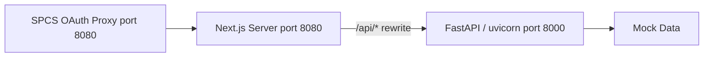

# Plan: Rebuild BookManager Frontend as Next.js (SPCS-Compatible)

## Guiding Principle

**Deploy early and often.** Each task that adds user-visible functionality ends with a build → push → ALTER SERVICE → verify cycle. If something breaks in SPCS, we know exactly which change caused it.

---

## Architecture



- **nginx removed.** Next.js standalone server handles port 8080 and proxies `/api/*` → FastAPI via `rewrites` in `next.config.ts`, forwarding all headers including `Sf-Context-Current-User`.
- **Backend unchanged** except for adding JUSDAVIS mock profiles and accounts.

---

## Task 1 — Update Backend Mock Data

**Goal:** Give JUSDAVIS a real identity in both ACE and ACEM modes.

**File: [`backend/app/auth/dependencies.py`](BookManager/backend/app/auth/dependencies.py)**

Add two JUSDAVIS entries to `MOCK_USERS`:

```python
MOCK_USERS = {
    "ace-jane":      CurrentUser(user_id="ace-jane", ...role=UserRole.ACE, team_id="team-west"),
    "ace-carlos":    CurrentUser(user_id="ace-carlos", ...role=UserRole.ACE, team_id="team-west"),
    "acem-mark":     CurrentUser(user_id="acem-mark", ...role=UserRole.ACEM, team_id="team-west"),
    # NEW
    "jusdavis":      CurrentUser(user_id="jusdavis", display_name="Justin Davis",
                                  email="jusdavis@snowflake.com", role=UserRole.ACEM,
                                  team_id="team-west", is_admin=True),
    "jusdavis-ace":  CurrentUser(user_id="jusdavis", display_name="Justin Davis",
                                  email="jusdavis@snowflake.com", role=UserRole.ACE,
                                  team_id="team-west", is_admin=False),
}
```

In SPCS mode the `Sf-Context-Current-User: JUSDAVIS` header already produces `user_id="jusdavis"`, `role=ACEM`, `is_admin=True` — no change needed there.
`jusdavis-ace` is used in local dev mode (via the user-switcher dropdown) to test the ACE view as yourself.

**File: [`backend/app/mocks/data.py`](BookManager/backend/app/mocks/data.py)** (or wherever `MOCK_ACCOUNTS` lives)

Add 3 accounts with `ace_assigned="jusdavis"` and matching use cases so neither the ACE nor ACEM view is empty when logged in as JUSDAVIS.

Example accounts:
- `acc-jd-fs` — "Meridian Capital" (Financial Services, Active)
- `acc-jd-tech` — "Vertex AI Labs" (Technology, Onboarding)
- `acc-jd-ret` — "Cascade Commerce" (Retail, At Risk)

Add 2–3 use cases per account with PSNotes and realistic stages.

Also add `jusdavis` and `jusdavis-ace` to the `ACE_DISPLAY_NAMES` dict so they appear in dropdowns/tables managed by ACEM.

---

## Task 2 — Scaffold Next.js Project

```bash
cd BookManager
npx --yes create-next-app@latest bkmng-next \
  --typescript --tailwind --eslint --app --src-dir=false --import-alias="@/*"
cd bkmng-next
npx --yes shadcn@latest init -d
npx --yes shadcn@latest add card button badge skeleton separator tabs
npm install recharts@2.15.4 lucide-react @tanstack/react-query clsx
```

**`bkmng-next/next.config.ts`** — standalone output + FastAPI proxy:

```typescript
import type { NextConfig } from "next";
const nextConfig: NextConfig = {
  output: "standalone",
  async rewrites() {
    return [{ source: "/api/:path*", destination: "http://localhost:8000/:path*" }];
  },
};
export default nextConfig;
```

**`bkmng-next/app/globals.css`** — add Snowflake brand blue as CSS variable alongside shadcn defaults:

```css
:root {
  --snow-500: #29B5E8;
}
```

---

## Task 3 — Foundation: Layout, Auth, API Client

**`context/AuthContext.tsx`** — ported from original, `fetch` instead of axios:
- Calls `GET /api/auth/mode`, `GET /api/auth/me`, `GET /api/auth/mock-users` in parallel on mount
- SPCS mode: user-switching disabled; exposes `currentUser` from `Sf-Context-Current-User` header
- Dev mode: `switchUser(id)` → writes `mock-user-id` to localStorage; injected as `X-Mock-User` on every fetch

**`hooks/useApi.ts`** — all React Query hooks (full list same as original), using `fetch` with the `X-Mock-User` header injected from context.

**`components/layout/AppLayout.tsx`** — two-column shell: `<Sidebar>` (fixed left) + `<main>` (scrollable content area).

**`components/layout/Sidebar.tsx`** — navigation links with lucide icons; user avatar (initials from `display_name`); in dev mode shows a `<select>` to switch mock users (including `jusdavis` and `jusdavis-ace`).

**`app/layout.tsx`** — wraps everything in `<Providers>` (QueryClientProvider + AuthProvider).

---

## Task 4 — Deploy #1: Bare Shell

**What's in the app at this point:** Sidebar + header + a single `/` page that shows a card with the current user's `display_name`, `role`, `is_admin`, and `user_id` — nothing else.

**Why:** Confirms the entire stack works in SPCS before any real features are built:
- SPCS OAuth proxy → Next.js server ✓
- Next.js rewrite → FastAPI ✓
- `Sf-Context-Current-User` header forwarded ✓
- `/api/auth/me` returns correct user ✓

**Updated [`Dockerfile.spcs`](BookManager/Dockerfile.spcs)**:

```dockerfile
FROM node:20-alpine AS frontend-build
WORKDIR /app
COPY bkmng-next/package*.json ./
RUN npm ci
COPY bkmng-next/ .
RUN npm run build

FROM python:3.11-slim AS spcs
RUN apt-get update && apt-get install -y --no-install-recommends curl ca-certificates \
    && curl -fsSL https://deb.nodesource.com/setup_20.x | bash - \
    && apt-get install -y nodejs && rm -rf /var/lib/apt/lists/*

WORKDIR /app
COPY backend/requirements.txt ./requirements.txt
RUN pip install --no-cache-dir -r requirements.txt
COPY backend/ ./backend/

COPY --from=frontend-build /app/.next/standalone ./frontend/
COPY --from=frontend-build /app/.next/static ./frontend/.next/static
COPY --from=frontend-build /app/bkmng-next/public ./frontend/public

COPY start.sh /start.sh
RUN chmod +x /start.sh

ENV SPCS_MODE=true MOCK_DATA=true APP_ENV=production PYTHONUNBUFFERED=1 PORT=8080 HOSTNAME=0.0.0.0
EXPOSE 8080
CMD ["/start.sh"]
```

**Updated [`start.sh`](BookManager/start.sh)**:

```sh
#!/bin/sh
set -e
cd /app/backend
uvicorn app.main:app --host 127.0.0.1 --port 8000 --workers 2 --log-level info &
cd /app/frontend
PORT=8080 HOSTNAME=0.0.0.0 node server.js &
trap 'kill $(jobs -p) 2>/dev/null; exit 0' TERM INT
wait
```

**Deploy commands:**
```bash
docker buildx build --platform linux/amd64 -f Dockerfile.spcs -t bkmng:latest .
docker tag bkmng:latest sfcogsops-snowhouse-aws-us-west-2.registry.snowflakecomputing.com/temp/jusdavis/bkmng_repo/bkmng:latest
docker push sfcogsops-snowhouse-aws-us-west-2.registry.snowflakecomputing.com/temp/jusdavis/bkmng_repo/bkmng:latest
```
```sql
ALTER SERVICE SNOWHOUSE.TEMP.JUSDAVIS.BKMNG_SERVICE FROM SPECIFICATION $$ <bkmng-spec.yaml> $$;
```

**Verify:** App loads at `g43seaixd-...snowflakecomputing.app`, shows sidebar + user card with `jusdavis / acem / is_admin: true`. **Stop here and confirm before proceeding.**

---

## Task 5 — Simple Dashboard

**What's added:** Replace the placeholder `/` page with a real (but simple) dashboard:

- **User card** (top): display_name, role badge, is_admin indicator
- **Count cards** (row of 3): Total Accounts, Total Use Cases, Open TMRs — each calls `useAccounts()`, `useUseCases()`, `useTMRs()`
- **Accounts table** (bottom): simple shadcn `Table` listing `account_name`, `industry`, `status`, `engagement_status` — ACE view shows only their accounts; ACEM view shows all

No charts yet. No complex widgets. Just data flowing from FastAPI → Next.js → UI.

**After local `npm run build` passes:** Deploy #2 (same docker build/push/ALTER SERVICE commands as Task 4).

**Verify in SPCS:**
1. Load app — confirm dashboard renders with real data
2. In dev mode locally: switch to `jusdavis-ace` → confirm ACE dashboard shows only jusdavis's 3 accounts
3. Switch to `jusdavis` (ACEM) → confirm all accounts appear

---

## Task 6 — Full Dashboard Widgets + Deploy #3

**ACEDashboard additions** (data: `useAccounts`, `useUseCases`, `useGongCalls`):
- At-Risk Alerts (blocked use cases + at-risk accounts with latest PS note)
- Pipeline bar chart (Recharts `BarChart` by stage: Discovery → Deployed)
- Upcoming Go-Lives (top 5, urgency color coding)
- Next Best Actions (up to 6, deep-link to AI assistant tab with pre-seeded prompt)

**ACEMDashboard additions** (data: `useAccounts`, `useUseCases`, `useForecasts`, `useAceDisplayNames`):
- KPI cards: Total Accounts, On-Track %, At-Risk count, Go-Lives this month
- Team Pipeline bar chart (all use cases)
- Team Members grid (ACE cards → `/team/:aceId`)
- Manager Alerts (blocked, overdue, at-risk → AI assistant links)
- Forecast Adjustments pending approval list → `/forecasts`

**Deploy #3** → verify charts render, ACE/ACEM routing works, no blank pages in SPCS.

---

## Task 7 — Accounts + Account Detail + Deploy #4

**`/accounts`:**
- Search + filter bar (engagement status, account status, industry, ACE name)
- Table/card view toggle (localStorage persisted)
- ACE: filtered to `ace_assigned === userId`
- shadcn `Table` + `Card` grid

**`/accounts/[accountId]`:**
- 3-tab layout (shadcn `Tabs`): By Use Case / Timeline / AI Assistant
- Tabs + AI prompt pre-seeded from `?tab=` and `?prompt=` query params
- Right sidebar: credit overview `AreaChart`, Resources & Notes, Recent Gong Calls
- Use Case cards with stage, status badge, PS notes, target go-live

**Deploy #4** → verify account list loads, detail page tabs work, no SPCS routing issues with `[accountId]` dynamic segments.

---

## Task 8 — Remaining Pages + Final Deploy

**`/forecasts`:**
- Quarter selector (Q1–Q4 2026, default Q2-2026), KPI cards, `ForecastTable`
- ACE: submit override → `pending_approval: true`; ACEM: approve/reject
- `ForecastSummaryChart` (Recharts `PieChart`) + `PerformanceTiers`

**`/tmrs`:**
- Status filter KPI cards + priority/type/text filters
- `TMRTable` with expandable `ReviewPanel` (ACE) and `AssignModal` (ACEM)
- Local state `tmrOverrides` map

**`/team`** + **`/team/[aceId]`:**
- ACE member grid + profile page with pipeline bar chart, 12-month credit area chart, accounts accordion

**`/data-catalog`:**
- Reads static `public/data-catalog.json`; schema pill filters + text search
- Inline editable fields persisted to `localStorage`; export JSON button

**`/admin/costs`:**
- Admin-only (redirect to `/` if `!isAdmin`)
- KPIs: credits today/7d/30d/projected; 30-day `AreaChart`; services table

**Final Deploy #5** → verify all routes load, admin redirect works, ACEM/ACE views correct throughout.

---

## Deploy Checkpoint Summary

| Checkpoint | What's Deployed | What to Verify |
|---|---|---|
| **#1** (Task 4) | Bare shell: sidebar + user card | SPCS loads, auth header works, jusdavis identity correct |
| **#2** (Task 5) | Simple dashboard: counts + accounts table | Data flows from FastAPI, ACE/ACEM scoping correct |
| **#3** (Task 6) | Full dashboard widgets + charts | Charts render, no blank pages, both role views work |
| **#4** (Task 7) | Accounts list + Account Detail | Dynamic routes `[accountId]` work in SPCS, tabs load |
| **#5** (Task 8) | All remaining pages | All routes functional, admin redirect works |
