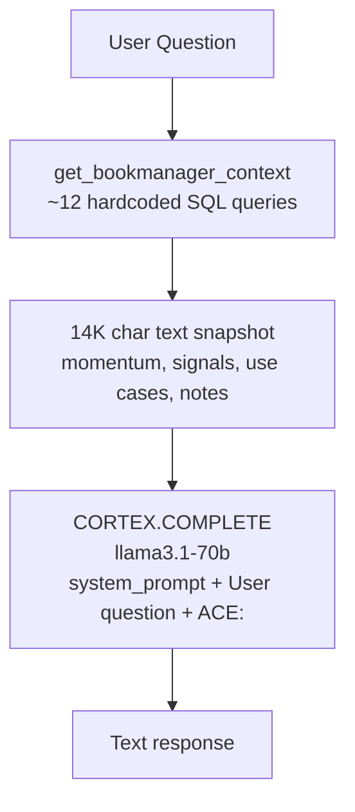
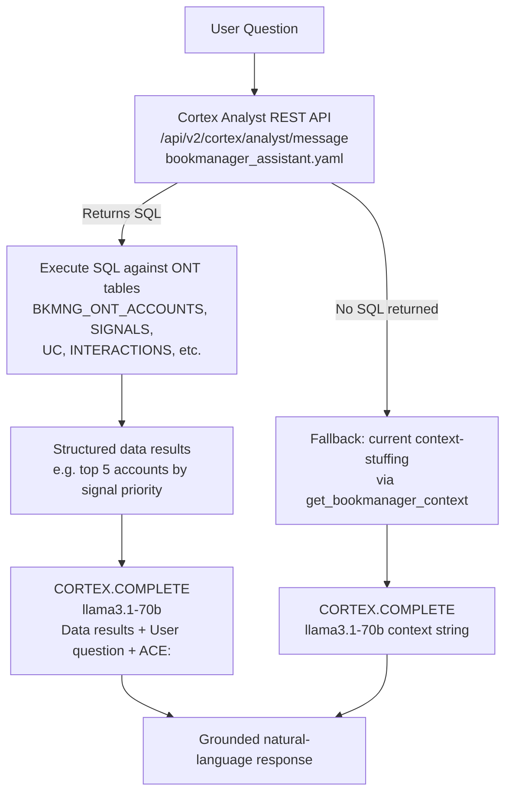

# Plan: Cortex Analyst Hybrid Chat

## What Is Currently Happening

The current ACE chat pipeline is "context stuffing":



**Limitations:**
- Only answers questions that fit in the pre-baked 14K snapshot
- Uses 12 hardcoded queries — can't answer dynamic analytical questions ("which decelerating accounts had a consumption spike this week?")
- LLM reasons over text summaries, not actual data — lower accuracy
- Context goes stale between ONT refreshes

---

## Proposed Architecture



**Why this is better:**
- Cortex Analyst interprets ANY natural language question against the 7-table ONT semantic model
- LLM answers are grounded in actual SQL results, not text summaries
- Dynamic queries: "which accounts haven't had a call in 14+ days in the retail industry?" — currently impossible with pre-baked context
- No hardcoded query maintenance

---

## Current State

- `bookmanager_assistant.yaml` has 7 tables: `accounts`, `use_cases`, `account_signals`, `interactions`, `account_topics`, `contacts`, `opportunities` — the full ONT model
- The YAML has a syntax error: unquoted colons inside description values (e.g. `Values: high, medium, low`) cause YAML parse failure
- Cortex Agents (`/api/v2/cortex/agents:run`) is 404 on this account — **but Cortex Analyst REST API is a separate endpoint** (`/api/v2/cortex/analyst/message`) that should be available
- PAT token is in `backend/.env` as `SNOWFLAKE_PAT`
- `bookmanager_assistant.yaml` references in `agent.py` exist (`_BOOKMANAGER_TOOL`, `_BOOKMANAGER_TOOL_RESOURCE`) but are not wired up

---

## Step-by-Step Changes

### Task 1 — Fix YAML syntax error

File: [`bookmanager_assistant.yaml`](BookManager/bookmanager_assistant.yaml)

Affected lines: any description containing `: ` in a values list, e.g.:
```yaml
# BROKEN:
description: Signal priority. Values: high, medium, low.

# FIXED:
description: "Signal priority. Values: high, medium, low."
```

Run `reflect_semantic_model` after fixing to confirm no errors.

---

### Task 2 — Upload fixed YAML to stage

```sql
PUT file:///Users/jusdavis/.snowflake/cortex/playground/workspace/BookManager/bookmanager_assistant.yaml
    @TEMP.JUSDAVIS.BKMNG_STAGE/
    OVERWRITE = TRUE
    AUTO_COMPRESS = FALSE;
```

---

### Task 3 — Implement `_call_cortex_analyst()` in `snowflake_service.py`

Add a new method to `SnowflakeDataService`:

```python
def call_cortex_analyst(self, question: str, account_id: Optional[str] = None) -> dict:
    """
    Calls Cortex Analyst REST API with the question.
    Returns {"sql": str, "data": list[dict], "text": str} or {} on failure.
    """
    import httpx
    from app.config import settings

    url = f"https://{settings.snowflake_account}.snowflakecomputing.com/api/v2/cortex/analyst/message"
    headers = {
        "Authorization": f'Snowflake Token="{settings.snowflake_pat}"',
        "X-Snowflake-Authorization-Token-Type": "PROGRAMMATIC_ACCESS_TOKEN",
        "Content-Type": "application/json",
    }
    scoped_question = question
    if account_id:
        scoped_question = f"[Scope: account_id = '{account_id}'] {question}"
    payload = {
        "messages": [{"role": "user", "content": scoped_question}],
        "semantic_model_file": "@TEMP.JUSDAVIS.BKMNG_STAGE/bookmanager_assistant.yaml",
    }
    resp = httpx.post(url, headers=headers, json=payload, timeout=30)
    resp.raise_for_status()
    result = resp.json()
    # Extract SQL from the analyst response
    sql = None
    text = ""
    for item in result.get("message", {}).get("content", []):
        if item.get("type") == "sql":
            sql = item.get("statement")
        elif item.get("type") == "text":
            text = item.get("text", "")
    if not sql:
        return {"sql": None, "data": [], "text": text}
    cur = self._cursor()
    cur.execute(sql)
    cols = [d[0] for d in cur.description]
    rows = cur.fetchmany(50)
    data = [dict(zip(cols, row)) for row in rows]
    return {"sql": sql, "data": data, "text": text}
```

Note: `httpx` is used for synchronous HTTP (available in the venv — already used by Snowflake connector deps). Alternative: use `urllib.request` if not present.

---

### Task 4 — Rewrite `_stream_agent()` as two-phase pipeline

File: [`backend/app/routers/agent.py`](BookManager/backend/app/routers/agent.py)

The `chat` endpoint extracts the last user message (or all messages), calls Cortex Analyst, then synthesizes:

```python
async def _stream_agent(messages: list[dict], data, account_id: Optional[str] = None) -> AsyncIterator[str]:
    try:
        if not hasattr(data, "_cursor"):
            yield f"data: {json.dumps({'text': 'Chat is not available in demo mode.'})}\n\n"
            yield "data: [DONE]\n\n"
            return

        user_question = next(
            (m["content"] for m in reversed(messages) if m["role"] == "user"), ""
        )

        # Phase 1: try Cortex Analyst for data-grounded answer
        analyst_result = {}
        if hasattr(data, "call_cortex_analyst"):
            try:
                analyst_result = await asyncio.to_thread(
                    data.call_cortex_analyst, user_question, account_id
                )
            except Exception:
                pass

        # Phase 2: CORTEX.COMPLETE synthesis
        def _call_cortex():
            cur = data._cursor()
            if analyst_result.get("data"):
                rows_text = json.dumps(analyst_result["data"][:20], default=str)
                prompt = (
                    f"You are ACE, the AI assistant for BookManager.\n"
                    f"Data from the database:\n{rows_text}\n\n"
                    f"User: {user_question}\n"
                    f"Answer concisely using the data above.\nACE:"
                )
            else:
                # fallback: current context-stuffing approach
                parts = []
                for m in messages:
                    role = m.get("role", "user")
                    content = (m.get("content") or "").strip()
                    if role == "system":
                        parts.append(content)
                    elif role == "user":
                        parts.append(f"\nUser: {content}")
                    elif role == "assistant":
                        parts.append(f"\nACE: {content}")
                parts.append("\nACE:")
                prompt = "\n".join(parts)
            cur.execute(
                "SELECT SNOWFLAKE.CORTEX.COMPLETE('llama3.1-70b', %s) AS response",
                (prompt,),
            )
            row = cur.fetchone()
            return (row or {}).get("RESPONSE") or ""

        text = await asyncio.to_thread(_call_cortex)
        if text:
            response = text.strip()
            if response.startswith("ACE:"):
                response = response[4:].strip()
            yield f"data: {json.dumps({'text': response})}\n\n"
        yield "data: [DONE]\n\n"
    except Exception as e:
        yield f"data: {json.dumps({'error': str(e)})}\n\n"
        yield "data: [DONE]\n\n"
```

Also update the `chat` endpoint to pass `account_id` to `_stream_agent`.

---

## Key Design Decisions

| Decision | Reasoning |
|---|---|
| Cortex Analyst REST API, not Cortex Agents | `agents:run` is 404 on this account; `analyst/message` is a separate endpoint |
| `account_id` injected into question as scope hint | Analyst can't filter by user scope automatically; prepending scopes the query |
| Fall back to context-stuffing if no SQL | Conversational questions ("what should I focus on today?") won't get SQL — need the narrative context |
| `httpx.post` (sync, in thread) | Keeps `asyncio.to_thread` pattern consistent with existing `_call_cortex()` |
| Limit to 20 rows in prompt | Enough for concise answers; avoids blowing the CORTEX.COMPLETE token limit |
| User scope (ACE/ACEM) NOT enforced at Analyst layer | The `bookmanager_assistant.yaml` doesn't know about ACE scoping — the fallback context carries it |
