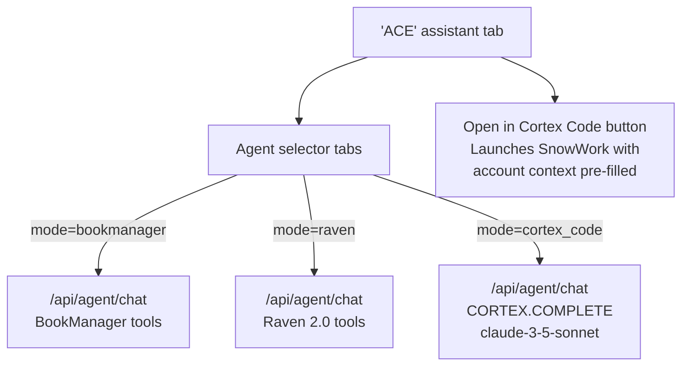

# Plan: Cortex Code + Raven + BookManager Agent in ACE

## Architecture



**Why not iframe:** Snowsight sends `X-Frame-Options: SAMEORIGIN` — Cortex Code/SnowWork cannot be embedded in a third-party app. The in-app mode calls the same underlying AI models. The deep-link button opens the real SnowWork app.

---

## Step 1: Backend — add `cortex_code` mode to `/api/agent/chat`

**File:** [`backend/app/routers/agent.py`](backend/app/routers/agent.py)

Add `mode: Optional[str] = "bookmanager"` to the request body model. When `mode == "cortex_code"`:

1. Call `data.get_bookmanager_context(account_id, ace_filter, acem_filter)` to get full account context text
2. Build a Cortex Code-style prompt:
```python
CORTEX_CODE_SYSTEM = (
    "You are Cortex Code, Snowflake's AI assistant. "
    "You help users write SQL, Python, and analyze Snowflake data. "
    "You have access to the following account context:\n\n{ctx}\n\n"
    "Use this context to give specific, data-grounded answers."
)
prompt = CORTEX_CODE_SYSTEM.format(ctx=account_context)
# append conversation history + user message
full_prompt = prompt + "\n\n" + formatted_history + "\nUser: " + message
```
3. Call `SNOWFLAKE.CORTEX.COMPLETE('claude-3-5-sonnet', full_prompt)` and stream via SSE
4. Fallback chain: `claude-3-5-sonnet` → `mistral-large2` → `llama3.1-70b`

Existing `bookmanager` and `raven` modes are unchanged.

---

## Step 2: Replace mock `AIChatPanel.tsx` with real SSE streaming

**File:** [`bkmng-next/components/account-detail/AIChatPanel.tsx`](bkmng-next/components/account-detail/AIChatPanel.tsx)

Remove `generateMockResponse()`. Replace with fetch + SSE reader (same pattern as `ACEChat.tsx`):

```typescript
const res = await fetch("/api/agent/chat", {
  method: "POST",
  headers: { "Content-Type": "application/json", "X-Mock-User": mockUserId },
  body: JSON.stringify({
    message: userMsg,
    history: conversationHistory,
    account_id: account.account_id,
    mode: selectedAgent,  // "bookmanager" | "raven" | "cortex_code"
  }),
});
// SSE reader → stream tokens into current assistant message
```

Keep existing props (`account`, `useCases`, `gongCalls`, `initialPrompt`) for suggested prompts and initial NBA message.

---

## Step 3: Add 3-way agent selector

Add pill tabs at the top of `AIChatPanel.tsx`:

```tsx
type AgentMode = "bookmanager" | "raven" | "cortex_code";

const AGENTS = [
  { id: "bookmanager", label: "BookManager", icon: <BookOpen size={12}/> },
  { id: "raven",       label: "Raven 2.0",   icon: <Rss size={12}/>      },
  { id: "cortex_code", label: "Cortex Code",  icon: <Code2 size={12}/>    },
];
```

Switching modes resets the conversation (with a visual divider) and updates the suggested prompts. Cortex Code mode shows coding-specific chips:
- "Write SQL to analyze this account's consumption"
- "Generate a Python script for this use case"
- "Explain this account's signals"
- "Help me build a data pipeline for this customer"

---

## Step 4: "Open in Cortex Code" deep-link button

**File:** [`bkmng-next/components/account-detail/AIChatPanel.tsx`](bkmng-next/components/account-detail/AIChatPanel.tsx)

Add a persistent action button in the panel header (visible in all modes, but especially prominent in Cortex Code mode):

```tsx
const buildCortexCodeUrl = (account: AccountData, lastMessage?: string) => {
  // SnowWork deep link: opens Cortex Code with a pre-seeded prompt
  const context = `Account: ${account.account_name}\nIndustry: ${account.industry}\nRegion: ${account.region}`;
  const prompt = lastMessage
    ? `${lastMessage}\n\nAccount context:\n${context}`
    : `I'm working on account: ${account.account_name} (${account.industry}, ${account.region}). Help me analyze this account.`;
  // Opens SnowWork URL — the active Cortex Code session
  return `https://app.snowflake.com?cortex_code_prompt=${encodeURIComponent(prompt)}`;
};

<button
  onClick={() => window.open(buildCortexCodeUrl(account, lastAssistantMessage), "_blank")}
  className="flex items-center gap-1.5 text-xs text-emerald-600 hover:text-emerald-700"
>
  <ExternalLink size={12} />
  Open in Cortex Code
</button>
```

> **Note on deep-link URL format:** Snowflake's exact SnowWork deep-link spec (`cortex_code_prompt` query param) will need to be verified at implementation time. If there is no supported deep-link URL, the button will open SnowWork and copy the context to clipboard with a toast notification instead (`navigator.clipboard.writeText(context)`).

---

## Step 5: Cortex Code mode — distinct styling

When `selectedAgent === "cortex_code"`:
- Panel header badge: `bg-emerald-600 text-white` with `<Code2>` icon  
- Code block detection: wrap ` ``` ... ``` ` blocks in a `<pre className="bg-slate-900 text-emerald-300 font-mono text-xs p-3 rounded overflow-x-auto">` 
- Inline code: wrap ` ` ` ` ` in `<code className="bg-slate-100 font-mono text-xs px-1 rounded">`

---

## Step 6: Pass account_id through Raven

**File:** [`bkmng-next/components/dashboard/RavenChat.tsx`](bkmng-next/components/dashboard/RavenChat.tsx)

RavenChat currently does NOT pass `account_id`. Add it so Raven's SQL tools can scope to the current account when in account detail context.

---

## Files Changed Summary

| File | Change |
|---|---|
| `backend/app/routers/agent.py` | Add `mode` field; add `cortex_code` branch with `CORTEX.COMPLETE` + account context |
| `bkmng-next/components/account-detail/AIChatPanel.tsx` | Replace mock with real SSE; add 3-way selector; add deep-link button; Cortex Code styling |
| `bkmng-next/components/dashboard/RavenChat.tsx` | Pass `account_id` in fetch body |
| `bkmng-next/components/dashboard/ACEChat.tsx` | Add explicit `mode: "bookmanager"` |

No new Snowflake tables, no new SPCS infra needed.
