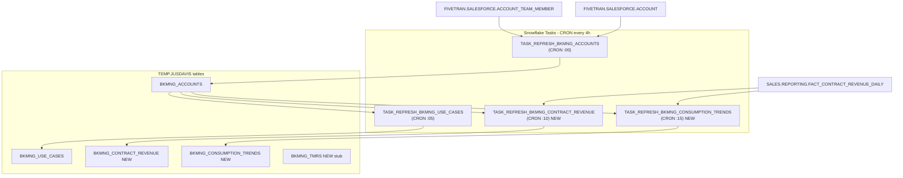

# Plan: Credit Usage + Revenue Data Pipeline

## Overview

The BKMNG_ACCOUNTS task already correctly scopes to activation SE accounts — it inner-joins `FIVETRAN.SALESFORCE.ACCOUNT_TEAM_MEMBER` with `TEAM_MEMBER_ROLE = 'SE - Activation'`. Both existing tasks are currently **suspended** and need to be resumed.

The main work is: build two new Snowflake tables (contract revenue + consumption trends), add backend API endpoints backed by real data, and redesign the frontend Credit Usage sidebar.

TMR data gets a stub table now; the refresh task will be added once the user provides the data source.

---

## Data Flow



---

## Step 1: Verify + Resume Activation-Scoped Account Task

**No SQL changes needed** to the account task body — it already contains:
```sql
INNER JOIN FIVETRAN.SALESFORCE.ACCOUNT_TEAM_MEMBER atm
    ON atm.ACCOUNT_ID = a.ID
    AND atm.TEAM_MEMBER_ROLE = 'SE - Activation'
    AND atm.IS_DELETED = FALSE
```

Action: Resume both existing tasks:
```sql
ALTER TASK TEMP.JUSDAVIS.TASK_REFRESH_BKMNG_ACCOUNTS RESUME;
ALTER TASK TEMP.JUSDAVIS.TASK_REFRESH_BKMNG_USE_CASES RESUME;
```

---

## Step 2: Create BKMNG_CONTRACT_REVENUE Table + Task

Create the table:
```sql
CREATE OR REPLACE TABLE TEMP.JUSDAVIS.BKMNG_CONTRACT_REVENUE (
    ACCOUNT_ID           VARCHAR,
    ACCOUNT_NAME         VARCHAR,
    CONTRACT_START_DATE  DATE,
    CONTRACT_END_DATE    DATE,
    CONTRACT_CAPACITY    FLOAT,
    TOTAL_CONSUMED_REVENUE FLOAT,
    CAPACITY_REMAINING   FLOAT,
    TOTAL_CONSUMED_CREDITS FLOAT,
    PREDICTED_OVERAGE_DATE DATE,
    LAST_ACTUAL_DATE     DATE,
    REFRESHED_AT         TIMESTAMP_NTZ
);
```

Create and resume the refresh task (CRON 10 minutes after accounts task, every 4h):
```sql
CREATE OR REPLACE TASK TEMP.JUSDAVIS.TASK_REFRESH_BKMNG_CONTRACT_REVENUE
    WAREHOUSE = SE_XS_WH
    SCHEDULE  = 'USING CRON 10 */4 * * * UTC'
AS
BEGIN
    TRUNCATE TABLE TEMP.JUSDAVIS.BKMNG_CONTRACT_REVENUE;
    INSERT INTO TEMP.JUSDAVIS.BKMNG_CONTRACT_REVENUE
    SELECT
        r.SALESFORCE_ACCOUNT_ID     AS ACCOUNT_ID,
        r.SALESFORCE_ACCOUNT_NAME   AS ACCOUNT_NAME,
        r.CONTRACT_START_DATE,
        r.CONTRACT_END_DATE,
        r.CONTRACT_CAPACITY,
        r.TOTAL_CONSUMED_REVENUE,
        r.CONTRACT_CAPACITY - r.TOTAL_CONSUMED_REVENUE AS CAPACITY_REMAINING,
        r.TOTAL_CONSUMED_CREDITS,
        r.PREDICTED_OVERAGE_DATE,
        r.LAST_ACTUAL_DATE,
        CURRENT_TIMESTAMP()         AS REFRESHED_AT
    FROM (
        SELECT
            SALESFORCE_ACCOUNT_ID,
            MAX(SALESFORCE_ACCOUNT_NAME)                              AS SALESFORCE_ACCOUNT_NAME,
            MIN(GENERAL_DATE)                                         AS CONTRACT_START_DATE,
            MAX(GENERAL_DATE)                                         AS CONTRACT_END_DATE,
            MAX(CAPACITY_CONTRACT_AMOUNT_STRAIGHT_LINE)               AS CONTRACT_CAPACITY,
            SUM(CASE WHEN IS_FUTURE = FALSE THEN REVENUE      ELSE 0 END) AS TOTAL_CONSUMED_REVENUE,
            SUM(CASE WHEN IS_FUTURE = FALSE THEN TOTAL_CREDITS ELSE 0 END) AS TOTAL_CONSUMED_CREDITS,
            MAX(DAY_OF_OVERAGE)                                       AS PREDICTED_OVERAGE_DATE,
            MAX(CASE WHEN IS_FUTURE = FALSE THEN GENERAL_DATE END)    AS LAST_ACTUAL_DATE
        FROM SALES.REPORTING.FACT_CONTRACT_REVENUE_DAILY
        GROUP BY SALESFORCE_ACCOUNT_ID
    ) r
    INNER JOIN TEMP.JUSDAVIS.BKMNG_ACCOUNTS a
        ON a.ACCOUNT_ID = r.SALESFORCE_ACCOUNT_ID;
END;

ALTER TASK TEMP.JUSDAVIS.TASK_REFRESH_BKMNG_CONTRACT_REVENUE RESUME;
```

Then execute manually to populate immediately:
```sql
EXECUTE TASK TEMP.JUSDAVIS.TASK_REFRESH_BKMNG_CONTRACT_REVENUE;
```

---

## Step 3: Create BKMNG_CONSUMPTION_TRENDS Table + Task

Create the table:
```sql
CREATE OR REPLACE TABLE TEMP.JUSDAVIS.BKMNG_CONSUMPTION_TRENDS (
    ACCOUNT_ID                      VARCHAR,
    PERIOD_TYPE                     VARCHAR,   -- 'WEEK' | 'MONTH'
    PERIOD_START                    DATE,
    PERIOD_REVENUE                  FLOAT,
    PERIOD_CREDITS                  FLOAT,
    DAYS_IN_PERIOD                  INT,
    IS_COMPLETE_PERIOD              BOOLEAN,
    PREV_PERIOD_REVENUE             FLOAT,
    PCT_CHANGE                      FLOAT,
    ROLLING_4_PERIOD_AVG_REVENUE    FLOAT,
    PREV_ROLLING_4_PERIOD_AVG_REVENUE FLOAT,
    ROLLING_PCT_CHANGE              FLOAT,
    REFRESHED_AT                    TIMESTAMP_NTZ
);
```

Create and resume the refresh task (CRON 15 minutes after accounts, every 4h):
```sql
CREATE OR REPLACE TASK TEMP.JUSDAVIS.TASK_REFRESH_BKMNG_CONSUMPTION_TRENDS
    WAREHOUSE = SE_XS_WH
    SCHEDULE  = 'USING CRON 15 */4 * * * UTC'
AS
BEGIN
    TRUNCATE TABLE TEMP.JUSDAVIS.BKMNG_CONSUMPTION_TRENDS;
    INSERT INTO TEMP.JUSDAVIS.BKMNG_CONSUMPTION_TRENDS
    -- [full account_consumption_trends DDL adapted here,
    --  wrapped in a final INNER JOIN to BKMNG_ACCOUNTS on SALESFORCE_ACCOUNT_ID]
    SELECT t.*, CURRENT_TIMESTAMP() AS REFRESHED_AT
    FROM (<provided_ddl_subquery>) t
    INNER JOIN TEMP.JUSDAVIS.BKMNG_ACCOUNTS a
        ON a.ACCOUNT_ID = t.salesforce_account_id;
END;

ALTER TASK TEMP.JUSDAVIS.TASK_REFRESH_BKMNG_CONSUMPTION_TRENDS RESUME;
EXECUTE TASK TEMP.JUSDAVIS.TASK_REFRESH_BKMNG_CONSUMPTION_TRENDS;
```

---

## Step 4: Create BKMNG_TMRS Stub Table

No task yet (awaiting data source):
```sql
CREATE TABLE IF NOT EXISTS TEMP.JUSDAVIS.BKMNG_TMRS (
    TMR_ID           VARCHAR,
    ACCOUNT_ID       VARCHAR,   -- FK to BKMNG_ACCOUNTS
    ACCOUNT_NAME     VARCHAR,
    REQUESTOR        VARCHAR,
    REQUEST_TYPE     VARCHAR,
    STATUS           VARCHAR,
    REQUESTED_DATE   DATE,
    START_DATE       DATE,
    END_DATE         DATE,
    ESTIMATED_HOURS  FLOAT,
    ACTUAL_HOURS     FLOAT,
    USE_CASE_ID      VARCHAR,
    PRIORITY         VARCHAR,
    OUTCOME          VARCHAR,
    REFRESHED_AT     TIMESTAMP_NTZ
);
```

---

## Step 5: Backend — Models + Service Methods

**[`backend/app/models/credit.py`](backend/app/models/credit.py)** — replace with:
```python
class AccountRevenueSummary(BaseModel):
    account_id: str
    contract_capacity: Optional[float] = None
    total_consumed_revenue: Optional[float] = None
    capacity_remaining: Optional[float] = None
    total_consumed_credits: Optional[float] = None
    pct_consumed: Optional[float] = None        # computed: consumed/capacity
    predicted_overage_date: Optional[date] = None
    last_actual_date: Optional[date] = None
    contract_start_date: Optional[date] = None
    contract_end_date: Optional[date] = None
    wow_credits_pct_change: Optional[float] = None   # from BKMNG_CONSUMPTION_TRENDS
    mom_credits_pct_change: Optional[float] = None   # from BKMNG_CONSUMPTION_TRENDS
```

**[`backend/app/services/snowflake_service.py`](backend/app/services/snowflake_service.py)** — add:
- `get_account_revenue_summary(account_id)` — queries `BKMNG_CONTRACT_REVENUE`, then queries `BKMNG_CONSUMPTION_TRENDS` for the latest complete WEEK and MONTH rows to get `pct_change` values. Returns `AccountRevenueSummary`.

---

## Step 6: Backend — Replace credit_series Router

**[`backend/app/routers/credit_series.py`](backend/app/routers/credit_series.py)** — replace the entire synthetic generation with a single real endpoint:

```python
@router.get("/accounts/{account_id}/revenue-summary", response_model=AccountRevenueSummary)
async def get_account_revenue_summary(
    account_id: str,
    user: CurrentUser = Depends(get_current_user),
) -> AccountRevenueSummary:
    svc = get_data_service()
    result = svc.get_account_revenue_summary(account_id, ace_filter=user.email)
    if result is None:
        return AccountRevenueSummary(account_id=account_id)
    return result
```

The old `/accounts/{id}/credit-series` route can be removed (it served synthetic data only).

---

## Step 7: Frontend — Hook + Credit Usage Sidebar Redesign

**[`bkmng-next/hooks/useApi.ts`](bkmng-next/hooks/useApi.ts)**:
```ts
// Replace useAccountCreditSeries with:
export function useAccountRevenueSummary(accountId: string) {
  return useQuery({
    queryKey: ["account-revenue-summary", accountId],
    queryFn: () => apiFetch(`/api/accounts/${accountId}/revenue-summary`),
    ...DEFAULT_OPTS,
    enabled: !!accountId,
  });
}
```

**[`bkmng-next/app/accounts/[id]/page.tsx`](bkmng-next/app/accounts/[id]/page.tsx)** — redesign the Credit Usage sidebar card:

```
┌─────────────────────────────┐
│ CREDIT USAGE                │
│                             │
│ $2.1M / $4.5M               │
│ ████████░░░░░░░░  47%       │
│                             │
│ ↑ 12.3%  WoW   (green pill) │
│ ↓  3.1%  MoM   (red pill)   │
│                             │
│ Overage forecast: Sep 2026  │
└─────────────────────────────┘
```

- Capacity bar: `total_consumed_revenue / contract_capacity`
- WoW pill: `wow_credits_pct_change` — green if positive, red if negative, slate if null
- MoM pill: `mom_credits_pct_change` — same coloring
- Overage forecast row: shown only if `predicted_overage_date` is not null
- Full null-safe: if no revenue data exists, show "No contract data" gracefully (same as current null credits behavior)
- Remove the recharts AreaChart sparkline (was based on synthetic data)

---

## What Is NOT Changing

- `BKMNG_ACCOUNTS` task body — already correct, just needs resuming
- `BKMNG_USE_CASES` task body — already inner-joins BKMNG_ACCOUNTS, just needs resuming
- Account model, accounts list page, account detail header — no changes
- TMR router — stub exists, no data wiring yet
