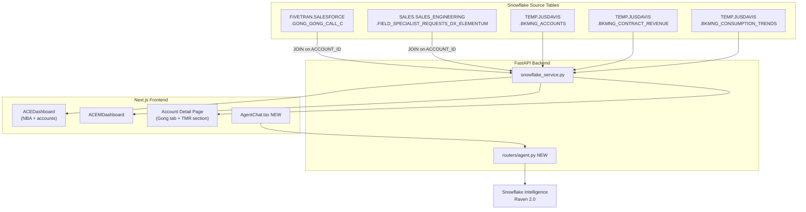

# Plan: Dashboard Fixes, Gong/TMR Data, and Raven AI Integration

## Data Flow



---

## Phase 1: Fix Dashboards

### Task 1 — Fix ACE Dashboard empty state

**Root cause**: `ACEDashboard.tsx` filters `allAccounts` by `a.ace_assigned === aceId` where `aceId = currentUser.user_id = "jusdavis-ace"`, but `ace_assigned` is an email. Backend already scopes accounts for ACE users. Result: 0 accounts shown.

**File**: [`bkmng-next/components/dashboard/ACEDashboard.tsx`](bkmng-next/components/dashboard/ACEDashboard.tsx)

```typescript
// Remove the aceId variable and client-side filter

// BEFORE (~lines 97–101):
const { currentUser } = useAuth();
const aceId = currentUser?.user_id ?? "";
const myAccounts = useMemo(
  () => (allAccounts as Account[]).filter((a) => a.ace_assigned === aceId),
  [allAccounts, aceId]
);

// AFTER:
const { currentUser } = useAuth();  // keep for greeting
const myAccounts = useMemo(() => allAccounts as Account[], [allAccounts]);
```

`myAccountIds` and `myUseCases` derive from `myAccounts` so they self-correct.

---

### Task 2 — Fix ACEM dashboard stale cache on user switch

**Root cause**: All TanStack Query hooks use user-agnostic keys (`["accounts"]`, `["use-cases"]`, etc.) with `staleTime: 30_000`. When switching ACE → ACEM, the stale ACE-scoped cache (11 accounts) is served until the 30s TTL expires, causing the ACEM dashboard to show partial/wrong data.

**File**: [`bkmng-next/components/providers/Providers.tsx`](bkmng-next/components/providers/Providers.tsx)

Move `queryClient` from `useState` to module scope so it's importable:

```typescript
import { QueryClient, QueryClientProvider } from "@tanstack/react-query";

export const queryClient = new QueryClient({
  defaultOptions: { queries: { staleTime: 30_000, retry: 1 } },
});

export function Providers({ children }: { children: React.ReactNode }) {
  return (
    <QueryClientProvider client={queryClient}>
      {children}
    </QueryClientProvider>
  );
}
```

**File**: [`bkmng-next/context/AuthContext.tsx`](bkmng-next/context/AuthContext.tsx)

```typescript
import { queryClient } from "@/components/providers/Providers";

const switchUser = useCallback((userId: string) => {
  localStorage.setItem(MOCK_USER_KEY, userId);
  queryClient.clear();   // evict all cached queries so next render re-fetches as new user
  setMockUserId(userId);
  setIsLoading(true);
}, []);
```

---

## Phase 2: Gong + TMR Data

### Task 3 — Wire Gong calls from Snowflake

**Source**: `FIVETRAN.SALESFORCE.GONG_GONG_CALL_C`
**ACE filter**: join to `TEMP.JUSDAVIS.BKMNG_ACCOUNTS` on `ACCOUNT_ID = GONG_PRIMARY_ACCOUNT_C` where `ACE_ASSIGNED = email`

**Step 1 — Update the Pydantic model** in [`backend/app/models/gong.py`](backend/app/models/gong.py):

```python
class GongCall(BaseModel):
    call_id: str
    account_id: str
    title: str | None
    call_date: datetime
    duration_minutes: int | None
    summary: str | None           # GONG_CALL_BRIEF_C
    key_points: str | None        # GONG_CALL_KEY_POINTS_C
    next_steps: str | None        # GONG_CALL_HIGHLIGHTS_NEXT_STEPS_C
    outcome: str | None           # GONG_CALL_OUTCOME_C
    call_score: float | None      # GONG_CALL_SCORE_C
    direction: str | None         # GONG_DIRECTION_C
    participants_emails: list[str]  # GONG_PARTICIPANTS_EMAILS_C split by comma
    action_items: list[str]       # parsed from GONG_RELATED_ACTION_ITEMS_JSON_C
    topics: list[str]             # parsed from GONG_RELATED_TOPICS_JSON_C
    recording_url: str | None     # GONG_VIEW_CALL_C
```

**Step 2 — Implement the service method** in [`backend/app/services/snowflake_service.py`](backend/app/services/snowflake_service.py), replacing the `return []` stub:

```python
def list_gong_calls(self, account_id=None, ace_filter=None):
    sql = """
        SELECT
            g.ID, g.GONG_PRIMARY_ACCOUNT_C, g.GONG_TITLE_C,
            g.GONG_CALL_START_C, g.GONG_CALL_DURATION_SEC_C,
            g.GONG_CALL_BRIEF_C, g.GONG_CALL_KEY_POINTS_C,
            g.GONG_CALL_HIGHLIGHTS_NEXT_STEPS_C, g.GONG_CALL_OUTCOME_C,
            g.GONG_CALL_SCORE_C, g.GONG_DIRECTION_C,
            g.GONG_PARTICIPANTS_EMAILS_C, g.GONG_RELATED_ACTION_ITEMS_JSON_C,
            g.GONG_RELATED_TOPICS_JSON_C, g.GONG_VIEW_CALL_C
        FROM FIVETRAN.SALESFORCE.GONG_GONG_CALL_C g
        {join}
        WHERE g.GONG_CALL_START_C >= DATEADD('day', -90, CURRENT_TIMESTAMP())
        {filters}
        ORDER BY g.GONG_CALL_START_C DESC
        LIMIT 50
    """
    # When ace_filter set: INNER JOIN BKMNG_ACCOUNTS a ON a.ACCOUNT_ID = g.GONG_PRIMARY_ACCOUNT_C AND a.ACE_ASSIGNED = %s
    # When account_id set: AND g.GONG_PRIMARY_ACCOUNT_C = %s
    # Parse GONG_RELATED_ACTION_ITEMS_JSON_C as JSON → extract text fields
    # Split GONG_PARTICIPANTS_EMAILS_C by comma
```

No table materialization needed — query live from source. (Unlike CONTRACT_REVENUE, this is read-only FIVETRAN data not subject to task permission issues.)

**Step 3 — Update frontend type** in [`bkmng-next/components/dashboard/ACEDashboard.tsx`](bkmng-next/components/dashboard/ACEDashboard.tsx): update `GongCall` type to add `title`, `summary`, `recording_url`.

---

### Task 4 — Wire TMR data from Snowflake

**Source**: `SALES.SALES_ENGINEERING.FIELD_SPECIALIST_REQUESTS_DX_ELEMENTUM`
**Filter**: `SPECIALIST_TYPE = 'Account Engineer'`
**ACE filter**: join to `BKMNG_ACCOUNTS` on `ACCOUNT_ID` where `ACE_ASSIGNED = email`

**Step 1 — Update the Pydantic model** in [`backend/app/models/tmr.py`](backend/app/models/tmr.py):

```python
class TMR(BaseModel):
    tmr_id: str                    # ID
    account_id: str                # ACCOUNT_ID
    account_name: str              # from BKMNG_ACCOUNTS join
    use_case_id: str | None        # USE_CASE_ID
    status: str                    # STATUS
    stage: str | None              # STAGE
    activity_requested: str | None # ACTIVITY_REQUESTED
    engagement_type: str | None    # ENGAGEMENT_TYPE
    requestor: str | None          # CREATED_BY_NAME
    requestor_email: str | None    # CREATED_BY_EMAIL
    request_reason: str | None     # REQUEST_REASON (long structured text)
    specialist_comments: str | None # SPECIALIST_COMMENTS
    specialist_engagement_status: str | None  # SPECIALIST_ENGAGEMENT_STATUS
    resolution: str | None         # RESOLUTION
    rejection_reason: str | None   # REJECTION_REASON
    manager_approver: str | None   # MANAGER_APPROVER
    requested_date: date | None    # REQUEST_CREATED_DATE
    start_date: date | None        # TARGET_ACTIVITY_START_DATE
    close_date: date | None        # REQUEST_CLOSE_DATE
```

**Step 2 — Implement the service method** in [`backend/app/services/snowflake_service.py`](backend/app/services/snowflake_service.py):

```python
def list_tmrs(self, ace_filter=None):
    sql = """
        SELECT
            t.ID, t.ACCOUNT_ID, a.ACCOUNT_NAME, t.USE_CASE_ID,
            t.STATUS, t.STAGE, t.ACTIVITY_REQUESTED, t.ENGAGEMENT_TYPE,
            t.CREATED_BY_NAME, t.CREATED_BY_EMAIL,
            t.REQUEST_REASON, t.SPECIALIST_COMMENTS,
            t.SPECIALIST_ENGAGEMENT_STATUS, t.RESOLUTION,
            t.REJECTION_REASON, t.MANAGER_APPROVER,
            t.REQUEST_CREATED_DATE, t.TARGET_ACTIVITY_START_DATE,
            t.REQUEST_CLOSE_DATE
        FROM SALES.SALES_ENGINEERING.FIELD_SPECIALIST_REQUESTS_DX_ELEMENTUM t
        JOIN TEMP.JUSDAVIS.BKMNG_ACCOUNTS a ON a.ACCOUNT_ID = t.ACCOUNT_ID
        WHERE t.SPECIALIST_TYPE = 'Account Engineer'
        {ace_where}
        ORDER BY t.REQUEST_CREATED_DATE DESC
    """
    # ace_where: AND a.ACE_ASSIGNED = %s
```

The `BKMNG_TMRS` table can be left empty — we query live from source to avoid task permission issues.

---

### Task 5 — Surface Gong + TMR in UI

**ACEDashboard NBA widget** — add two new signal sources to `nextActions` in [`bkmng-next/components/dashboard/ACEDashboard.tsx`](bkmng-next/components/dashboard/ACEDashboard.tsx):

```typescript
const { data: allTmrs = [] } = useTMRs();

// Signal 1: open TMRs
for (const tmr of allTmrs) {
  if (!myAccountIds.has(tmr.account_id)) continue;
  if (tmr.status !== "Closed")
    actions.push({ id: `tmr-${tmr.tmr_id}`, accountId: tmr.account_id,
      text: `TMR pending: ${tmr.activity_requested} @ ${tmr.account_name}`,
      priority: "medium", color: "text-orange-500" });
}

// Signal 2: accounts with no Gong activity in 30 days
for (const acc of myAccounts) {
  const lastCall = allGongCalls.find((c) => c.account_id === acc.account_id);
  const cutoff = Date.now() - 30 * MS_PER_DAY;
  if (!lastCall || new Date(lastCall.call_date).getTime() < cutoff)
    actions.push({ id: `nogong-${acc.account_id}`, accountId: acc.account_id,
      text: `No recent call: ${acc.account_name}`,
      priority: "low", color: "text-slate-400" });
}
```

**Account detail Gong tab** — add a "Calls" tab to [`bkmng-next/app/accounts/[id]/page.tsx`](bkmng-next/app/accounts/[id]/page.tsx) alongside the existing "use-cases" / "timeline" tabs:
- Shows last 10 Gong calls as expandable cards (title, date, duration, summary, next steps, recording link)
- Uses `useAccountGongCalls(accountId)` hook (already defined in `useApi.ts`)

**Account detail TMR section** — add a collapsible "Technical Resources" panel in the sidebar (below Credit Usage) showing open TMRs for the account: stage, activity requested, requestor, start date.

---

## Phase 3: Raven 2.0 Chat

### Task 6 — Raven 2.0 chat panel

**Agent**: `Raven 2.0` in `SNOWFLAKE_INTELLIGENCE.AGENTS.CONFIG`
**API**: Snowflake REST `POST /api/v2/cortex/agents:run` with SSE streaming

**Step 1 — New backend router** [`backend/app/routers/agent.py`](backend/app/routers/agent.py):

```python
@router.post("/agent/chat")
async def agent_chat(body: AgentChatRequest, user=Depends(get_current_user)):
    """Proxy to Raven 2.0 via Snowflake Intelligence REST API with SSE streaming."""
    # Authenticate using Snowflake JWT (same account/user as existing connection)
    # POST to: https://<account>.snowflakecomputing.com/api/v2/cortex/agents:run
    # Body: { "agent_name": "Raven 2.0", "messages": body.messages }
    # Stream SSE tokens back to client
    return StreamingResponse(stream_agent_response(...), media_type="text/event-stream")
```

```python
class AgentChatRequest(BaseModel):
    messages: list[dict]           # [{role: "user", content: "..."}, ...]
    account_context: str | None    # e.g. "Lawson Products (0010Z00001uZeNKQA0)"
```

**Step 2 — New frontend component** [`bkmng-next/components/dashboard/AgentChat.tsx`](bkmng-next/components/dashboard/AgentChat.tsx):
- Fixed-position floating button "Ask Raven" bottom-right corner
- Opens a 400px slide-up chat panel
- Streams tokens via `fetch` + `ReadableStream` from `/api/agent/chat`
- When opened from an account detail page, pre-seeds with account context

**Step 3 — Wire into pages**:
- Add `<AgentChat />` to both `ACEDashboard.tsx` and `ACEMDashboard.tsx`
- Add `<AgentChat accountContext={account.account_name} />` to `app/accounts/[id]/page.tsx`

---

## Execution Order

| Step | Task | Prerequisite |
|------|------|-------------|
| 1 | Fix ACE client filter | none |
| 2 | Fix ACEM cache invalidation | none |
| 3 | Gong model + service + frontend type | none |
| 4 | TMR model + service | none |
| 5 | NBA widget + account detail UI | Tasks 3 + 4 |
| 6 | Raven backend + chat component | none |
