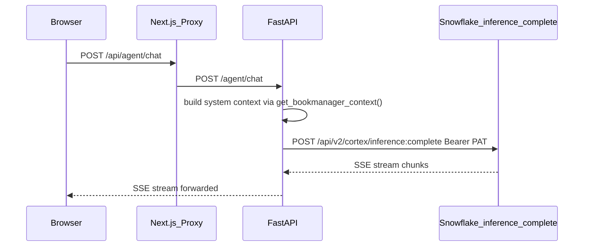

# Plan: Fix ACE Chat Endpoint

## Root Cause

`_stream_agent()` in [`backend/app/routers/agent.py`](backend/app/routers/agent.py) targets:

```
POST /api/v2/cortex/agents:run
Authorization: Snowflake Token="..."
X-Snowflake-Authorization-Token-Type: PROGRAMMATIC_ACCESS_TOKEN
```

This returns **HTTP 404** on `sfcogsops-snowhouse-aws-us-west-2`. Cortex Agents / Snowflake Intelligence is not enabled on this account.

## What Works

```
POST /api/v2/cortex/inference:complete
Authorization: Bearer <PAT>
```

- Returns **HTTP 200**, streaming works, SSE delta format is identical (`choices[0].delta.content`)
- Models available: `mistral-7b`, `llama3.1-70b` (claude-3-5-sonnet is **not** available here)
- No `[DONE]` sentinel — stream ends when connection closes, which the existing reader handles correctly via `if (done) break`

## Change: `_stream_agent()` in [`backend/app/routers/agent.py`](backend/app/routers/agent.py)

Three changes to the single function (~line 64–93):

**1. URL** — `agents:run` → `inference:complete`

**2. Auth headers** — drop `X-Snowflake-Authorization-Token-Type`, change `Snowflake Token=` to `Bearer`

**3. Request body** — remove `tools` and `tool_resources` (not supported by inference:complete); change model to `llama3.1-70b`

```python
async def _stream_agent(messages: list[dict]) -> AsyncIterator[str]:
    account = (settings.snowflake_account or "").replace("_", "-")
    url = f"https://{account}.snowflakecomputing.com/api/v2/cortex/inference:complete"
    headers = {
        "Authorization": f"Bearer {settings.snowflake_pat}",
        "Content-Type": "application/json",
        "Accept": "text/event-stream",
    }
    body = {
        "model": "llama3.1-70b",
        "messages": messages,
        "stream": True,
    }
    async with httpx.AsyncClient(timeout=120) as client:
        async with client.stream("POST", url, headers=headers, json=body) as resp:
            resp.raise_for_status()
            async for line in resp.aiter_lines():
                if line.startswith("data: "):
                    payload = line[6:]
                    if payload.strip() == "[DONE]":
                        yield "data: [DONE]\n\n"
                        return
                    try:
                        evt = json.loads(payload)
                        delta = (
                            evt.get("choices", [{}])[0]
                            .get("delta", {})
                            .get("content", "")
                        )
                        if delta:
                            yield f"data: {json.dumps({'text': delta})}\n\n"
                    except Exception:
                        pass
```

No changes needed to:
- Frontend `streamChat()` — already handles stream-close via `done=true`
- `ChatRequest`, `chat()` endpoint, or `get_bookmanager_context()` — system context injection is unaffected

## Data Flow (after fix)



## Trade-off Note

Switching from `agents:run` to `inference:complete` removes the Raven tool integrations (Sales_Knowledge_Assistant cortex_search, Use_Case_Explorer, etc.). The chat will respond using only the system context injected by `get_bookmanager_context()` — your account/use-case data. This is still functional and contextual; it just won't do live tool lookups against Raven's Cortex Search or semantic models.
