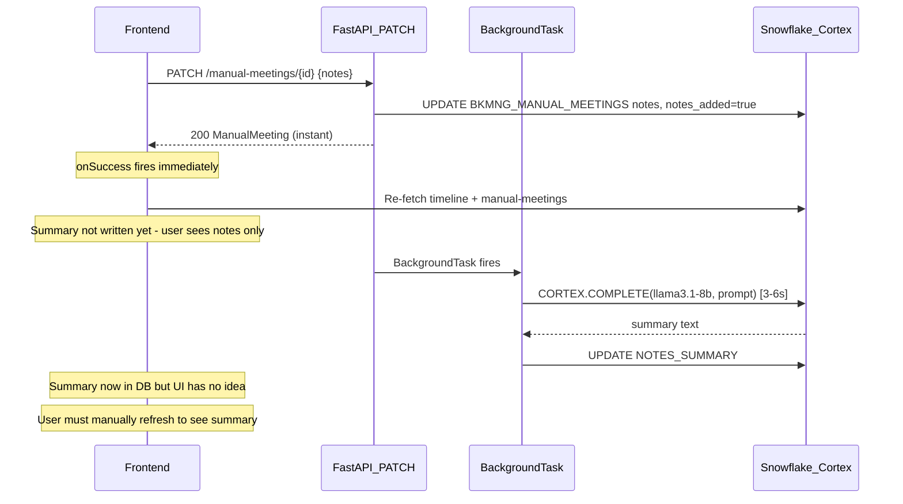

# Plan: Fix Meeting Notes Summarization + Surface Generation State

## Background Process Timing



**Single account refresh time:** 7 queries fire in parallel (`account`, `use-cases`, `timeline`, `manual-meetings`, `gong-calls`, `context`, `situations`). All are independent Snowflake round-trips. Bottleneck is the timeline UNION ALL query. Expected: **~1-2 seconds total.**

---

## Root Causes

### Bug 1 — SQL Escaping (summarization never runs)

In [`backend/app/services/snowflake_service.py`](backend/app/services/snowflake_service.py) ~line 1580:

```python
# BROKEN: Snowflake uses '' not \' to escape single quotes
escaped = prompt.replace("'", "\\'")
cur.execute(f"SELECT SNOWFLAKE.CORTEX.COMPLETE('llama3.1-8b', '{escaped}') AS SUMMARY")
```

Any apostrophe in notes ("today's", "can't") causes a SQL syntax error silently swallowed by `except Exception: pass`.

### Bug 2 — `notes_summary` missing from frontend type

[`bkmng-next/hooks/useApi.ts`](bkmng-next/hooks/useApi.ts) ~line 524 — `ManualMeeting` type does not include `notes_summary`, so the UI cannot distinguish "summary ready" from "summary still generating".

### Bug 3 — No delayed refetch after save

`useUpdateMeetingNotes.onSuccess` invalidates queries immediately, before the background task completes (~4-7s later). The summary is never surfaced without a manual refresh.

---

## Fix

### Step 1 — Fix SQL escaping + add logging

**File:** [`backend/app/services/snowflake_service.py`](backend/app/services/snowflake_service.py)

**1a.** Add `import logging` and `logger = logging.getLogger(__name__)` at the top with the other imports.

**1b.** Remove the `escaped = ...` line. Replace the f-string execute with a parameterized call — identical to all other `CORTEX.COMPLETE` calls in the same file (lines 559, 891, 1097, 2108):

```python
# BEFORE
escaped = prompt.replace("'", "\\'")
cur = self._cursor()
try:
    cur.execute(
        f"SELECT SNOWFLAKE.CORTEX.COMPLETE('llama3.1-8b', '{escaped}') AS SUMMARY"
    )
    ...
except Exception:
    pass

# AFTER
cur = self._cursor()
try:
    cur.execute(
        "SELECT SNOWFLAKE.CORTEX.COMPLETE('llama3.1-8b', %s) AS SUMMARY",
        (prompt,),
    )
    ...
except Exception as e:
    logger.error("Meeting summary failed for %s: %s", meeting_id, e)
```

---

### Step 2 — Add `notes_summary` to the frontend type

**File:** [`bkmng-next/hooks/useApi.ts`](bkmng-next/hooks/useApi.ts) ~line 524

```typescript
// BEFORE
export type ManualMeeting = {
  ...
  notes: string | null;
  notes_added: boolean;
  ...
};

// AFTER
export type ManualMeeting = {
  ...
  notes: string | null;
  notes_summary: string | null;   // ← add this
  notes_added: boolean;
  ...
};
```

---

### Step 3 — Auto-refetch 7 seconds after saving notes

**File:** [`bkmng-next/hooks/useApi.ts`](bkmng-next/hooks/useApi.ts) — `useUpdateMeetingNotes.onSuccess`

```typescript
// BEFORE
onSuccess: () => {
  qc.invalidateQueries({ queryKey: ["manual-meetings", accountId] });
  qc.invalidateQueries({ queryKey: ["account-timeline", accountId] });
},

// AFTER
onSuccess: () => {
  qc.invalidateQueries({ queryKey: ["manual-meetings", accountId] });
  qc.invalidateQueries({ queryKey: ["account-timeline", accountId] });
  // Pick up the LLM summary after the background task completes (~4-7s)
  setTimeout(() => {
    qc.invalidateQueries({ queryKey: ["manual-meetings", accountId] });
    qc.invalidateQueries({ queryKey: ["account-timeline", accountId] });
  }, 7000);
},
```

---

### Step 4 — Show "Generating summary..." badge in the meeting card

**File:** [`bkmng-next/app/accounts/[id]/page.tsx`](bkmng-next/app/accounts/[id]/page.tsx) — Scheduled Meetings card

When a meeting has `notes_added=true` but `notes_summary=null`, the summary is in flight. Show a subtle inline badge so the user can see something is happening:

```tsx
{/* Inside the meeting list item, after attendees line */}
{meeting.notes_added && !meeting.notes_summary && (
  <span className="inline-flex items-center gap-1 text-[10px] text-amber-600">
    <RefreshCw size={9} className="animate-spin" />
    Generating summary…
  </span>
)}
{meeting.notes_added && meeting.notes_summary && (
  <p className="text-[11px] text-slate-500 italic line-clamp-2 mt-0.5">
    {meeting.notes_summary}
  </p>
)}
```

---

## What the user sees after all fixes

| Moment | UI state |
|---|---|
| Save notes | Modal closes, meeting card immediately shows notes saved (green) |
| 0-7s | Card shows "Generating summary..." spinner badge |
| ~7s auto-refetch | If LLM completed, spinner disappears, summary preview appears in card and on Timeline |
| If LLM took longer | Next manual Refresh shows it |
