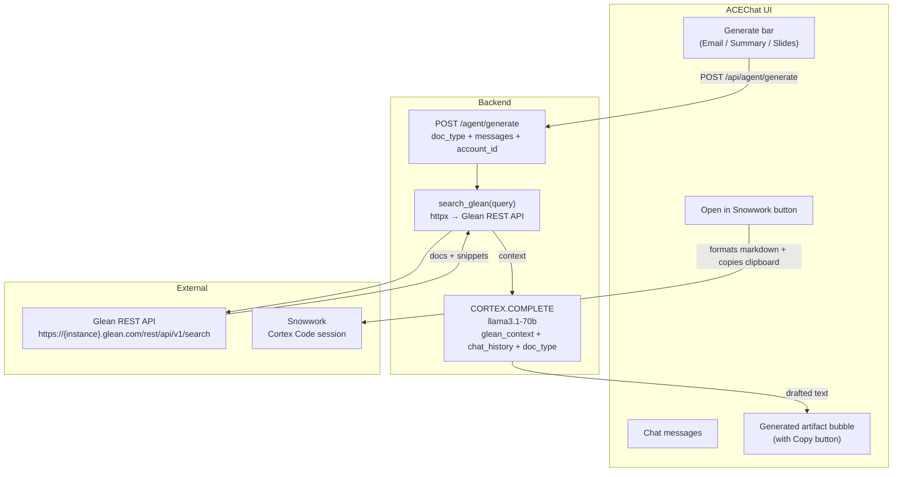

# Plan: Glean Integration + Open in Snowwork

## Overview

Two independent features that build on the existing ACEChat pipeline:

1. **Glean search context + document generation** — ACE can search Glean for account-specific docs (meeting notes, past proposals, battle cards), then use that context to draft follow-up emails, meeting summaries, and slide outlines via CORTEX.COMPLETE.

2. **Open in Snowwork** — a button in the ACEChat header that serializes the full conversation and account context as a formatted prompt, copies it to clipboard, and opens a new Snowflake session tab. The user pastes it into Snowwork (Cortex Code) to continue with capabilities BookManager can't handle (demos, PowerPoints, code generation).

---

## Architecture



---

## Feature 1: Glean Context + Document Generation

### Task 1 — Glean config in `.env` and `config.py`

File: [`backend/.env`](BookManager/backend/.env)
```
GLEAN_BASE_URL=https://{your-instance}.glean.com/rest/api/v1
GLEAN_API_TOKEN=your-glean-api-token
```

File: [`backend/app/config.py`](BookManager/backend/app/config.py)
```python
glean_base_url: Optional[str] = None
glean_api_token: Optional[str] = None
```

These are optional — if not set, document generation falls back to pure CORTEX.COMPLETE without Glean context.

---

### Task 2 — `search_glean()` in `snowflake_service.py`

New method at the end of `SnowflakeDataService`, after `call_cortex_analyst()`:

```python
def search_glean(self, query: str, account_name: Optional[str] = None) -> list[dict]:
    import httpx
    from app.config import settings
    if not settings.glean_base_url or not settings.glean_api_token:
        return []
    scoped_query = f"{account_name} {query}" if account_name else query
    resp = httpx.post(
        f"{settings.glean_base_url}/search",
        headers={
            "Authorization": f"Bearer {settings.glean_api_token}",
            "Content-Type": "application/json",
        },
        json={"query": scoped_query, "pageSize": 5, "datasourceFilter": ["GDRIVE", "SLACK", "CONFLUENCE"]},
        timeout=8,
    )
    resp.raise_for_status()
    results = resp.json().get("results", [])
    return [
        {
            "title": r.get("document", {}).get("title", ""),
            "snippet": r.get("snippets", [{}])[0].get("text", ""),
            "url": r.get("document", {}).get("url", ""),
        }
        for r in results[:5]
    ]
```

Glean's `/search` API returns `results[].document.title`, `results[].snippets[].text`, `results[].document.url`. If Glean is unavailable or not configured, returns empty list — generation still works via CORTEX.COMPLETE alone.

---

### Task 3 — `/agent/generate` endpoint

New endpoint in [`backend/app/routers/agent.py`](BookManager/backend/app/routers/agent.py):

```python
class GenerateRequest(BaseModel):
    doc_type: str  # "email" | "meeting_summary" | "slide_outline"
    messages: list[ChatMessage]
    account_id: Optional[str] = None
    account_name: Optional[str] = None

@router.post("/generate")
async def generate_document(
    req: GenerateRequest,
    user: CurrentUser = Depends(get_current_user),
    data = Depends(get_data_service),
):
    doc_type = req.doc_type
    account_name = req.account_name or ""
    history = "\n".join(
        f"{'User' if m.role == 'user' else 'ACE'}: {m.content}"
        for m in req.messages
        if m.role in ("user", "assistant")
    )
    # Pull Glean context
    glean_results = []
    if hasattr(data, "search_glean"):
        query_map = {
            "email": "follow-up email template account notes",
            "meeting_summary": "meeting notes action items",
            "slide_outline": "pitch deck slides overview",
        }
        glean_results = data.search_glean(query_map.get(doc_type, ""), account_name)
    glean_ctx = ""
    if glean_results:
        glean_ctx = "Relevant documents from Glean:\n" + "\n".join(
            f'- {r["title"]}: {r["snippet"]}' for r in glean_results
        ) + "\n\n"
    # Build prompt per doc_type
    instructions = {
        "email": "Write a professional follow-up email to the customer. Be specific and reference the conversation points.",
        "meeting_summary": "Write a concise meeting summary with: attendees context, key discussion points, decisions made, and action items.",
        "slide_outline": "Create a slide-by-slide outline for a presentation. Each slide: title + 3-5 bullet points. 8-10 slides total.",
    }
    prompt = (
        f"You are an enterprise sales assistant at Snowflake.\n"
        f"{glean_ctx}"
        f"Conversation history:\n{history}\n\n"
        f"Task: {instructions.get(doc_type, 'Generate a professional document.')}\n"
        f"Account: {account_name or 'the customer'}\n\n"
        f"Output:"
    )
    def _generate():
        cur = data._cursor()
        cur.execute("SELECT SNOWFLAKE.CORTEX.COMPLETE('llama3.1-70b', %s) AS response", (prompt,))
        row = cur.fetchone()
        return ((row or {}).get("RESPONSE") or "").strip()
    content = await asyncio.to_thread(_generate)
    return {"doc_type": doc_type, "content": content, "glean_sources": glean_results}
```

---

### Task 4 — Generate action bar + artifact bubble in `ACEChat.tsx`

File: [`bkmng-next/components/dashboard/ACEChat.tsx`](BookManager/bkmng-next/components/dashboard/ACEChat.tsx)

**State additions:**
```typescript
const [generatedDoc, setGeneratedDoc] = useState<{type: string; content: string; sources: any[]} | null>(null);
const [generating, setGenerating] = useState(false);
```

**Generate function:**
```typescript
const generateDocument = async (docType: "email" | "meeting_summary" | "slide_outline") => {
  setGenerating(true);
  setGeneratedDoc(null);
  try {
    const res = await fetch("/api/agent/generate", {
      method: "POST",
      headers: { "Content-Type": "application/json", ...(mockUserId ? {"X-Mock-User": mockUserId} : {}) },
      body: JSON.stringify({
        doc_type: docType,
        messages: messages.filter(m => m.role === "user" || m.role === "assistant"),
        account_id: accountId ?? null,
        account_name: null,
      }),
    });
    const data = await res.json();
    setGeneratedDoc({ type: docType, content: data.content, sources: data.glean_sources || [] });
  } finally {
    setGenerating(false);
  }
};
```

**Generate bar** (rendered below the input, when `messages.length >= 2`):
```tsx
{messages.length >= 2 && (
  <div className="border-t border-slate-100 px-3 py-2 flex gap-1.5 flex-wrap">
    <span className="text-[10px] text-slate-400 w-full mb-0.5">Generate</span>
    {[
      { type: "email", label: "Follow-up Email" },
      { type: "meeting_summary", label: "Meeting Summary" },
      { type: "slide_outline", label: "Slide Outline" },
    ].map(({ type, label }) => (
      <button key={type}
        onClick={() => generateDocument(type as any)}
        disabled={generating || streaming}
        className="text-[11px] px-2.5 py-1 rounded-full border border-slate-200 bg-slate-50 text-slate-600 hover:bg-slate-100 disabled:opacity-40"
      >
        {generating ? <Loader2 size={10} className="inline animate-spin mr-1" /> : null}
        {label}
      </button>
    ))}
  </div>
)}
```

**Artifact bubble** (rendered in the message list when `generatedDoc` is set):
```tsx
{generatedDoc && (
  <div className="mx-4 mb-3 rounded-xl border border-sky-100 bg-sky-50 p-3">
    <div className="flex items-center justify-between mb-2">
      <span className="text-[11px] font-semibold text-sky-700 uppercase tracking-wide">
        {generatedDoc.type.replace("_", " ")}
      </span>
      <button
        onClick={() => navigator.clipboard.writeText(generatedDoc.content)}
        className="text-[10px] px-2 py-0.5 rounded border border-sky-200 text-sky-600 hover:bg-sky-100"
      >
        Copy
      </button>
    </div>
    <pre className="text-xs text-slate-700 whitespace-pre-wrap leading-relaxed max-h-48 overflow-y-auto">
      {generatedDoc.content}
    </pre>
    {generatedDoc.sources.length > 0 && (
      <div className="mt-2 text-[10px] text-slate-400">
        Glean sources: {generatedDoc.sources.map(s => s.title).join(", ")}
      </div>
    )}
  </div>
)}
```

---

## Feature 2: Open in Snowwork

### Task 5 — "Open in Snowwork" button in `ACEChat.tsx`

This button formats the chat conversation as a structured Markdown prompt, copies it to clipboard, and opens Snowwork in a new tab.

**Serializer function:**
```typescript
const openInSnowwork = () => {
  const lines: string[] = [
    "# BookManager ACE Chat — Continue in Snowwork",
    "",
    accountId ? `**Account context loaded** (ID: ${accountId})` : "**Portfolio-level context**",
    "",
    "## Conversation",
    ...messages
      .filter(m => m.id !== "intro")
      .map(m => `**${m.role === "user" ? "User" : "ACE"}:** ${m.content}`),
    "",
    "---",
    "Continue this conversation below. You have access to all BookManager ONT data.",
    "Suggested next steps: build a demo, create a PowerPoint deck, write a proposal, or run advanced analysis.",
  ];
  const text = lines.join("\n");
  navigator.clipboard.writeText(text);
  setSnowworkToast(true);
  window.open(
    `https://app.snowflake.com/${import.meta.env?.NEXT_PUBLIC_SNOWFLAKE_ACCOUNT ?? "sfcogsops-snowhouse-aws-us-west-2"}`,
    "_blank"
  );
  setTimeout(() => setSnowworkToast(false), 4000);
};
```

**State:** `const [snowworkToast, setSnowworkToast] = useState(false);`

**Button placement** — in the ACEChat header, between the title and X close button:
```tsx
<button
  onClick={openInSnowwork}
  title="Open in Snowwork"
  className="text-[10px] px-2 py-0.5 rounded border border-sky-200 text-sky-600 hover:bg-sky-100 flex items-center gap-1"
>
  <ExternalLink size={10} />
  Snowwork
</button>
```

**Toast overlay** (in the chat panel, rendered when `snowworkToast` is true):
```tsx
{snowworkToast && (
  <div className="absolute bottom-16 left-0 right-0 mx-4 rounded-lg bg-sky-600 text-white text-xs px-3 py-2 text-center shadow-lg">
    Context copied to clipboard — paste it in Snowwork to continue
  </div>
)}
```

Add `ExternalLink` to the lucide-react import line.

---

## File Change Summary

| File | Change |
|---|---|
| `backend/.env` | Add `GLEAN_BASE_URL` and `GLEAN_API_TOKEN` |
| `backend/app/config.py` | Add `glean_base_url` and `glean_api_token` optional fields |
| `backend/app/services/snowflake_service.py` | Add `search_glean()` method |
| `backend/app/routers/agent.py` | Add `GenerateRequest` model + `POST /agent/generate` endpoint |
| `bkmng-next/components/dashboard/ACEChat.tsx` | Generate bar, artifact bubble, Open in Snowwork button + toast |

---

## Notes on Glean Configuration

The plan uses Glean's REST search API directly (`POST /rest/api/v1/search`). The `GLEAN_BASE_URL` will vary by company deployment:
- Glean-hosted: `https://{company}-be.glean.com/rest/api/v1`
- Self-hosted: your instance URL

If you later want the full MCP protocol (for tool-calling, multi-step workflows), the `mcp` Python package can replace `search_glean()` using `sse_client` connecting to `https://{company}.glean.com/mcp/sse`. The `/agent/generate` endpoint interface would stay the same.

Until `GLEAN_BASE_URL` and `GLEAN_API_TOKEN` are set in `.env`, document generation works without Glean context (CORTEX.COMPLETE uses only the conversation history).
