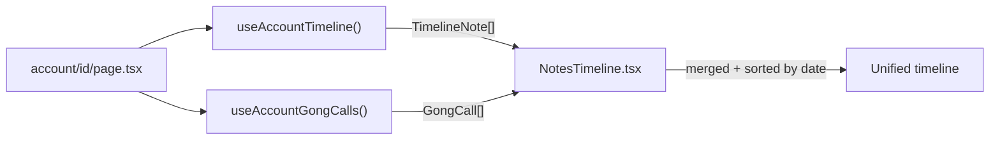

# Plan: Fix Gong Calls + Integrate into Timeline

## Local Dev Status

Yes, the code changes are live — uvicorn `--reload` auto-applies file edits. **However**, the backend likely crashed during the transition when `app/mocks/` was deleted before router imports were fixed. If the backend process exited, it will not auto-restart; the user needs to `kill` and relaunch it.

---

## Task 1 — Fix Gong Calls Not Showing

**Root cause**: [`backend/app/routers/misc.py`](BookManager/backend/app/routers/misc.py) line 34 applies `ace_filter` to the per-account endpoint. When someone is using the user switcher and viewing an account belonging to a different ACE profile, the SQL filters out all results:

```python
# Current — filters are AND'd together:
# WHERE ACCOUNT_ID IN (...ACE_ASSIGNED = 'redacted@example.com')
# AND ACCOUNT_ID = '0010Z...'  ← zero rows if account belongs to someone else
return data.list_gong_calls(account_id=account_id, ace_filter=_ace_filter(user))
```

For a per-account call, `account_id` already fully scopes the results. The `ace_filter` is redundant and harmful. **Fix**: remove it from the per-account endpoint only:

```python
@router.get("/accounts/{account_id}/gong-calls", response_model=list[GongCall])
async def list_account_gong_calls(
    account_id: str,
    data: SnowflakeDataService = Depends(get_data_service),
) -> list[GongCall]:
    return data.list_gong_calls(account_id=account_id)  # no ace_filter
```

The global `GET /gong-calls` endpoint (which returns calls across all accounts) keeps the `ace_filter` scoping.

---

## Task 2 — Add Gong Calls to the Timeline

**Approach**: Frontend merge. Both `timelineNotes` and `gongCalls` are already fetched on the account detail page. Pass gong calls into `NotesTimeline.tsx`, merge and sort by date, and render with distinct visual treatment.

### Data flow



### 2a — Update `NotesTimeline.tsx`

Add a `gongCalls` prop, merge into a unified `TimelineEvent[]`, sort descending by date, and render a separate card style for call events.

```tsx
// New union type at top of file
type TimelineEvent =
  | { kind: 'note'; data: TimelineNote }
  | { kind: 'call'; data: GongCall }

// Props update
interface NotesTimelineProps {
  accountId: string
  gongCalls?: GongCall[]   // new optional prop
}

// Merge + sort inside component
const events: TimelineEvent[] = useMemo(() => {
  const noteEvents = (notes ?? []).map(n => ({ kind: 'note' as const, data: n }))
  const callEvents = (gongCalls ?? []).map(c => ({ kind: 'call' as const, data: c }))
  return [...noteEvents, ...callEvents].sort(
    (a, b) => new Date(b.kind === 'note' ? b.data.created_at : b.data.call_date).getTime()
           - new Date(a.kind === 'note' ? a.data.created_at : a.data.call_date).getTime()
  )
}, [notes, gongCalls])
```

**Gong call card design** (consistent with the note card style — vertical line, avatar, content):
- Avatar: phone icon in a purple-100 circle (distinct from note initials)
- Header: call title (or "Gong Call") + duration badge
- Body: summary (clamped to 3 lines), topics pills (up to 4), participants (comma list)
- No use-case link (unlike notes which link to Salesforce)
- Date grouped the same way as notes (ISO date key → calendar date header)

### 2b — Update account detail page

Pass gong calls into `NotesTimeline`:
```tsx
// bkmng-next/app/accounts/[id]/page.tsx — in the Timeline tab
<NotesTimeline accountId={accountId} gongCalls={gongCalls} />
```

The existing "Recent Gong Calls" sidebar section stays unchanged — it's a quick-access widget. The timeline tab gives the full chronological view.
