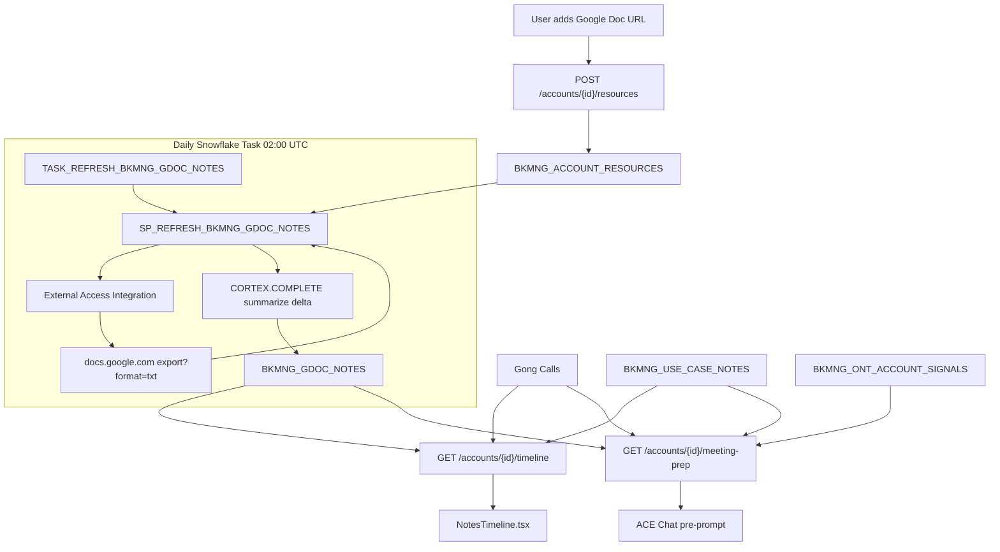

# Plan: Google Docs Extraction + Meeting Prep Pipeline

## Overview

The existing "Add info" form in the account detail sidebar ([`bkmng-next/app/accounts/[id]/page.tsx:966-993`](bkmng-next/app/accounts/[id]/page.tsx)) accepts a URL but only writes to in-memory React state — resources are lost on reload. This plan persists those links, extracts Google Doc content on a daily cadence via a Snowflake task, surfaces summaries in the timeline alongside Gong notes, and wires everything into a meeting prep experience in ACE chat.

## Architecture



---

## Phase 1: Persist Resources to Snowflake

**Problem**: `handleAddResource` at [`page.tsx:523`](bkmng-next/app/accounts/[id]/page.tsx) only writes to `localResources` state. The backend stub at [`misc.py:36`](backend/app/routers/misc.py) returns `[]` with no POST/DELETE.

### Snowflake table

```sql
CREATE TABLE TEMP.JUSDAVIS.BKMNG_ACCOUNT_RESOURCES (
    RESOURCE_ID     VARCHAR DEFAULT UUID_STRING(),
    ACCOUNT_ID      VARCHAR NOT NULL,
    TITLE           VARCHAR,
    RESOURCE_TYPE   VARCHAR,  -- 'note' | 'link'
    CONTENT         VARCHAR,  -- URL for links, text for notes
    LINK_TYPE       VARCHAR,  -- 'gdoc' | 'external' | NULL
    CREATED_BY      VARCHAR,
    CREATED_AT      TIMESTAMP DEFAULT CURRENT_TIMESTAMP(),
    IS_ACTIVE       BOOLEAN DEFAULT TRUE
);
```

`LINK_TYPE = 'gdoc'` is auto-detected on insert when `CONTENT LIKE '%docs.google.com%'`.

### Backend changes

- [`backend/app/routers/misc.py`](backend/app/routers/misc.py): Add `POST /accounts/{id}/resources` and `DELETE /accounts/{id}/resources/{resource_id}`
- [`backend/app/services/snowflake_service.py`](backend/app/services/snowflake_service.py): Implement `add_account_resource()` and `delete_account_resource()`; update `list_account_resources()` to query the table instead of returning `[]`

### Frontend changes

- [`bkmng-next/app/accounts/[id]/page.tsx`](bkmng-next/app/accounts/[id]/page.tsx): Replace `setLocalResources` in `handleAddResource` with a `POST /api/accounts/{id}/resources` call; add `useResources` hook instead of local state
- Add `useResources`, `useAddResource`, `useDeleteResource` hooks to [`bkmng-next/hooks/useApi.ts`](bkmng-next/hooks/useApi.ts)

---

## Phase 2: Google Docs Extraction

### Authentication approach

The simplest path that doesn't require per-user OAuth is **Google Docs export URL** — if the doc is shared as "anyone with link can view" (the most common way SE teams share internal notes docs), the plain-text export requires no auth:

```
https://docs.google.com/document/d/{DOC_ID}/export?format=txt
```

This works for "viewer" shared docs without a token. For org-restricted docs (requires Google login), a Google Service Account key would be needed — that can be stored as a Snowflake secret and passed as a Bearer token header. The SP is designed to support both: no-auth for public docs, Bearer token for org-restricted.

### Snowflake External Access Integration

```sql
CREATE NETWORK RULE BKMNG_GDOCS_RULE
    TYPE = HOST_PORT MODE = EGRESS
    VALUE_LIST = ('docs.google.com:443');

CREATE EXTERNAL ACCESS INTEGRATION BKMNG_GDOCS_EAI
    ALLOWED_NETWORK_RULES = (BKMNG_GDOCS_RULE)
    ENABLED = TRUE;
```

### Storage table

```sql
CREATE TABLE TEMP.JUSDAVIS.BKMNG_GDOC_NOTES (
    DOC_ID          VARCHAR,       -- Google Doc ID extracted from URL
    ACCOUNT_ID      VARCHAR,
    RESOURCE_ID     VARCHAR,       -- FK to BKMNG_ACCOUNT_RESOURCES
    EXTRACTED_AT    TIMESTAMP,
    CHAR_COUNT      NUMBER,
    RAW_CONTENT     VARCHAR(65535),
    DELTA_CONTENT   VARCHAR(65535), -- only new content since last extract
    SUMMARY         VARCHAR(4000),  -- CORTEX.COMPLETE summary of delta
    REFRESHED_AT    TIMESTAMP DEFAULT CURRENT_TIMESTAMP()
);
```

### Stored procedure logic

`SP_REFRESH_BKMNG_GDOC_NOTES` (EXECUTE AS OWNER, uses `BKMNG_GDOCS_EAI`):

```
FOR EACH row in BKMNG_ACCOUNT_RESOURCES WHERE LINK_TYPE='gdoc' AND IS_ACTIVE=TRUE:
  1. Extract DOC_ID from URL via REGEXP_SUBSTR
  2. SYSTEM$HTTP_REQUEST('GET', export_url, headers, ...) → raw text
  3. Compare char_count to previous extract in BKMNG_GDOC_NOTES
  4. If new content exists:
       delta = new_content[prev_char_count:]
       summary = CORTEX.COMPLETE('llama3.1-70b', 'Summarize new notes: ' || delta)
  5. MERGE INTO BKMNG_GDOC_NOTES ON DOC_ID
```

The SP only calls CORTEX.COMPLETE for the **delta** — new content appended since the last run. This keeps summaries incremental ("Notes added since last check: …") rather than re-summarizing the whole document every day.

### Task

```sql
CREATE TASK TASK_REFRESH_BKMNG_GDOC_NOTES
    WAREHOUSE = SE_XS_WH
    SCHEDULE = 'USING CRON 0 2 * * * UTC'
AS CALL TEMP.JUSDAVIS.SP_REFRESH_BKMNG_GDOC_NOTES();
```

---

## Phase 3: Timeline Integration

**Current state**: [`get_account_timeline()`](backend/app/services/snowflake_service.py) queries only `BKMNG_USE_CASE_NOTES`. The [`NotesTimeline.tsx`](bkmng-next/components/account-detail/NotesTimeline.tsx) renders those alongside Gong calls passed as props.

### Backend change

Extend `get_account_timeline()` to UNION `BKMNG_GDOC_NOTES` summaries:

```sql
-- existing: BKMNG_USE_CASE_NOTES
SELECT note_id, use_case_name, note_date, author_id, content, 'ps_note' AS source
FROM BKMNG_USE_CASE_NOTES WHERE ACCOUNT_ID = %s

UNION ALL

-- new: Google Doc delta summaries
SELECT doc_id, title, extracted_at, 'Google Doc' AS author_id, summary, 'gdoc' AS source
FROM BKMNG_GDOC_NOTES gdn
JOIN BKMNG_ACCOUNT_RESOURCES bar ON gdn.resource_id = bar.resource_id
WHERE gdn.ACCOUNT_ID = %s AND summary IS NOT NULL

ORDER BY created_at DESC
```

Add `source: str` and `link: Optional[str]` to the `PSNote` model in [`backend/app/models/account.py`](backend/app/models/account.py).

### Frontend change

In [`NotesTimeline.tsx`](bkmng-next/components/account-detail/NotesTimeline.tsx): render `gdoc` entries with a Google Doc icon and a link to the original doc URL (stored in `BKMNG_ACCOUNT_RESOURCES.CONTENT`), visually distinguished from PS notes (e.g., sky border vs. slate border).

---

## Phase 4: Meeting Prep Endpoint + ACE Integration

### New backend endpoint

`GET /accounts/{id}/meeting-prep` in [`backend/app/routers/accounts.py`](backend/app/routers/accounts.py):

```python
@router.get("/{account_id}/meeting-prep")
async def get_meeting_prep(account_id: str, user=Depends(get_current_user)):
    return data.get_meeting_prep_context(account_id, user.email)
```

`get_meeting_prep_context()` in [`snowflake_service.py`](backend/app/services/snowflake_service.py) assembles:

| Section | Source |
|---------|--------|
| Next meeting | `BKMNG_MEETING_ACTIVITY WHERE IS_UPCOMING=TRUE AND ACTIVITY_DATE <= DATEADD(day,14,CURRENT_DATE())` |
| Account signals | `BKMNG_ONT_ACCOUNT_SIGNALS` top 5 by priority |
| Recent Gong calls | `FIVETRAN.SALESFORCE.GONG_GONG_CALL_C` last 3 |
| Google Doc summaries | `BKMNG_GDOC_NOTES` for this account, ordered by `EXTRACTED_AT DESC` |
| PS note highlights | `BKMNG_USE_CASE_NOTES` last 5 by date |
| Contract health | `BKMNG_A360_CONTRACT` key metrics |

Returns a structured `MeetingPrepBrief` Pydantic model — not an AI summary itself, raw structured data.

### Meeting prep prompt construction

A new hook `useMeetingPrep(accountId)` fetches the brief and constructs the ACE initial prompt:

```
I'm preparing for an upcoming meeting with {account_name} on {next_meeting_date}.

**Active signals:** {signals_summary}
**Contract health:** {contract_summary}
**Recent call highlights:** {gong_summary}
**Notes from Google Docs:** {gdoc_summary}

Based on this context, what are the key topics I should cover and what actions should I recommend?
```

### Frontend: "Prep for meeting" button

In [`bkmng-next/app/accounts/[id]/page.tsx`](bkmng-next/app/accounts/[id]/page.tsx): add a "Prep for meeting" button in the account header — visible only when `account.upcoming_meetings_5d > 0`. On click, switches to the `assistant` tab and passes the constructed prep prompt as `initialPrompt` to `AIChatPanel`.

```tsx
{account.upcoming_meetings_5d > 0 && (
  <button onClick={() => { setTab("assistant"); setPrepMode(true); }}
    className="...">
    Prep for meeting
  </button>
)}
```

The `AIChatPanel` [`bkmng-next/components/account-detail/AIChatPanel.tsx`](bkmng-next/components/account-detail/AIChatPanel.tsx) already supports `initialPrompt` — it fires on mount via the `sendMessageRef` pattern. No changes needed to the chat component itself.

---

## Updated Task Chain

```
02:00 UTC  TASK_REFRESH_BKMNG_GDOC_NOTES  (new)
03:00 UTC  TASK_REFRESH_BKMNG_MEETING_ACTIVITY
04:00 UTC  TASK_REFRESH_BKMNG_ONT_ACCOUNT_SIGNALS
04:25 UTC  TASK_REFRESH_BKMNG_ONT_ACCOUNTS
```

---

## Key Notes

- **Google auth**: The SP works without auth for "anyone with link" Google Docs. For org-restricted docs, a Google Service Account key can be stored as a Snowflake secret and passed as `Authorization: Bearer {token}` in `SYSTEM$HTTP_REQUEST`. This is a configuration decision, not a code change.
- **Rate limiting**: The SP processes one HTTP request per registered Google Doc resource. With a daily cadence and likely fewer than 20 docs total, this is well within Google's unauthenticated rate limits.
- **SYSTEM$HTTP_REQUEST**: Requires Snowflake Business Critical or above for some account types. Verify this is available on `SNOWHOUSE_AWS_US_WEST_2` before execution.
