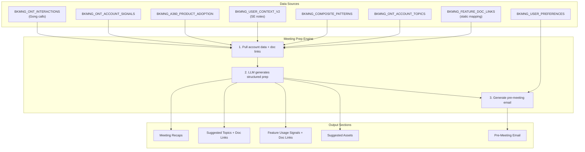

# Plan: Meeting Prep v2 Workflow

## Overview

Redesign the meeting prep system from a basic LLM-generated recap into a structured, multi-section intelligence brief. The new workflow produces:

1. **Recent Meeting Recaps** (last 2-3 meetings, structured per-meeting with Gong links)
2. **Suggested Topics with Justification** (backed by signals, notes, transcripts, with Snowflake doc links)
3. **New Product Feature Usage Signals** (from `BKMNG_A360_PRODUCT_ADOPTION` IS_NEW_30D data, with doc links)
4. **Suggested Assets to Build** (demos, PDF guides, notebooks — inferred from topics + adoption)
5. **Pre-Meeting Email Draft** (personalized using user preferences from `BKMNG_USER_PREFERENCES`)

No competitive context section (dropped per user request).



---

## Task 1: Create feature-to-doc-URL mapping table

There is **no populated Snowflake documentation Cortex Search service** on Snowhouse. The `CKE_SNOWFLAKE_DOCS_SERVICE` exists but has 0 rows. The Raven search (`FILE_SEARCH_SERVICE_PAGENUM_PROD`) only has Seismic sales assets, not docs.snowflake.com links.

**Solution:** Create a static mapping table `BKMNG_FEATURE_DOC_LINKS` that maps each of the ~102 distinct features from `BKMNG_A360_PRODUCT_ADOPTION` to their corresponding docs.snowflake.com URL.

```sql
CREATE TABLE TEMP.JUSDAVIS.BKMNG_FEATURE_DOC_LINKS (
    FEATURE         VARCHAR NOT NULL,
    PRODUCT_CATEGORY VARCHAR,
    DOC_URL         VARCHAR NOT NULL,
    DOC_TITLE       VARCHAR,
    PRIMARY KEY (FEATURE)
);
```

Seed with mappings via a single INSERT...VALUES statement. Examples:

| FEATURE | DOC_URL | DOC_TITLE |
|---------|---------|-----------|
| Cortex AI Functions | https://docs.snowflake.com/en/user-guide/snowflake-cortex/llm-functions | Cortex LLM Functions |
| Cortex Analyst (Direct) | https://docs.snowflake.com/en/user-guide/snowflake-cortex/cortex-analyst | Cortex Analyst |
| Cortex Search (Direct) | https://docs.snowflake.com/en/user-guide/snowflake-cortex/cortex-search/cortex-search-overview | Cortex Search |
| SPCS CPU | https://docs.snowflake.com/en/developer-guide/snowpark-container-services/overview | Snowpark Container Services |
| Streamlit | https://docs.snowflake.com/en/developer-guide/streamlit/about-streamlit | Streamlit in Snowflake |
| Dynamic table access | https://docs.snowflake.com/en/user-guide/dynamic-tables-about | Dynamic Tables |
| Snowpipe streaming v2 | https://docs.snowflake.com/en/user-guide/data-load-snowpipe-streaming-overview | Snowpipe Streaming |
| Iceberg DML | https://docs.snowflake.com/en/user-guide/tables-iceberg | Iceberg Tables |
| dbt projects in Snowflake | https://docs.snowflake.com/en/developer-guide/dbt/dbt-snowflake | dbt in Snowflake |
| Snowflake Postgres | https://docs.snowflake.com/en/user-guide/postgres/overview | Snowflake Postgres |
| ...etc for all ~102 features | | |

This will be generated using web search and LLM assistance to produce correct docs.snowflake.com URLs for each feature. Multiple related features (e.g., "Iceberg DML", "Iceberg DT refresh", "Iceberg Snowpipe") can share the same doc URL since they point to the same product area.

---

## Task 2: Extend `generate_meeting_prep` with new data pulls and restructured LLM prompt

**File:** [backend/app/services/snowflake_service.py](BookManager/backend/app/services/snowflake_service.py) (lines 995-1185)

### New data queries added to `generate_meeting_prep`:

**Product adoption (new features last 30 days):**
```sql
SELECT pa.PRODUCT_CATEGORY, pa.FEATURE, pa.FIRST_USE_DATE, pa.TOTAL_REVENUE_90D,
       dl.DOC_URL, dl.DOC_TITLE
FROM TEMP.JUSDAVIS.BKMNG_A360_PRODUCT_ADOPTION pa
LEFT JOIN TEMP.JUSDAVIS.BKMNG_FEATURE_DOC_LINKS dl ON pa.FEATURE = dl.FEATURE
WHERE pa.ACCOUNT_ID = %s AND pa.IS_NEW_30D = TRUE
ORDER BY pa.FIRST_USE_DATE DESC
```

**Account topics from Gong (filtered, top 8):**
```sql
SELECT TOPIC, MENTION_COUNT_90D, LAST_MENTIONED_DATE
FROM TEMP.JUSDAVIS.BKMNG_ONT_ACCOUNT_TOPICS
WHERE ACCOUNT_ID = %s
  AND TOPIC NOT IN ('Small Talk','Call Setup','Wrap-Up','Next Steps','Building Announcements')
ORDER BY MENTION_COUNT_90D DESC LIMIT 8
```

**Expand interactions from 3 to 5 recent calls** (existing query, just change LIMIT).

**All feature doc links for this account's active features:**
```sql
SELECT DISTINCT dl.FEATURE, dl.DOC_URL, dl.DOC_TITLE, dl.PRODUCT_CATEGORY
FROM TEMP.JUSDAVIS.BKMNG_A360_PRODUCT_ADOPTION pa
JOIN TEMP.JUSDAVIS.BKMNG_FEATURE_DOC_LINKS dl ON pa.FEATURE = dl.FEATURE
WHERE pa.ACCOUNT_ID = %s AND pa.IS_ACTIVE_30D = TRUE
```

### Restructured LLM prompt

The prompt will include all the new data and request a richer JSON structure. Key changes from current:
- Remove `competitive_context` field from output
- Add `meeting_recaps` (structured per-meeting, not flat summary)
- Add `feature_signals` (per new feature, with insight and suggested action)
- Add `suggested_assets` (demos/guides/notebooks inferred from topics and adoption)
- Each `suggested_topic` includes `feature_area` which will be used to attach doc links in post-processing

```
Output JSON schema:
{
  "meeting_recaps": [
    {"title":"...", "date":"...", "summary":"...",
     "key_decisions":["..."], "open_items":["..."]}
  ],
  "suggested_topics": [
    {"topic":"...", "justification":"...",
     "evidence_source":"signal|gong|notes|adoption",
     "priority":"high|medium", "feature_area":"..."}
  ],
  "feature_signals": [
    {"feature":"...", "category":"...", "first_use_date":"...",
     "insight":"...", "suggested_action":"..."}
  ],
  "suggested_assets": [
    {"asset_type":"demo|pdf_guide|notebook|workshop",
     "title":"...", "description":"...", "related_topic":"..."}
  ],
  "open_action_items": [
    {"item":"...", "source":"...", "owner":"..."}
  ]
}
```

**Post-processing:** After LLM returns, attach doc links to `suggested_topics` and `feature_signals` by matching `feature_area` / `feature` against the doc links query results. This keeps the LLM prompt focused on analysis, not URL generation.

---

## Task 3: Update BKMNG_MEETING_PREPS table schema

Add new columns to store the richer prep output:

```sql
ALTER TABLE TEMP.JUSDAVIS.BKMNG_MEETING_PREPS ADD COLUMN IF NOT EXISTS MEETING_RECAPS VARCHAR;
ALTER TABLE TEMP.JUSDAVIS.BKMNG_MEETING_PREPS ADD COLUMN IF NOT EXISTS FEATURE_SIGNALS VARCHAR;
ALTER TABLE TEMP.JUSDAVIS.BKMNG_MEETING_PREPS ADD COLUMN IF NOT EXISTS SUGGESTED_ASSETS VARCHAR;
ALTER TABLE TEMP.JUSDAVIS.BKMNG_MEETING_PREPS ADD COLUMN IF NOT EXISTS PRE_MEETING_EMAIL VARCHAR;
ALTER TABLE TEMP.JUSDAVIS.BKMNG_MEETING_PREPS ADD COLUMN IF NOT EXISTS DOC_LINKS VARCHAR;
```

Old columns (`last_meeting_recap`, `changes_since_last`, `suggested_agenda`, `questions_to_ask`, `competitive_context`) remain for backward compatibility. The frontend will prefer new columns when present and fall back to old ones.

Update the INSERT statement in `generate_meeting_prep` to populate the new columns.

---

## Task 4: Add pre-meeting email generation endpoint

**File:** [backend/app/routers/accounts.py](BookManager/backend/app/routers/accounts.py)

New endpoint:
```
POST /api/accounts/{account_id}/meeting-prep/email
Body: { "recipient_name": "...", "meeting_date": "..." }
```

Logic:
1. Load latest meeting prep for the account
2. Load user preferences from `BKMNG_USER_PREFERENCES` (greeting_style, closing_style, preferred_name, writing_examples)
3. Call `CORTEX.COMPLETE('llama3.1-70b', ...)` with a prompt that:
   - Structures suggested topics as concise pre-meeting agenda bullets
   - Mentions any relevant new feature adoption ("I noticed you recently started using X — happy to walk through best practices")
   - Applies the user's greeting/closing style
   - Matches writing tone from examples if provided
   - Keeps it to 150-200 words
4. Return `{ "subject": "...", "body": "..." }`
5. Store in `PRE_MEETING_EMAIL` column of `BKMNG_MEETING_PREPS`

---

## Task 5: Update MeetingPrepView.tsx with new sections

**File:** [bkmng-next/components/account-detail/MeetingPrepView.tsx](BookManager/bkmng-next/components/account-detail/MeetingPrepView.tsx)

Replace the current 6-section layout with a new 6-section layout:

### Section 1: Recent Meetings (replaces "Last Meeting")
- Cards for last 2-3 meetings, each showing: title, date, summary, key decisions, open items
- Gong recording link per call (external link icon)
- Collapsible per-meeting detail

### Section 2: Suggested Topics (enhanced "Suggested Agenda")
- Each topic shows: priority badge (high/medium), justification text, evidence source tag
- **Doc Links per topic**: clickable `docs.snowflake.com` links styled as small pill links with ExternalLink icon
- Grouped visually — high priority topics first

### Section 3: Feature Usage Signals (NEW)
- Card layout showing newly adopted features (last 30 days)
- Each entry: feature name, category pill, first use date, insight text, suggested action
- Doc link per feature (from the mapping table)

### Section 4: Suggested Assets to Build (NEW)
- Cards with asset type icon: `Monitor` for demo, `FileText` for PDF guide, `Code2` for notebook, `Users` for workshop
- Title, description, which suggested topic it relates to

### Section 5: Open Action Items (kept, with checkboxes)

### Section 6: Pre-Meeting Email (NEW)
- "Generate Email" button with recipient name + meeting date inputs
- Renders email with subject line + body in a styled email preview card (light blue background, monospace-ish)
- "Copy to Clipboard" button
- "Regenerate" button

The "Copy All" button at the top updates to include the new sections in its plaintext export.

---

## Task 6: Update TypeScript types and API hooks

**File:** [bkmng-next/hooks/useApi.ts](BookManager/bkmng-next/hooks/useApi.ts)

### New types:
```typescript
type DocLink = { url: string; title: string };
type MeetingRecap = {
  title: string; date: string; summary: string;
  key_decisions: string[]; open_items: string[];
  gong_url: string | null;
};
type SuggestedTopic = {
  topic: string; justification: string;
  evidence_source: "signal" | "gong" | "notes" | "adoption";
  priority: "high" | "medium"; feature_area: string;
  doc_links: DocLink[];
};
type FeatureSignal = {
  feature: string; category: string; first_use_date: string;
  insight: string; suggested_action: string;
  doc_links: DocLink[];
};
type SuggestedAsset = {
  asset_type: "demo" | "pdf_guide" | "notebook" | "workshop";
  title: string; description: string; related_topic: string;
};
```

### Extended MeetingPrep type (new fields alongside existing for backward compat):
```typescript
type MeetingPrep = {
  // existing fields kept...
  meeting_recaps: string | null;    // JSON string -> MeetingRecap[]
  feature_signals: string | null;   // JSON string -> FeatureSignal[]
  suggested_assets: string | null;  // JSON string -> SuggestedAsset[]
  pre_meeting_email: string | null;
  doc_links: string | null;         // JSON string -> Record<string, DocLink[]>
};
```

### New hook:
```typescript
export function useGeneratePrepEmail(accountId: string) {
  return useMutation<{subject: string; body: string}, unknown, {
    recipient_name?: string; meeting_date?: string;
  }>({
    mutationFn: (body) =>
      apiFetch(`/api/accounts/${accountId}/meeting-prep/email`, {
        method: "POST", body: JSON.stringify(body),
      }),
  });
}
```

---

## Task 7: Test and deploy to SPCS

1. Verify doc mapping table is populated and joinable
2. Test `generate_meeting_prep` locally for one account — verify JSON structure
3. Test email generation endpoint
4. Run TypeScript check
5. Docker build + push + ALTER SERVICE
