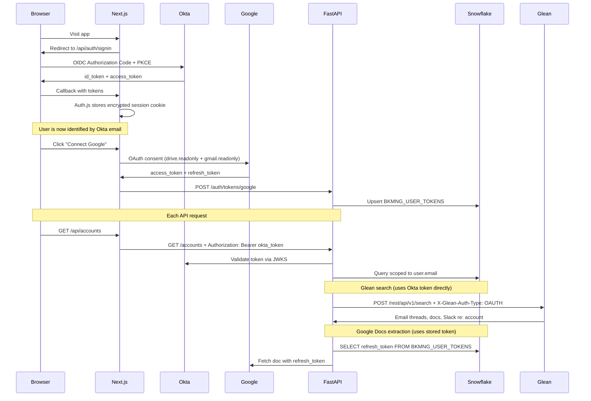

# Plan: Okta + Google + Glean Auth Integration

## Current State

BookManager has no real authentication. Identity is entirely header-based:
- Local dev: `X-Mock-User` header → `MOCK_USERS` dict in [`backend/app/auth/dependencies.py`](backend/app/auth/dependencies.py)
- SPCS: `Sf-Context-Current-User` header injected by Snowflake → `BKMNG_USERS` table lookup

The mock user switcher in [`bkmng-next/components/layout/Sidebar.tsx`](bkmng-next/components/layout/Sidebar.tsx) remains useful for demo/impersonation and is preserved.

## Token Flow Architecture



---

## Phase 1: Auth.js (NextAuth v5) + Okta OIDC

### What changes

- Replace `X-Mock-User` localStorage approach with a real Okta session
- The session cookie carries the Okta access token, which is forwarded to FastAPI on every request
- Mock user switcher stays in the sidebar but is gated to `APP_ENV=development` (still useful for demos)

### Next.js setup

Install: `npm install next-auth@beta`

New file: [`bkmng-next/auth.ts`](bkmng-next/auth.ts)
```typescript
import NextAuth from "next-auth";
import Okta from "next-auth/providers/okta";

export const { handlers, auth, signIn, signOut } = NextAuth({
  providers: [
    Okta({
      clientId: process.env.OKTA_CLIENT_ID!,
      clientSecret: process.env.OKTA_CLIENT_SECRET!,
      issuer: process.env.OKTA_ISSUER!,  // e.g. https://snowflake.okta.com/oauth2/default
    }),
  ],
  callbacks: {
    async jwt({ token, account }) {
      if (account) token.accessToken = account.access_token;
      return token;
    },
    async session({ session, token }) {
      session.accessToken = token.accessToken as string;
      session.user.email = token.email as string;
      return session;
    },
  },
});
```

New file: [`bkmng-next/app/api/auth/[...nextauth]/route.ts`](bkmng-next/app/api/auth/[...nextauth]/route.ts) — standard Auth.js route handler.

New file: [`bkmng-next/middleware.ts`](bkmng-next/middleware.ts) — protects all routes except `/api/auth/*`, redirects unauthenticated users to Okta login.

### Passing token to FastAPI

Update [`bkmng-next/hooks/useApi.ts`](bkmng-next/hooks/useApi.ts) `apiFetch()`:

```typescript
// Was: X-Mock-User header from localStorage
// Now: Authorization: Bearer <okta_access_token> from session
const session = await getSession();
headers["Authorization"] = `Bearer ${session?.accessToken}`;
// Keep X-Mock-User for local dev when session is absent
```

For server-side data fetching (Next.js Server Components), pass the token from `auth()` directly.

### FastAPI token validation

Update [`backend/app/auth/dependencies.py`](backend/app/auth/dependencies.py):

```python
# New path: validate Okta JWT via JWKS
async def get_current_user(authorization: str = Header(None), ...):
    if authorization and authorization.startswith("Bearer "):
        token = authorization.removeprefix("Bearer ")
        email = _validate_okta_jwt(token, settings.okta_issuer)
        user = _fetch_user_from_table(email) or _default_user(email)
        return user
    # Fallback: SPCS header, then X-Mock-User (dev only)
    ...

def _validate_okta_jwt(token: str, issuer: str) -> str:
    # Fetch JWKS from {issuer}/v1/keys, validate signature + claims
    # Return email claim
    import jwt  # PyJWT already in requirements
    ...
```

This means the FastAPI `get_current_user()` now trusts the Okta email claim instead of the `X-Mock-User` string. All existing `_ace_filter(user)` / `_acem_filter(user)` calls work unchanged since they use `user.email`.

### New environment variables

```
# .env (and docker-compose.yml frontend service)
OKTA_CLIENT_ID=...
OKTA_CLIENT_SECRET=...
OKTA_ISSUER=https://snowflake.okta.com/oauth2/default
NEXTAUTH_URL=http://localhost:3001
NEXTAUTH_SECRET=<random-32-char>
```

FastAPI also needs `OKTA_ISSUER` in [`backend/app/config.py`](backend/app/config.py) for JWT validation.

---

## Phase 2: Token Storage for Google + Glean

### Snowflake table

```sql
CREATE TABLE TEMP.JUSDAVIS.BKMNG_USER_TOKENS (
    USER_EMAIL      VARCHAR NOT NULL,
    PROVIDER        VARCHAR NOT NULL,  -- 'google' | 'glean'
    ACCESS_TOKEN    VARCHAR,           -- short-lived, refreshed on use
    REFRESH_TOKEN   VARCHAR,           -- long-lived, stored securely
    EXPIRES_AT      TIMESTAMP,
    SCOPES          VARCHAR,           -- comma-separated granted scopes
    UPDATED_AT      TIMESTAMP DEFAULT CURRENT_TIMESTAMP(),
    PRIMARY KEY (USER_EMAIL, PROVIDER)
);
```

Note: Tokens at rest in Snowflake are encrypted by Snowflake's storage encryption. For additional security, encrypt with a Python secret before storing (using `cryptography` library + a key stored in `.env`/SPCS secret). This is noted as a recommended enhancement.

### New backend endpoints

In [`backend/app/routers/auth.py`](backend/app/routers/auth.py) (new file):

```
POST /auth/tokens/google    — Store Google OAuth tokens after consent
POST /auth/tokens/glean     — Store Glean token (if using separate Glean OAuth)
GET  /auth/tokens/status    — Which providers are connected for current user
DELETE /auth/tokens/{provider} — Disconnect a provider
```

New service methods in [`backend/app/services/snowflake_service.py`](backend/app/services/snowflake_service.py): `store_user_token()`, `get_user_token()`, `refresh_google_token_if_needed()`.

---

## Phase 3: Google OAuth (Docs + Gmail)

Okta handles user *identity*. Google API access requires a separate OAuth 2.0 consent because Google Workspace restricts API scope grants to their own OAuth server (not Okta). This is a one-time "Connect Google" flow per user.

### Frontend

New "Connected Accounts" section in the sidebar (below user name):

```
Connected: [Google Docs] [Gmail]     (green checkmarks)
Not connected: [Connect Google →]    (link, opens consent)
```

Clicking "Connect Google" triggers:
```
GET /api/auth/google/connect → redirects to Google OAuth consent
  scopes: drive.readonly + gmail.readonly + offline_access
```

After consent, Google redirects to `/api/auth/google/callback`, which exchanges the code for `access_token` + `refresh_token` and POSTs to `/auth/tokens/google`.

### Backend usage

`get_account_gdoc_content(account_id, user_email)`:
1. `get_user_token(user_email, 'google')` → get refresh_token
2. `refresh_google_token_if_needed()` → get fresh access_token
3. Fetch Google Doc content via export URL using the token

This replaces the "public doc only" limitation from the previous plan — any doc shared with the user's `@snowflake.com` account will now be accessible.

---

## Phase 4: Glean API Integration

### Why this is simpler than Google

Glean accepts Okta access tokens directly with no extra setup on the app side (only a one-time Glean admin configuration registering the Okta client ID). The token the user already has from logging into BookManager with Okta is the Glean token.

From Glean docs:
```
Authorization: Bearer <okta_access_token>
X-Glean-Auth-Type: OAUTH
```

This means: **no second OAuth flow for Glean**. The Okta token obtained at login is forwarded to Glean on each request.

### Admin prerequisite (one-time)

A Glean admin needs to:
1. Navigate to Glean Admin Console → Settings → Third-party access (OAuth)
2. Enable IDP OAuth
3. Enter the Okta issuer and the BookManager Okta client ID

### New backend endpoints

In a new [`backend/app/routers/glean.py`](backend/app/routers/glean.py):

```python
GLEAN_BASE = "https://snowflake-be.glean.com/rest/api/v1"

@router.get("/accounts/{account_id}/glean-context")
async def get_account_glean_context(account_id: str, user=Depends(get_current_user),
                                    authorization: str = Header(None)):
    # Forward the Okta Bearer token to Glean
    account = data.get_account(account_id, user.email)
    results = await _glean_search(
        query=f"account:{account.name} customer",
        okta_token=authorization.removeprefix("Bearer "),
        filters=["EMAIL", "DRIVE", "SLACK"]
    )
    return results
```

`_glean_search()` calls `POST /rest/api/v1/search` with the Okta token + `X-Glean-Auth-Type: OAUTH`.

### What Glean returns (for meeting prep)

Relevant result types from Glean:
- **Email threads** (Gmail) mentioning the account name
- **Google Drive docs** linked to the account
- **Slack threads** in customer channels
- **Internal wiki pages** about the customer

### New frontend hook

```typescript
// hooks/useApi.ts
export function useGleanContext(accountId: string) {
  return useQuery({
    queryKey: ["glean-context", accountId],
    queryFn: () => apiFetch(`/accounts/${accountId}/glean-context`),
    staleTime: 5 * 60 * 1000,  // 5 min
  });
}
```

---

## Phase 5: Meeting Prep Integration

With Okta auth + Glean working, the meeting prep brief from the previous plan gains a new section. The `get_meeting_prep_context()` service method is extended:

| Section | Source | Auth |
|---------|--------|------|
| Next meeting | `BKMNG_MEETING_ACTIVITY` | Snowflake |
| Account signals | `BKMNG_ONT_ACCOUNT_SIGNALS` | Snowflake |
| Recent Gong calls | Salesforce Fivetran | Snowflake |
| Google Doc summaries | `BKMNG_GDOC_NOTES` | Google OAuth |
| PS note highlights | `BKMNG_USE_CASE_NOTES` | Snowflake |
| **Email threads** | Glean search | Okta token |
| **Recent Slack context** | Glean search | Okta token |
| Contract health | `BKMNG_A360_CONTRACT` | Snowflake |

The enriched prep prompt to ACE becomes:

```
Preparing for {account_name} meeting on {date}.

SIGNALS: {signals}
CONTRACT: {contract_health}
RECENT CALLS: {gong_highlights}
GOOGLE DOCS: {gdoc_summaries}
EMAILS & SLACK (from Glean): {glean_context}

What should I focus on and what do you recommend?
```

---

## Impact on Mock User Switcher

The switcher in [`Sidebar.tsx`](bkmng-next/components/layout/Sidebar.tsx) is retained but gated:

```typescript
{process.env.NEXT_PUBLIC_APP_ENV === "development" && mockUsers.length > 0 && (
  <UserSwitcher ... />
)}
```

In production (SPCS), users see only their own identity from Okta. In local dev, the full switcher remains for rapid testing across user personas.

---

## Summary of New Files

| File | Purpose |
|------|---------|
| `bkmng-next/auth.ts` | Auth.js config with Okta provider |
| `bkmng-next/middleware.ts` | Route protection, redirect to Okta login |
| `bkmng-next/app/api/auth/[...nextauth]/route.ts` | Auth.js handlers |
| `backend/app/routers/auth.py` | Token store/status/disconnect endpoints |
| `backend/app/routers/glean.py` | Glean search proxy endpoints |
| Snowflake: `BKMNG_USER_TOKENS` | Per-user OAuth token storage |

## Okta App Registration Checklist (one-time, outside codebase)

- Create OIDC app in Okta: Authorization Code + PKCE
- Redirect URIs: `http://localhost:3001/api/auth/callback/okta`, `https://ar7vvu-*.snowflakecomputing.app/api/auth/callback/okta`
- Scopes: `openid profile email offline_access`
- Copy Client ID, Client Secret, Issuer into `.env`
- Share Okta Client ID with Glean admin for OAUTH enablement

