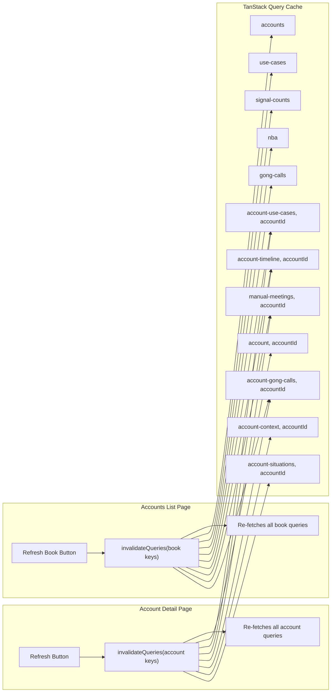

## Overview

A single **Refresh** button on the account detail page header invalidates all cached data for that account (use cases, timeline, manual meetings, Gong calls, context, signals). A second **Refresh Book** button on the Accounts list page invalidates all book-level cached data across the user's full account list.

Both use TanStack Query `invalidateQueries` — no new backend endpoints needed.

---

## Data Flow



---

## Step 1: Add hooks to `useApi.ts`

**File:** [`bkmng-next/hooks/useApi.ts`](bkmng-next/hooks/useApi.ts)

Add `useState` and `useCallback` to the existing React imports, then add two hooks at the end of the file.

```typescript
import { useState, useCallback } from "react";

export function useRefreshAccount(accountId: string) {
  const qc = useQueryClient();
  const [isRefreshing, setIsRefreshing] = useState(false);
  const refresh = useCallback(async () => {
    setIsRefreshing(true);
    await Promise.all([
      qc.invalidateQueries({ queryKey: ["account", accountId] }),
      qc.invalidateQueries({ queryKey: ["account-use-cases", accountId] }),
      qc.invalidateQueries({ queryKey: ["account-timeline", accountId] }),
      qc.invalidateQueries({ queryKey: ["manual-meetings", accountId] }),
      qc.invalidateQueries({ queryKey: ["account-gong-calls", accountId] }),
      qc.invalidateQueries({ queryKey: ["account-context", accountId] }),
      qc.invalidateQueries({ queryKey: ["account-situations", accountId] }),
    ]);
    setIsRefreshing(false);
  }, [qc, accountId]);
  return { refresh, isRefreshing };
}

export function useRefreshBook() {
  const qc = useQueryClient();
  const [isRefreshing, setIsRefreshing] = useState(false);
  const refresh = useCallback(async () => {
    setIsRefreshing(true);
    await Promise.all([
      qc.invalidateQueries({ queryKey: ["accounts"] }),
      qc.invalidateQueries({ queryKey: ["use-cases"] }),
      qc.invalidateQueries({ queryKey: ["signal-counts"] }),
      qc.invalidateQueries({ queryKey: ["nba"] }),
      qc.invalidateQueries({ queryKey: ["gong-calls"] }),
      qc.invalidateQueries({ queryKey: ["account-use-cases"] }),
      qc.invalidateQueries({ queryKey: ["account-timeline"] }),
      qc.invalidateQueries({ queryKey: ["manual-meetings"] }),
      qc.invalidateQueries({ queryKey: ["account-gong-calls"] }),
    ]);
    setIsRefreshing(false);
  }, [qc]);
  return { refresh, isRefreshing };
}
```

Note: passing `["account-timeline"]` without the `accountId` suffix uses TanStack Query's prefix matching — it invalidates ALL cached timelines across every account simultaneously.

---

## Step 2: Refresh button on account detail page

**File:** [`bkmng-next/app/accounts/[id]/page.tsx`](bkmng-next/app/accounts/[id]/page.tsx)

**2a.** Add `RefreshCw` to the existing lucide-react import on line 7.

**2b.** Add `useRefreshAccount` to the existing `@/hooks/useApi` import on line 11.

**2c.** Add the hook call near the other action hooks (~line 473):
```typescript
const { refresh: refreshAccount, isRefreshing } = useRefreshAccount(accountId);
```

**2d.** Place the button in the header action row, immediately before the tracking `{trackingStatus ? ... }` block (~line 668). The button sits at the right side of the header alongside Follow/Archive:

```tsx
<button
  type="button"
  onClick={refreshAccount}
  disabled={isRefreshing}
  title="Refresh account data"
  className="inline-flex items-center gap-1 rounded-full border border-slate-200 bg-white px-2.5 py-0.5 text-[11px] font-medium text-slate-500 hover:border-sky-300 hover:text-sky-600 hover:bg-sky-50 transition-colors disabled:opacity-50"
>
  <RefreshCw size={11} className={isRefreshing ? "animate-spin" : ""} />
  {isRefreshing ? "Refreshing…" : "Refresh"}
</button>
```

---

## Step 3: Refresh Book button on accounts list page

**File:** [`bkmng-next/app/accounts/page.tsx`](bkmng-next/app/accounts/page.tsx)

**3a.** Add `RefreshCw` to the existing lucide-react import on line 5.

**3b.** Add `useRefreshBook` to the existing `@/hooks/useApi` import on line 7.

**3c.** Add the hook call near the top of the component:
```typescript
const { refresh: refreshBook, isRefreshing: bookRefreshing } = useRefreshBook();
```

**3d.** Place the button in the filter bar (`<div className="px-6 py-3 flex flex-wrap...">` ~line 407), to the right of the search input:

```tsx
<button
  type="button"
  onClick={refreshBook}
  disabled={bookRefreshing}
  className="inline-flex items-center gap-1.5 rounded-lg border border-slate-200 bg-white px-3 py-1.5 text-sm font-medium text-slate-500 hover:border-sky-300 hover:text-sky-600 hover:bg-sky-50 transition-colors disabled:opacity-50 ml-auto"
>
  <RefreshCw size={13} className={bookRefreshing ? "animate-spin" : ""} />
  {bookRefreshing ? "Refreshing…" : "Refresh Book"}
</button>
```

---

## Scope Summary

| Button | Location | Refreshes |
|---|---|---|
| Refresh | Account detail header | account, use cases, timeline, manual meetings, Gong calls, context, situations |
| Refresh Book | Accounts list filter bar | accounts list, all use cases, signal counts, NBA, Gong calls, + all per-account timelines/meetings |
