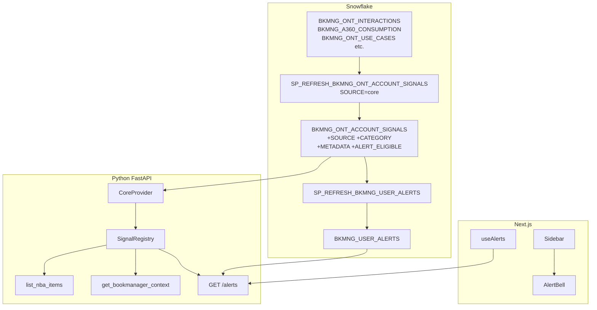

# Plan: Signals Framework

## Overview

Implement the three-layer Signals Framework as documented in `docs/signals-framework-plan.md`. Everything in this plan is net-new — no signals package or alerts router exists yet, and `BKMNG_ONT_ACCOUNT_SIGNALS` does not have the four new columns.

**One correction from the design doc**: The alert bell goes in [`bkmng-next/components/layout/Sidebar.tsx`](bkmng-next/components/layout/Sidebar.tsx), not `AppLayout.tsx`. `AppLayout` is a thin shell — `Sidebar` is the actual nav component with all links.

---

## Architecture



---

## Step 1 — Extend `BKMNG_ONT_ACCOUNT_SIGNALS` Schema

Run on the `snowhouse` connection:

```sql
ALTER TABLE TEMP.JUSDAVIS.BKMNG_ONT_ACCOUNT_SIGNALS
  ADD COLUMN IF NOT EXISTS SOURCE VARCHAR DEFAULT 'core';
ALTER TABLE TEMP.JUSDAVIS.BKMNG_ONT_ACCOUNT_SIGNALS
  ADD COLUMN IF NOT EXISTS CATEGORY VARCHAR;
ALTER TABLE TEMP.JUSDAVIS.BKMNG_ONT_ACCOUNT_SIGNALS
  ADD COLUMN IF NOT EXISTS METADATA VARIANT;
ALTER TABLE TEMP.JUSDAVIS.BKMNG_ONT_ACCOUNT_SIGNALS
  ADD COLUMN IF NOT EXISTS ALERT_ELIGIBLE BOOLEAN DEFAULT FALSE;
```

Then update `SP_REFRESH_BKMNG_ONT_ACCOUNT_SIGNALS` (in Snowflake) to:
- Set `SOURCE = 'core'` on all rows it inserts
- Populate `CATEGORY` using the type→category mapping from the design doc
- Set `ALERT_ELIGIBLE = TRUE` for `priority = 'high'`

---

## Step 2 — Create `BKMNG_USER_ALERTS` Table and SP

```sql
CREATE TABLE IF NOT EXISTS TEMP.JUSDAVIS.BKMNG_USER_ALERTS (
    ALERT_ID     VARCHAR DEFAULT UUID_STRING(),
    USER_EMAIL   VARCHAR NOT NULL,
    SIGNAL_ID    VARCHAR,
    SIGNAL_TYPE  VARCHAR NOT NULL,
    ACCOUNT_ID   VARCHAR,
    ACCOUNT_NAME VARCHAR,
    TEXT         VARCHAR,
    PRIORITY     VARCHAR DEFAULT 'medium',
    SOURCE       VARCHAR,
    IS_READ      BOOLEAN DEFAULT FALSE,
    IS_DISMISSED BOOLEAN DEFAULT FALSE,
    CREATED_AT   TIMESTAMP_NTZ DEFAULT CURRENT_TIMESTAMP()
);
```

Create `SP_REFRESH_BKMNG_USER_ALERTS`:
- Joins `BKMNG_ONT_ACCOUNT_SIGNALS` (WHERE `ALERT_ELIGIBLE = TRUE`) with `BKMNG_ONT_ACCOUNTS` on `ACE_ASSIGNED`
- Inserts new alert rows per ACE user, deduplicating on `(SIGNAL_ID, USER_EMAIL)`
- Schedule: hourly Task after `SP_REFRESH_BKMNG_ONT_ACCOUNT_SIGNALS` completes

---

## Step 3 — Create `backend/app/signals/` Package

**New files** (full content provided in the design doc):

```
backend/app/signals/
├── __init__.py              ← get_registry() singleton + register_all_providers()
├── models.py                ← Signal(BaseModel), SignalScope(dataclass)
├── provider.py              ← SignalProvider ABC with collect() + format_for_ai()
├── registry.py              ← SignalRegistry: collect_all, get_nba_items, get_ai_context, get_alert_eligible
└── providers/
    ├── __init__.py
    └── core.py              ← CoreProvider: reads SOURCE='core', maps SIGNAL_TYPE → CATEGORY
```

`CoreProvider.collect()` runs the same query that's currently in `list_nba_items()` but with the new columns (`SOURCE`, `CATEGORY`, `ALERT_ELIGIBLE`, `METADATA`) and the `scope.account_id` filter added.

---

## Step 4 — Integrate Registry into `snowflake_service.py`

**File**: [`backend/app/services/snowflake_service.py`](backend/app/services/snowflake_service.py)

### 4a — Update `list_nba_items()` (line 1325)

Replace the inline SQL query with a registry delegation:

```python
def list_nba_items(self, ace_filter=None, acem_filter=None) -> list[NBAItem]:
    from app.signals import get_registry
    from app.signals.models import SignalScope
    scope = SignalScope(user_email="", ace_filter=ace_filter, acem_filter=acem_filter)
    cap = 10 if acem_filter else 8
    return get_registry().get_nba_items(self._cursor(), scope, cap=cap)
```

### 4b — Update `get_bookmanager_context()` (lines 740–765)

Replace the hardcoded signal SELECT block with:

```python
from app.signals import get_registry
from app.signals.models import SignalScope
scope = SignalScope(user_email=user_email, ace_filter=ace_filter,
                    acem_filter=acem_filter, account_id=account_id)
signal_section = get_registry().get_ai_context(cur, scope, limit=6)
```

And replace the `signal_lines` interpolation in the prompt string with `signal_section`.

### 4c — Delete `_list_nba_items_legacy()` (lines 1369–1751)

This is ~383 lines of dead code that previously computed signals from raw tables. Delete the entire method.

### 4d — Open up `NBAItem.signal_type` in `models/nba.py`

[`backend/app/models/nba.py`](backend/app/models/nba.py) line 10:

```python
# Before:
signal_type: Literal["blocker", "at_risk", ...]

# After:
signal_type: str
```

---

## Step 5 — Add Alerts Router

**New file**: [`backend/app/routers/alerts.py`](backend/app/routers/alerts.py)

```python
router = APIRouter(prefix="/alerts", tags=["alerts"])

@router.get("", response_model=list[AlertItem])
async def get_alerts(user=Depends(get_current_user), data=Depends(get_data_service)):
    ...

@router.get("/count")
async def get_alert_count(user=Depends(get_current_user), data=Depends(get_data_service)):
    ...

@router.post("/{alert_id}/read")
async def mark_alert_read(alert_id: str, ...): ...

@router.post("/{alert_id}/dismiss")
async def dismiss_alert(alert_id: str, ...): ...
```

Mount in [`backend/app/main.py`](backend/app/main.py):
```python
from app.routers import ..., alerts
app.include_router(alerts.router)
```

`AlertItem` Pydantic model mirrors the `BKMNG_USER_ALERTS` schema.

---

## Step 6 — Frontend: Alert Bell + Hooks

### `hooks/useApi.ts`

Add four hooks after existing patterns:

```typescript
export type AlertItem = {
  alert_id: string; signal_type: string; account_id: string | null;
  account_name: string | null; text: string; priority: "high" | "medium" | "low";
  source: string | null; is_read: boolean; is_dismissed: boolean; created_at: string;
};

export function useAlertCount() { ... }         // GET /alerts/count — lightweight badge
export function useAlerts() { ... }             // GET /alerts — full list
export function useMarkAlertRead() { ... }      // POST /alerts/{id}/read
export function useDismissAlert() { ... }       // POST /alerts/{id}/dismiss
```

### `Sidebar.tsx`

Add a `Bell` icon from `lucide-react` with an unread count badge below the nav links (or inline with a "Alerts" nav item). Uses `useAlertCount()`. Clicking navigates to `/alerts` (new page, or opens a dropdown).

**Note**: The design doc mentions `AppLayout.tsx` but `Sidebar.tsx` is the correct target — `AppLayout` contains no nav elements.

---

## Step 7 — Update `bookmanager_assistant.yaml`

File: [`BookManager/bookmanager_assistant.yaml`](BookManager/bookmanager_assistant.yaml)

In the `account_signals` table definition, add two new dimensions:

```yaml
- name: source
  description: "Which system generated this signal (core, gong, jira, etc.)"
  expr: SOURCE
  data_type: TEXT

- name: category
  description: "Signal family: engagement, consumption, go_live, use_case, tmr, team"
  expr: CATEGORY
  data_type: TEXT
```

Optionally add a VQR: `"Show me signals from Gong"`.

---

## File Impact Summary

| File | Change |
|------|--------|
| `backend/app/signals/` (new) | 6 new files |
| `backend/app/routers/alerts.py` (new) | Alerts CRUD endpoints |
| `backend/app/models/nba.py` | `signal_type: Literal → str` |
| `backend/app/services/snowflake_service.py` | Delegate NBA + context to registry; delete 383 lines legacy |
| `backend/app/main.py` | Mount alerts router |
| `bkmng-next/hooks/useApi.ts` | 4 new alert hooks + `AlertItem` type |
| `bkmng-next/components/layout/Sidebar.tsx` | Alert bell with badge |
| `BookManager/bookmanager_assistant.yaml` | Add `source`, `category` dimensions |
| Snowflake (snowhouse) | 4 ALTER TABLE cols, new BKMNG_USER_ALERTS table, 2 new SPs + Tasks |
