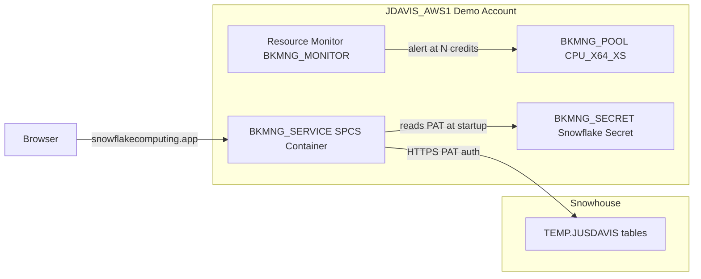

# Plan: BookManager SPCS Demo Deployment

## Answering Your Questions

### Will the PAT token data fetch still work?

**Yes.** SPCS containers have unrestricted outbound internet access. The backend makes standard HTTPS calls to `sfcogsops-snowhouse-aws-us-west-2.snowflakecomputing.com` using the PAT as a password parameter — this is identical to running the server on any cloud VM or local machine. The PAT is scoped to your `JUSDAVIS` identity on Snowhouse; it doesn't matter which account hosts the container.

```
Browser → SPCS Service (odc77562.us-east-1) ──HTTPS──> Snowhouse (sfcogsops-snowhouse-aws-us-west-2)
```

### Custom URL

You'll get a generated URL in the format `<hash>.snowflakecomputing.app` once the service is running. No configuration needed — the URL is auto-assigned and publicly accessible after login.

### Cost tracking / Minimal compute

Plan uses:
- `CPU_X64_XS` instance family (~$0.00034/node-second credit consumption, the smallest SPCS family)
- 1 node, no auto-scaling
- 10-minute auto-suspend when idle (keeps costs near-zero when not demoing)
- Resource Monitor with credit alert
- `platformMonitor.metricConfig.groups: [system]` in the spec for per-service metrics

---

## Architecture



---

## Step 1: Create Infrastructure in JDAVIS_AWS1

Run the following SQL with the `JDAVIS_AWS1` connection (requires `SYSADMIN` / `ACCOUNTADMIN`):

```sql
-- Database and schema for app objects
CREATE DATABASE IF NOT EXISTS BOOKMANAGER;
CREATE SCHEMA IF NOT EXISTS BOOKMANAGER.DEMO;

-- Minimal compute pool: 1 node, CPU_X64_XS, 10-min auto-suspend
CREATE COMPUTE POOL IF NOT EXISTS BKMNG_POOL
    MIN_NODES = 1
    MAX_NODES = 1
    INSTANCE_FAMILY = CPU_X64_XS
    AUTO_SUSPEND_SECS = 600
    AUTO_RESUME = TRUE
    COMMENT = 'BookManager demo — minimal single-node pool';

-- Image repository
CREATE IMAGE REPOSITORY IF NOT EXISTS BOOKMANAGER.DEMO.BKMNG_REPO;

-- Show registry URL (needed for docker push)
SHOW IMAGE REPOSITORIES IN SCHEMA BOOKMANAGER.DEMO;
```

---

## Step 2: Store Snowhouse Credentials as a Snowflake Secret

PAT and connection details are stored as Snowflake Secrets so they never appear in the YAML spec:

```sql
-- PAT value (the eyJraWQi... token from your .env)
CREATE SECRET IF NOT EXISTS BOOKMANAGER.DEMO.BKMNG_SNOWHOUSE_PAT
    TYPE = GENERIC_STRING
    SECRET_STRING = '<your-pat-value>';
```

Other connection details (`SNOWFLAKE_ACCOUNT`, `SNOWFLAKE_USER`, etc.) are non-sensitive and set directly as env vars in the spec.

---

## Step 3: Create `bkmng-spec-demo.yaml`

Create a new file [`bkmng-spec-demo.yaml`](BookManager/bkmng-spec-demo.yaml) (separate from the Snowhouse spec to avoid overwriting it):

```yaml
spec:
  containers:
    - name: bkmng
      image: /bookmanager/demo/bkmng_repo/bkmng:latest
      env:
        SPCS_MODE: "true"
        MOCK_DATA: "false"
        APP_ENV: "production"
        ADMIN_USERS: "JUSDAVIS"
        SPCS_DEFAULT_USER_ID: "ace-jane"
        SNOWFLAKE_ACCOUNT: "sfcogsops-snowhouse-aws-us-west-2"
        SNOWFLAKE_USER: "JUSDAVIS"
        SNOWFLAKE_WAREHOUSE: "SE_XS_WH"
        SNOWFLAKE_DATABASE: "TEMP"
        SNOWFLAKE_SCHEMA: "JUSDAVIS"
        SNOWFLAKE_ROLE: "SALES_ENGINEER"
      secrets:
        - snowflakeSecret:
            objectName: "BOOKMANAGER.DEMO.BKMNG_SNOWHOUSE_PAT"
          envVarName: "SNOWFLAKE_PAT"
      resources:
        requests:
          cpu: "0.1"
          memory: "128Mi"
        limits:
          cpu: "0.5"
          memory: "512Mi"
      readinessProbe:
        port: 8080
        path: /api/auth/mode
  endpoints:
    - name: bkmng-ui
      port: 8080
      public: true
  platformMonitor:
    metricConfig:
      groups:
        - system
```

Key differences from `bkmng-spec.yaml`:
- Image path references the JDAVIS_AWS1 registry (no hostname prefix in spec — SPCS resolves it automatically)
- `MOCK_DATA: "false"` to use live Snowhouse data
- `secrets:` block injects the PAT from the Snowflake Secret at runtime

---

## Step 4: Build and Push Image

```bash
# Build for linux/amd64 (required for SPCS)
docker build --platform linux/amd64 -f Dockerfile.spcs -t bkmng:latest .

# Tag for JDAVIS_AWS1 registry
docker tag bkmng:latest odc77562.us-east-1.registry.snowflakecomputing.com/bookmanager/demo/bkmng_repo/bkmng:latest

# Login and push
snow spcs image-registry login --connection JDAVIS_AWS1
docker push odc77562.us-east-1.registry.snowflakecomputing.com/bookmanager/demo/bkmng_repo/bkmng:latest
```

---

## Step 5: Deploy the Service

```sql
CREATE SERVICE IF NOT EXISTS BOOKMANAGER.DEMO.BKMNG_SERVICE
    IN COMPUTE POOL BKMNG_POOL
    FROM SPECIFICATION $$
    <contents of bkmng-spec-demo.yaml>
    $$
    MIN_INSTANCES = 1
    MAX_INSTANCES = 1
    COMMENT = 'BookManager demo app';

-- Monitor startup (~60-90s)
SELECT SYSTEM$GET_SERVICE_STATUS('BOOKMANAGER.DEMO.BKMNG_SERVICE');

-- Get the public URL
SHOW ENDPOINTS IN SERVICE BOOKMANAGER.DEMO.BKMNG_SERVICE;
```

---

## Step 6: Configure Resource Monitor for Cost Tracking

```sql
-- Alert at 5 credits used (adjust to your budget)
CREATE RESOURCE MONITOR BKMNG_MONITOR
    WITH CREDIT_QUOTA = 5
    FREQUENCY = MONTHLY
    START_TIMESTAMP = IMMEDIATELY
    TRIGGERS
      ON 75 PERCENT DO NOTIFY
      ON 100 PERCENT DO NOTIFY;

ALTER COMPUTE POOL BKMNG_POOL SET RESOURCE_MONITOR = BKMNG_MONITOR;
```

You can also query actual cost in Snowsight under Admin → Cost Management, filtered to the `BKMNG_POOL` compute pool. The `platformMonitor` block in the spec additionally exposes per-container CPU/memory/network metrics.

---

## Step 7: Grant Demo User Access

For each demo user (Snowflake user on `odc77562.us-east-1`):

```sql
-- Grant service endpoint usage
GRANT SERVICE ROLE BOOKMANAGER.DEMO.BKMNG_SERVICE!ALL_ENDPOINTS_USAGE
    TO ROLE <demo_user_role>;
```

Non-admin users will see the `ace-jane` SE profile (controlled by `SPCS_DEFAULT_USER_ID`). To make specific users admins, add their usernames comma-separated to `ADMIN_USERS` in the spec.

---

## Notes

- **Suspend when not demoing**: `ALTER COMPUTE POOL BKMNG_POOL SUSPEND;` to stop billing between demos. Auto-resume is on, so the service will restart automatically on next visit (adds ~60s cold start).
- **Updating the app**: Rebuild and push a new image, then `ALTER SERVICE BOOKMANAGER.DEMO.BKMNG_SERVICE FROM SPECIFICATION $$...$$` — never drop-and-recreate (changes the URL).
- **`Dockerfile.spcs`** is already present and correctly builds the combined Next.js + FastAPI image on port 8080. No changes needed to the Dockerfile.
