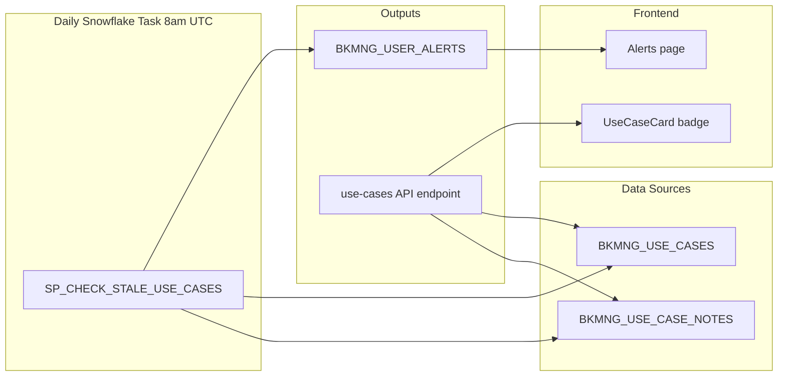

# Plan: Stale Use Case Notes Alert

## Approach

Your instinct is right: `BKMNG_USE_CASE_NOTES` is the source of truth. We `MAX(NOTE_DATE)` per `USE_CASE_ID` to find the last note date for each use case. When that date is 6+ days ago (or no notes exist at all), two things happen:

1. **Inline badge** on the `UseCaseCard` — computed from `last_note_date` returned by the existing use-cases API endpoint (no new API call needed).
2. **Bell alert** — a daily Snowflake task inserts one row per stale use case into `BKMNG_USER_ALERTS` for the `LEAD_SE` user, following the same pattern as `SP_CHECK_MEETING_REMINDERS`.



---

## Step 1 — Add `last_note_date` to use case queries

**File:** [`backend/app/services/snowflake_service.py`](backend/app/services/snowflake_service.py)

Both `list_use_cases_for_account` (~line 405) and `list_all_use_cases` (~line 386) query `BKMNG_USE_CASES` with `SELECT *`. Wrap each into a subquery that LEFT JOINs the last note date:

```python
# Replace the base SQL in both methods
sql = """
    SELECT uc.*,
           n.LAST_NOTE_DATE
    FROM BKMNG_USE_CASES uc
    LEFT JOIN (
        SELECT USE_CASE_ID, MAX(NOTE_DATE) AS LAST_NOTE_DATE
        FROM TEMP.JUSDAVIS.BKMNG_USE_CASE_NOTES
        GROUP BY USE_CASE_ID
    ) n ON n.USE_CASE_ID = uc.USE_CASE_ID
    WHERE uc.ACCOUNT_ID = %s
    {ace_clause}
    ORDER BY uc.LAST_MODIFIED_DATE DESC NULLS LAST
"""
```

---

## Step 2 — Add `last_note_date` to the `UseCase` model

**File:** [`backend/app/models/account.py`](backend/app/models/account.py)

```python
class UseCase(BaseModel):
    # ... existing fields ...
    last_note_date: Optional[datetime] = None   # ← add this
```

**File:** [`backend/app/services/snowflake_service.py`](backend/app/services/snowflake_service.py) — `_row_to_use_case` function:

```python
return UseCase(
    # ... existing fields ...
    last_note_date=_dt(r.get("LAST_NOTE_DATE")),
)
```

---

## Step 3 — Inline stale badge on `UseCaseCard`

**File:** [`bkmng-next/app/accounts/[id]/page.tsx`](bkmng-next/app/accounts/[id]/page.tsx)

**3a.** Add `last_note_date` to the local `UseCase` type (~line 30):

```typescript
type UseCase = {
  // ...existing...
  last_note_date: string | null;
};
```

**3b.** In `UseCaseCard`, compute staleness and render an amber badge in the header badge row:

```typescript
function UseCaseCard({ uc }: { uc: UseCase }) {
  const days = daysUntil(uc.target_go_live_date);
  const daysSinceNote = uc.last_note_date
    ? Math.floor((Date.now() - new Date(uc.last_note_date).getTime()) / 86_400_000)
    : null;
  const isStaleNotes = daysSinceNote === null || daysSinceNote >= 6;

  // In the badge row, after existing badges:
  {isStaleNotes && (
    <span className="inline-flex items-center gap-1 rounded-full border border-amber-200 bg-amber-50 px-2 py-0.5 text-[11px] font-medium text-amber-700">
      <AlertTriangle size={10} />
      {daysSinceNote === null ? "No notes yet" : `Notes ${daysSinceNote}d old`}
    </span>
  )}
```

`AlertTriangle` is already imported on line 7.

---

## Step 4 — Snowflake stored procedure + daily task

Execute via `snowflake_sql_execute`.

**Procedure** — inserts one alert per stale use case per LEAD_SE user; skips if a non-dismissed alert already exists for that use case:

```sql
CREATE OR REPLACE PROCEDURE TEMP.JUSDAVIS.SP_CHECK_STALE_USE_CASES()
RETURNS VARCHAR
LANGUAGE SQL
AS $$
BEGIN
    INSERT INTO TEMP.JUSDAVIS.BKMNG_USER_ALERTS (
        ALERT_ID, USER_EMAIL, SIGNAL_ID, SIGNAL_TYPE,
        ACCOUNT_ID, ACCOUNT_NAME, TEXT, PRIORITY, SOURCE,
        IS_READ, IS_DISMISSED, CREATED_AT
    )
    SELECT
        UUID_STRING(),
        uc.LEAD_SE,
        uc.USE_CASE_ID,
        'stale_use_case',
        uc.ACCOUNT_ID,
        uc.ACCOUNT_NAME,
        CASE
            WHEN n.LAST_NOTE_DATE IS NULL
                THEN 'Add PS notes for: ' || uc.USE_CASE_NAME || ' — no notes yet'
            ELSE 'Update PS notes for: ' || uc.USE_CASE_NAME
                 || ' — last updated ' || DATEDIFF('day', n.LAST_NOTE_DATE, CURRENT_DATE())::VARCHAR || ' days ago'
        END,
        'medium',
        'system',
        FALSE,
        FALSE,
        CURRENT_TIMESTAMP()
    FROM TEMP.JUSDAVIS.BKMNG_USE_CASES uc
    LEFT JOIN (
        SELECT USE_CASE_ID, MAX(NOTE_DATE) AS LAST_NOTE_DATE
        FROM TEMP.JUSDAVIS.BKMNG_USE_CASE_NOTES
        GROUP BY USE_CASE_ID
    ) n ON n.USE_CASE_ID = uc.USE_CASE_ID
    WHERE uc.LEAD_SE IS NOT NULL
      AND uc.STATUS NOT IN ('Completed', 'Closed')
      AND (n.LAST_NOTE_DATE IS NULL OR DATEDIFF('day', n.LAST_NOTE_DATE, CURRENT_DATE()) >= 6)
      AND NOT EXISTS (
          SELECT 1 FROM TEMP.JUSDAVIS.BKMNG_USER_ALERTS a
          WHERE a.SIGNAL_ID = uc.USE_CASE_ID
            AND a.SIGNAL_TYPE = 'stale_use_case'
            AND a.IS_DISMISSED = FALSE
      );
    RETURN 'done';
END;
$$;
```

**Task** — runs once daily at 8am UTC:

```sql
CREATE OR REPLACE TASK TEMP.JUSDAVIS.TASK_CHECK_STALE_USE_CASES
  WAREHOUSE = SE_XS_WH
  SCHEDULE = 'USING CRON 0 8 * * * UTC'
AS
  CALL TEMP.JUSDAVIS.SP_CHECK_STALE_USE_CASES();

ALTER TASK TEMP.JUSDAVIS.TASK_CHECK_STALE_USE_CASES RESUME;
```

---

## Step 5 — Link account name in alerts page

**File:** [`bkmng-next/app/alerts/page.tsx`](bkmng-next/app/alerts/page.tsx)

The alert has `account_id` and `account_name`. Make the account name a link so the user can jump straight to the offending account:

```tsx
// Add to imports
import Link from "next/link";

// Replace the static <p> in both unread and read alert cards:
{alert.account_name && alert.account_id ? (
  <Link href={`/accounts/${alert.account_id}`}
    className="text-xs text-sky-600 hover:underline mt-0.5 block">
    {alert.account_name}
  </Link>
) : alert.account_name ? (
  <p className="text-xs text-slate-500 mt-0.5">{alert.account_name}</p>
) : null}
```

---

## What the user sees

| Location | Trigger | Display |
|---|---|---|
| UseCaseCard header | last_note_date null or 6+ days old | Amber "Notes 7d old" badge next to stage badge |
| Alerts page | Daily Snowflake task at 8am | "Update PS notes for: [Name] — last updated 7 days ago" with link to account |
| Alert count badge | Same | Increments bell counter |
