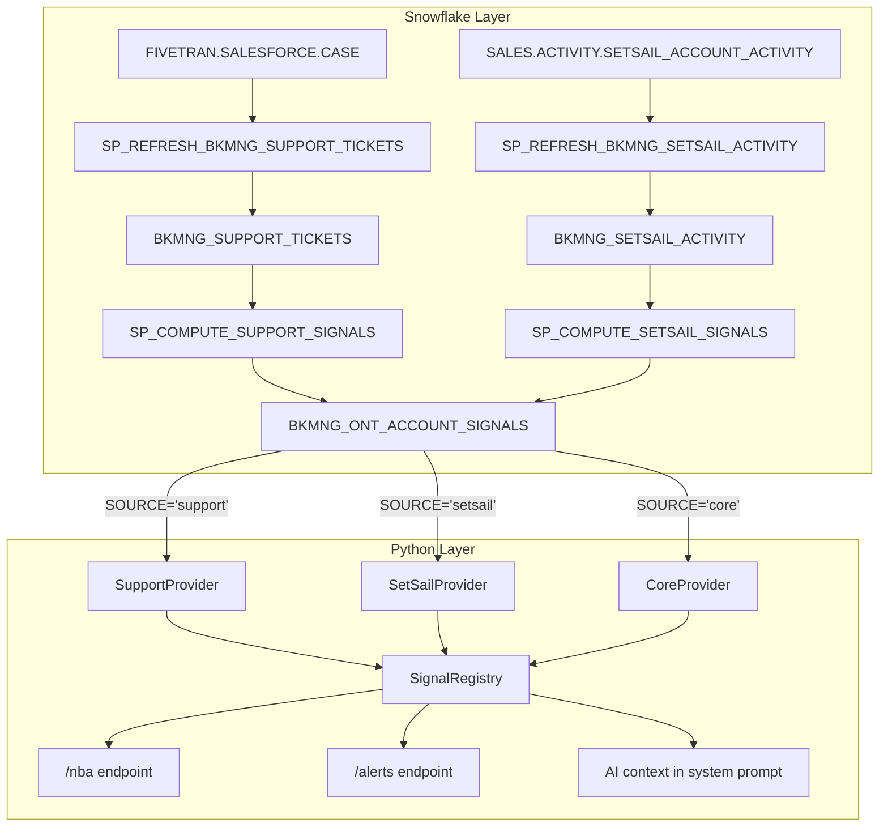

# Plan: Support Ticket & SetSail Integration

## Overview

Extends the signals framework with two new sources. The existing `CoreProvider` reads from `BKMNG_ONT_ACCOUNT_SIGNALS WHERE SOURCE='core'`. This plan adds `support` and `setsail` sources using the same provider/registry pattern.



---

## Prerequisite

**Critical:** The current `SP_REFRESH_BKMNG_ONT_ACCOUNT_SIGNALS` does `TRUNCATE TABLE` which would wipe all non-core rows every hour. This must be fixed first.

---

## Part A: Support Tickets (ready now)

### Task 1 — Fix core SP: TRUNCATE → partition-safe DELETE

Retrieve the current SP DDL (it's large, ~14K chars), rebuild it replacing the single line:

```sql
-- REMOVE:
TRUNCATE TABLE TEMP.JUSDAVIS.BKMNG_ONT_ACCOUNT_SIGNALS;

-- REPLACE WITH:
DELETE FROM TEMP.JUSDAVIS.BKMNG_ONT_ACCOUNT_SIGNALS WHERE SOURCE = 'core';
```

Use the Python connector (`/System/Volumes/Data/private/tmp/bkmng-venv/bin/python3`) with `SNOWHOUSE_AWS_US_WEST_2` to retrieve and rebuild the SP (the Snowflake SQL tool truncates large DDL results).

Verify after: run the SP, confirm ~2K rows with `SOURCE='core'` still exist.

---

### Task 2 — Create `BKMNG_SUPPORT_TICKETS` table + SP + Task

**Table** (`TEMP.JUSDAVIS.BKMNG_SUPPORT_TICKETS`):

| Column | Type |
|--------|------|
| CASE_ID | VARCHAR |
| CASE_NUMBER | VARCHAR |
| ACCOUNT_ID | VARCHAR |
| ACCOUNT_NAME | VARCHAR |
| STATUS | VARCHAR |
| SEVERITY | VARCHAR |
| PRIORITY | VARCHAR |
| CATEGORY | VARCHAR |
| SUB_CATEGORY | VARCHAR |
| COMPONENT | VARCHAR |
| SUBJECT | VARCHAR |
| TYPE | VARCHAR |
| IS_ESCALATED | BOOLEAN |
| SALES_ESCALATED | BOOLEAN |
| IS_CLOSED | BOOLEAN |
| CREATED_DATE | TIMESTAMP_TZ |
| CLOSED_DATE | TIMESTAMP_TZ |
| DAYS_OPEN | FLOAT |
| TIME_TO_RESOLUTION_HRS | FLOAT |
| ESCALATION_STATUS | VARCHAR |
| SNOWFLAKE_ACCOUNT | VARCHAR |
| SNOWFLAKE_ACCOUNT_ALIAS | VARCHAR |
| REFRESHED_AT | TIMESTAMP_NTZ |

**SP: `SP_REFRESH_BKMNG_SUPPORT_TICKETS()`**

- TRUNCATE → INSERT pattern (standalone table, safe)
- Source: `FIVETRAN.SALESFORCE.CASE`
- Filters: `_FIVETRAN_ACTIVE = TRUE`, `TYPE = 'Technical Issue'`, `CREATED_DATE >= DATEADD('day', -90, CURRENT_DATE())`, `ACCOUNT_ID IS NOT NULL`
- Join: inner join to `BKMNG_ONT_ACCOUNTS` on `ACCOUNT_ID` to get `ACCOUNT_NAME` (restricts to BookManager activation accounts only)

**Task: `TASK_REFRESH_BKMNG_SUPPORT_TICKETS`**
- `USING CRON 45 * * * * UTC`
- Warehouse: `SE_XS_WH`
- Standalone (not part of existing DAG)

---

### Task 3 — Create `SP_COMPUTE_SUPPORT_SIGNALS()` + Task

Reads `BKMNG_SUPPORT_TICKETS`, writes to `BKMNG_ONT_ACCOUNT_SIGNALS`.

Pattern:
```sql
DELETE FROM TEMP.JUSDAVIS.BKMNG_ONT_ACCOUNT_SIGNALS WHERE SOURCE = 'support';
-- then 5 INSERTs
```

**5 signal types:**

| Signal Type | Priority | Trigger |
|-------------|----------|---------|
| `open_sev1_ticket` | high | `SEVERITY ILIKE '%Severity-1%' AND IS_CLOSED = FALSE` |
| `open_sev2_ticket` | high | `SEVERITY ILIKE '%Severity-2%' AND IS_CLOSED = FALSE` |
| `escalated_ticket` | high | `IS_ESCALATED = TRUE AND IS_CLOSED = FALSE` |
| `ticket_volume_spike` | medium | Account has 3+ open tickets |
| `long_running_ticket` | medium | `DAYS_OPEN >= 14 AND IS_CLOSED = FALSE` |

SIGNAL_ID format: `'<signal_type>-' || CASE_ID`.

**Task: `TASK_COMPUTE_SUPPORT_SIGNALS`**
- `USING CRON 50 * * * * UTC` (5 min after materialization)
- Warehouse: `SE_XS_WH`

---

### Task 4 — Create `SupportProvider`

New file: [`backend/app/signals/providers/support.py`](backend/app/signals/providers/support.py)

Mirrors `CoreProvider` with `WHERE SOURCE='support'` and support-specific `ORDER BY` (sev1 → escalated → sev2 → long_running → volume_spike).

---

### Task 5 — Register SupportProvider + update YAML

**[`backend/app/signals/__init__.py`](backend/app/signals/__init__.py):**

```python
from app.signals.providers.support import SupportProvider

def _register_all_providers(registry: SignalRegistry) -> None:
    registry.register(CoreProvider())
    registry.register(SupportProvider())
    # Future: registry.register(SetSailProvider())
```

**[`bookmanager_assistant.yaml`](bookmanager_assistant.yaml)** — update two dimension descriptions:

```yaml
- name: source
  description: "Which system generated this signal. Values: core, support. Future: setsail, gong."

- name: category
  description: "Signal family. Values: engagement, consumption, go_live, use_case, tmr, support, other."
```

Re-upload to `@TEMP.JUSDAVIS.BKMNG_STAGE` using `snow stage copy`.

---

## Part B: SetSail Meeting Integration (access-dependent)

### Task 6 — Verify `SALES.ACTIVITY` access

Run:
```sql
SELECT COUNT(*) FROM SALES.ACTIVITY.SETSAIL_ACCOUNT_ACTIVITY LIMIT 1;
```

If access is denied, execution stops and a blocker is raised. No fallback source will be used.

---

### Task 7 — Create `BKMNG_SETSAIL_ACTIVITY` table + SP + Task

**Table** (`TEMP.JUSDAVIS.BKMNG_SETSAIL_ACTIVITY`):

| Column | Type |
|--------|------|
| ACCOUNT_ID | VARCHAR |
| ACCOUNT_NAME | VARCHAR |
| ACTIVITY_DATE | DATE |
| MEETINGS_TOTAL | NUMBER |
| MEETINGS_HIGH_IMPACT | NUMBER |
| MEETINGS_LOW_IMPACT | NUMBER |
| MEETINGS_PARTNER_PRESENT | NUMBER |
| EMAILS_SENT | NUMBER |
| EMAILS_RECEIVED | NUMBER |
| MEETINGS_TOTAL_DURATION | NUMBER |
| VP_EXTERNAL_INVOLVED | NUMBER |
| VP_INTERNAL_INVOLVED | NUMBER |
| REFRESHED_AT | TIMESTAMP_NTZ |

**SP: `SP_REFRESH_BKMNG_SETSAIL_ACTIVITY()`**
- TRUNCATE → INSERT pattern
- Source: `SALES.ACTIVITY.SETSAIL_ACCOUNT_ACTIVITY`
- Filter: `ACTIVITY_DATE >= DATEADD('day', -90, CURRENT_DATE())`
- Inner join to `BKMNG_ONT_ACCOUNTS` (restricts to BookManager accounts)

**Task: `TASK_REFRESH_BKMNG_SETSAIL_ACTIVITY`**
- `USING CRON 35 */2 * * * UTC` (every 2 hours at :35)
- Warehouse: `SE_XS_WH`

---

### Task 8 — Create `SP_COMPUTE_SETSAIL_SIGNALS()` + Task

**4 signal types:**

| Signal Type | Priority | Category | Trigger | Alert |
|-------------|----------|----------|---------|-------|
| `no_meeting_14d` | medium | engagement | Zero meetings in 14 days, but had meetings before | TRUE |
| `meeting_frequency_drop` | medium | engagement | Meetings last 14d < 50% of 90d average | TRUE |
| `high_impact_meeting` | low | engagement | Recent high-impact meeting (positive signal) | FALSE |
| `vp_engagement` | low | engagement | VP external participant in last 14 days | FALSE |

Uses CTEs to compute per-account rolling stats (14d and 90d windows) before inserting.

**Task: `TASK_COMPUTE_SETSAIL_SIGNALS`**
- `USING CRON 40 */2 * * * UTC`
- Warehouse: `SE_XS_WH`

---

### Task 9 — Create `SetSailProvider` + register + update YAML

New file: [`backend/app/signals/providers/setsail.py`](backend/app/signals/providers/setsail.py)

Same pattern as `SupportProvider`. Custom `format_for_ai()` includes meeting counts and last meeting date for richer AI context.

Register in [`backend/app/signals/__init__.py`](backend/app/signals/__init__.py):
```python
registry.register(SetSailProvider())
```

Update [`bookmanager_assistant.yaml`](bookmanager_assistant.yaml) source description to include `"setsail"`.

---

## Task Scheduling Summary

| Task | Schedule | Type |
|------|----------|------|
| `TASK_REFRESH_BKMNG_SUPPORT_TICKETS` | Hourly at :45 | Standalone |
| `TASK_COMPUTE_SUPPORT_SIGNALS` | Hourly at :50 | Standalone |
| `TASK_REFRESH_BKMNG_SETSAIL_ACTIVITY` | Every 2h at :35 | Standalone |
| `TASK_COMPUTE_SETSAIL_SIGNALS` | Every 2h at :40 | Standalone |
| `TASK_REFRESH_BKMNG_ONT_ACCOUNT_SIGNALS` | Hourly at :00 | Existing |
| `TASK_REFRESH_BKMNG_USER_ALERTS` | After signals | Existing child |

---

## Verification Steps

After Task 1: Run core SP, confirm `SELECT COUNT(*) FROM BKMNG_ONT_ACCOUNT_SIGNALS WHERE SOURCE='core'` returns ~2K rows.

After Task 3:
```sql
SELECT SOURCE, SIGNAL_TYPE, COUNT(*)
FROM TEMP.JUSDAVIS.BKMNG_ONT_ACCOUNT_SIGNALS
GROUP BY 1, 2 ORDER BY 1, 3 DESC;
```
Confirm both `core` and `support` rows coexist.

After Task 5: Hit `GET /nba` and `GET /alerts` — confirm support signals appear.

After Task 8: Same query, confirm `setsail` rows appear alongside `core` and `support`.

---

## File Impact Summary

### New Files
- `backend/app/signals/providers/support.py`
- `backend/app/signals/providers/setsail.py`

### Modified Files
- [`backend/app/signals/__init__.py`](backend/app/signals/__init__.py) — register new providers
- [`bookmanager_assistant.yaml`](bookmanager_assistant.yaml) — add source/category values

### New Snowflake Objects
- `TEMP.JUSDAVIS.BKMNG_SUPPORT_TICKETS` (table)
- `SP_REFRESH_BKMNG_SUPPORT_TICKETS` (SP)
- `TASK_REFRESH_BKMNG_SUPPORT_TICKETS` (task, hourly :45)
- `SP_COMPUTE_SUPPORT_SIGNALS` (SP)
- `TASK_COMPUTE_SUPPORT_SIGNALS` (task, hourly :50)
- `TEMP.JUSDAVIS.BKMNG_SETSAIL_ACTIVITY` (table)
- `SP_REFRESH_BKMNG_SETSAIL_ACTIVITY` (SP)
- `TASK_REFRESH_BKMNG_SETSAIL_ACTIVITY` (task, every 2h :35)
- `SP_COMPUTE_SETSAIL_SIGNALS` (SP)
- `TASK_COMPUTE_SETSAIL_SIGNALS` (task, every 2h :40)

### Modified Snowflake Objects
- `SP_REFRESH_BKMNG_ONT_ACCOUNT_SIGNALS` — TRUNCATE → DELETE WHERE SOURCE='core'
