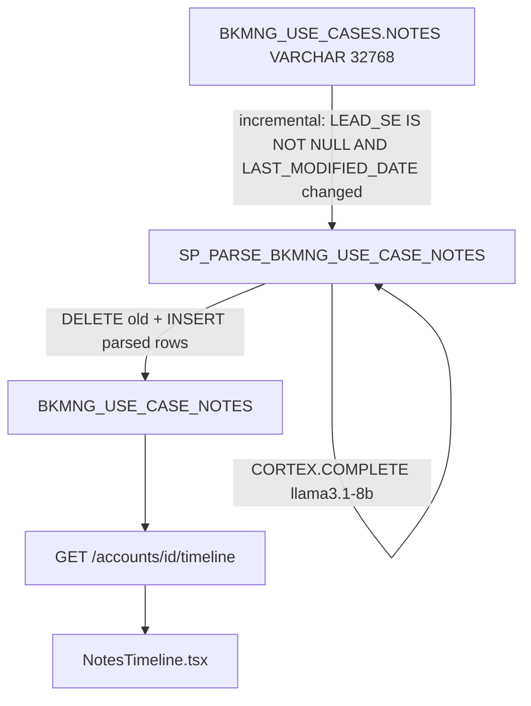

# Plan: Timeline Notes Parsing

## Overview

Parse each individual note entry from the `BKMNG_USE_CASES.NOTES` blob using Snowflake Cortex COMPLETE, store as structured rows in a new `BKMNG_USE_CASE_NOTES` table, and expose via a dedicated backend endpoint consumed by the Timeline tab.

---

## Why AI Parsing

The notes format is highly inconsistent across SEs. Sampled patterns:

```
[04/02/26] JD: AFE joined call to discuss...
RM 01/27/26 - Confirmed customer has de-prioritized...
10-28-2025 RG - PS is telling us we are in the last 3 weeks...
TSmith 12/18/25 - Met with Graham on 11/18...
03/26/2026 - CA - CAA intro call 03/19...
```

Regex would miss too many variants. Cortex COMPLETE handles all patterns and can normalize dates to ISO format.

---

## Scope: SE Owned

- **SE owned = `LEAD_SE IS NOT NULL`**
- 787 of 793 notes-bearing use cases qualify — only 6 have notes with no LEAD_SE
- Filter applied in the parse SP; use cases without a LEAD_SE are excluded

---

## Data Flow



---

## Task 1: New Snowflake Table `BKMNG_USE_CASE_NOTES`

```sql
CREATE TABLE IF NOT EXISTS TEMP.JUSDAVIS.BKMNG_USE_CASE_NOTES (
    NOTE_ID          VARCHAR(64),       -- MD5(USE_CASE_ID || '|' || note_date_str || '|' || author)
    USE_CASE_ID      VARCHAR(18),
    ACCOUNT_ID       VARCHAR(18),
    ACCOUNT_NAME     VARCHAR(255),
    USE_CASE_NAME    VARCHAR(255),
    LEAD_SE          VARCHAR(255),
    NOTE_DATE        DATE,
    AUTHOR_INITIALS  VARCHAR(30),       -- preserves "TSmith", "JD", "RM", etc.
    CONTENT          VARCHAR(8000),
    REFRESHED_AT     TIMESTAMP_NTZ
);
```

---

## Task 2: New SP `SP_PARSE_BKMNG_USE_CASE_NOTES`

Runs incrementally: only parses use cases whose `LAST_MODIFIED_DATE` has changed since last parse. Uses a single parallel `SELECT ... CORTEX.COMPLETE(...)` query (Snowflake parallelizes per-row calls), then `LATERAL FLATTEN` to expand the JSON array.

```sql
CREATE OR REPLACE PROCEDURE TEMP.JUSDAVIS.SP_PARSE_BKMNG_USE_CASE_NOTES()
RETURNS VARCHAR LANGUAGE SQL EXECUTE AS CALLER AS $$
BEGIN
    -- 1. Find SE-owned use cases modified since last parse
    CREATE OR REPLACE TEMPORARY TABLE _needs_parse AS
    SELECT uc.USE_CASE_ID, uc.ACCOUNT_ID, uc.ACCOUNT_NAME,
           uc.USE_CASE_NAME, uc.LEAD_SE, LEFT(uc.NOTES, 4000) AS NOTES
    FROM TEMP.JUSDAVIS.BKMNG_USE_CASES uc
    LEFT JOIN (
        SELECT USE_CASE_ID, MAX(REFRESHED_AT) AS LAST_PARSED
        FROM TEMP.JUSDAVIS.BKMNG_USE_CASE_NOTES
        GROUP BY USE_CASE_ID
    ) lp ON lp.USE_CASE_ID = uc.USE_CASE_ID
    WHERE uc.LEAD_SE IS NOT NULL
      AND uc.NOTES IS NOT NULL AND uc.NOTES != ''
      AND (lp.LAST_PARSED IS NULL OR uc.LAST_MODIFIED_DATE > lp.LAST_PARSED);

    -- 2. Call Cortex COMPLETE for all rows needing parse (Snowflake parallelizes)
    CREATE OR REPLACE TEMPORARY TABLE _parsed_raw AS
    SELECT n.USE_CASE_ID, n.ACCOUNT_ID, n.ACCOUNT_NAME, n.USE_CASE_NAME, n.LEAD_SE,
        SNOWFLAKE.CORTEX.COMPLETE(
            'llama3.1-8b',
            CONCAT(
                'Extract each note entry from SE notes. Return ONLY a JSON array, no markdown, no explanation. ',
                'Each element: {"date":"YYYY-MM-DD","initials":"XX","content":"text"}. ',
                'Handle any date format (M/D/YY, MM/DD/YYYY, MM-DD-YYYY, etc). ',
                'Preserve author exactly as written (e.g. "JD", "TSmith", "RM"). ',
                'Return [] if no clear entries.\n\nNotes:\n', n.NOTES
            )
        ) AS PARSED_JSON
    FROM _needs_parse n;

    -- 3. Delete stale entries for re-parsed use cases
    DELETE FROM TEMP.JUSDAVIS.BKMNG_USE_CASE_NOTES
    WHERE USE_CASE_ID IN (SELECT USE_CASE_ID FROM _needs_parse);

    -- 4. Flatten and insert parsed notes
    INSERT INTO TEMP.JUSDAVIS.BKMNG_USE_CASE_NOTES
    SELECT
        MD5(p.USE_CASE_ID || '|' || f.value:date::VARCHAR || '|' || f.value:initials::VARCHAR) AS NOTE_ID,
        p.USE_CASE_ID, p.ACCOUNT_ID, p.ACCOUNT_NAME, p.USE_CASE_NAME, p.LEAD_SE,
        TRY_TO_DATE(f.value:date::VARCHAR) AS NOTE_DATE,
        f.value:initials::VARCHAR AS AUTHOR_INITIALS,
        f.value:content::VARCHAR AS CONTENT,
        CURRENT_TIMESTAMP()::TIMESTAMP_NTZ AS REFRESHED_AT
    FROM _parsed_raw p,
    LATERAL FLATTEN(TRY_PARSE_JSON(
        REGEXP_SUBSTR(p.PARSED_JSON, '\\[.*', 1, 1, 's')
    )) f
    WHERE f.value:date IS NOT NULL
      AND f.value:content IS NOT NULL;

    RETURN 'Parsed ' || (SELECT COUNT(DISTINCT USE_CASE_ID) FROM _needs_parse)
        || ' use cases, ' || (SELECT COUNT(*) FROM TEMP.JUSDAVIS.BKMNG_USE_CASE_NOTES)
        || ' total notes';
END $$
```

Notes on the implementation:
- `REGEXP_SUBSTR(..., '\\[.*', 1, 1, 's')` strips any LLM preamble before the `[` to get clean JSON
- `TRY_PARSE_JSON` / `TRY_TO_DATE` are used throughout to be resilient to LLM output variance
- `EXECUTE AS CALLER` required because Cortex COMPLETE requires caller privileges on this account

---

## Task 3: Chain into Use Cases Refresh

Append a `CALL` at the end of the existing `SP_REFRESH_BKMNG_USE_CASES` body (via `CREATE OR REPLACE PROCEDURE` with the updated definition):

```sql
-- Last line before RETURN in SP_REFRESH_BKMNG_USE_CASES:
CALL TEMP.JUSDAVIS.SP_PARSE_BKMNG_USE_CASE_NOTES();
```

This keeps the timeline data in sync with every 4h use case refresh (`TASK_REFRESH_BKMNG_USE_CASES` at `CRON 5 */4`).

We also run an immediate initial full parse after creating the table and SP.

---

## Task 4: Backend — `/accounts/{id}/timeline` Endpoint

**New method in [`backend/app/services/snowflake_service.py`](backend/app/services/snowflake_service.py):**

```python
def get_account_timeline(self, account_id: str) -> list[PSNote]:
    cur = self._cursor()
    cur.execute("""
        SELECT NOTE_ID, USE_CASE_ID, USE_CASE_NAME, LEAD_SE,
               NOTE_DATE, AUTHOR_INITIALS, CONTENT
        FROM TEMP.JUSDAVIS.BKMNG_USE_CASE_NOTES
        WHERE ACCOUNT_ID = %s AND NOTE_DATE IS NOT NULL
        ORDER BY NOTE_DATE DESC, REFRESHED_AT DESC
    """, (account_id,))
    rows = cur.fetchall()
    return [
        PSNote(
            note_id=r["NOTE_ID"],
            use_case_id=r["USE_CASE_ID"],
            author_id=r["AUTHOR_INITIALS"] or "SE",
            content=r["CONTENT"] or "",
            created_at=datetime.combine(r["NOTE_DATE"], time.min),
        )
        for r in rows
        if r.get("CONTENT")
    ]
```

Also add a stub to `MockDataService` returning `[]`.

**New route in [`backend/app/routers/accounts.py`](backend/app/routers/accounts.py):**

```python
@router.get("/accounts/{account_id}/timeline", response_model=list[PSNote])
async def get_account_timeline(account_id: str, ...):
    return data.get_account_timeline(account_id)
```

**New hook in [`bkmng-next/hooks/useApi.ts`](bkmng-next/hooks/useApi.ts):**

```ts
export function useAccountTimeline(accountId: string) {
  return useQuery({
    queryKey: ["timeline", accountId],
    queryFn: () => apiFetch<PSNote[]>(`/accounts/${accountId}/timeline`),
    enabled: !!accountId,
  });
}
```

Where `PSNote` is the existing type: `{ note_id, use_case_id, content, created_at, author_id }`.

---

## Task 5: Update `NotesTimeline.tsx`

**Change the component signature** — replace `useCases` prop with `accountId`:

```tsx
// Before:
export function NotesTimeline({ useCases }: { useCases: UseCase[] })
// After:
export function NotesTimeline({ accountId }: { accountId: string })
```

Internally, call `useAccountTimeline(accountId)` and use the returned notes directly (already flat, properly dated).

Key display improvements from structured data:
- **Date grouping**: use `note.created_at` (from `NOTE_DATE`) — real note date, not `LAST_MODIFIED_DATE`
- **Author initials**: `note.author_id` now contains the actual initials/short name ("JD", "TSmith", "RM")
- **One entry per note** instead of one big blob per use case

**Update call site in [`bkmng-next/app/accounts/[id]/page.tsx`](bkmng-next/app/accounts/[id]/page.tsx):**

```tsx
// Before:
{tab === "timeline" && <NotesTimeline useCases={useCases} />}
// After:
{tab === "timeline" && <NotesTimeline accountId={accountId} />}
```

---

## Non-Changes

- `_row_to_use_case()` synthetic PSNote left in place — still populates `ps_notes` on the `UseCase` model for the AI summary section on use case cards (not the Timeline tab)
- No change to the use cases API or use case card rendering
- The `BKMNG_USE_CASE_NOTES` table is append-safe: re-parses delete+reinsert only affected use cases

---

## Estimated Note Counts

- 787 SE-owned use cases with notes to parse on initial run
- Incremental runs: only use cases with `LAST_MODIFIED_DATE` changed since last 4h cycle (typically small)
- Cortex COMPLETE parallelizes the batch SELECT — initial run expected ~2-5 min
