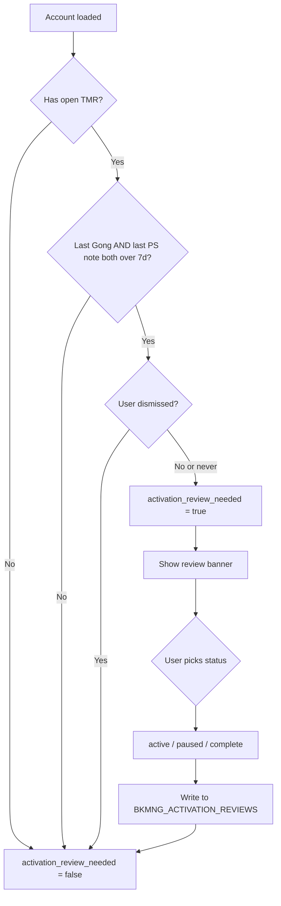

# Plan: TMR Scoping + Activation Review

## Feature 1: TMR Scoping

### Current Behavior (incorrect)
[`backend/app/routers/tmr.py`](backend/app/routers/tmr.py) `_ace_filter` returns the user's email for ACE, `None` for ACEM. `list_tmrs()` then does `AND a.ACE_ASSIGNED = %s` — so an ACE sees all TMRs on their accounts, and ACEM sees all TMRs across all BKMNG accounts.

### Desired Behavior
- **ACEM**: sees all `SPECIALIST_TYPE = 'Account Engineer'` TMRs scoped to their managed ACE team (via `BKMNG_ACEM_TEAM`)
- **ACE**: sees only TMRs where they are the **assigned specialist** (`ASSIGNED_RESOURCE_ID`) or **secondary member** (`SECONDARY_ASSIGNED_TEAM_MEMBER`). Both store Salesforce User IDs — join `FIVETRAN.SALESFORCE.USER` on email to resolve.

### Data confirmed
```
FIELD_SPECIALIST_REQUESTS_DX_ELEMENTUM columns:
  ASSIGNED_RESOURCE_ID            -- SF User ID of assigned AE
  SECONDARY_ASSIGNED_TEAM_MEMBER  -- SF User ID of secondary AE
  CREATED_BY_EMAIL                -- email of requestor
```
Open statuses: `New`, `Pending Manager Review`, `Pending Specialist Manager Review`, `Clarification Needed`

---

### Task 2a — [`backend/app/routers/tmr.py`](backend/app/routers/tmr.py)

Add `_acem_filter`, update both endpoints:

```python
def _acem_filter(user: CurrentUser) -> str | None:
    return user.email if user.role == UserRole.ACEM else None

@router.get("", response_model=list[TMR])
async def list_tmrs(user=..., data=...) -> list[TMR]:
    return data.list_tmrs(_ace_filter(user), _acem_filter(user))
```

### Task 2b — [`backend/app/services/snowflake_service.py`](backend/app/services/snowflake_service.py) `list_tmrs()`

Signature: `list_tmrs(self, ace_filter=None, acem_filter=None)`

```sql
-- ACEM: scope to managed team
AND a.ACE_ASSIGNED IN (
  SELECT ACE_EMAIL FROM BKMNG_ACEM_TEAM WHERE ACEM_EMAIL = %s
)

-- ACE: assigned as specialist or secondary
AND (
  t.ASSIGNED_RESOURCE_ID IN (
    SELECT ID FROM FIVETRAN.SALESFORCE.USER
    WHERE EMAIL = %s AND NOT _FIVETRAN_DELETED
  )
  OR t.SECONDARY_ASSIGNED_TEAM_MEMBER IN (
    SELECT ID FROM FIVETRAN.SALESFORCE.USER
    WHERE EMAIL = %s AND NOT _FIVETRAN_DELETED
  )
)
```

### Task 3 — [`bkmng-next/app/tmrs/page.tsx`](bkmng-next/app/tmrs/page.tsx)

- Remove local `TMR` type, import from `useApi`
- Remove client-side `scopedTmrs` filter
- Update table columns to real fields: `activity_requested`, `engagement_type`, `requestor`, `requested_date`, `status`, `specialist_comments`
- Keep account name link to `/accounts/${tmr.account_id}`

---

## Feature 2: Activation Review Detection

### Logic

```
Account activation_review_needed = true when ALL of:
  1. Has at least 1 open TMR (STATUS != 'Closed')
  2. Last Gong call > 7 days ago (or no call on record)
  3. Last use case LAST_MODIFIED_DATE > 7 days ago
  4. User has not dismissed (no entry in BKMNG_ACTIVATION_REVIEWS)
```



---

### Task 1 — Create Snowflake table

```sql
CREATE TABLE IF NOT EXISTS TEMP.JUSDAVIS.BKMNG_ACTIVATION_REVIEWS (
  ACCOUNT_ID   VARCHAR      NOT NULL,
  USER_EMAIL   VARCHAR      NOT NULL,
  STATUS       VARCHAR      NOT NULL,
  UPDATED_AT   TIMESTAMP_NTZ DEFAULT CURRENT_TIMESTAMP(),
  PRIMARY KEY (ACCOUNT_ID, USER_EMAIL)
);
```

---

### Task 3 — [`backend/app/models/account.py`](backend/app/models/account.py)

```python
activation_review_needed: bool = False
activation_review_status: Optional[str] = None  # 'active' | 'paused' | 'complete' | None
```

---

### Task 3 — [`backend/app/services/snowflake_service.py`](backend/app/services/snowflake_service.py) `list_accounts()`

Add 4 LEFT JOINs and computed column. `list_accounts()` gains a `user_email` param:

```sql
LEFT JOIN (
  SELECT GONG_PRIMARY_ACCOUNT_C as account_id, MAX(GONG_CALL_START_C) as last_call_date
  FROM FIVETRAN.SALESFORCE.GONG_GONG_CALL_C
  WHERE GONG_CALL_START_C >= DATEADD('day', -90, CURRENT_TIMESTAMP())
  GROUP BY 1
) gong ON gong.account_id = a.ACCOUNT_ID

LEFT JOIN (
  SELECT ACCOUNT_ID, MAX(LAST_MODIFIED_DATE) as last_note_date
  FROM TEMP.JUSDAVIS.BKMNG_USE_CASES GROUP BY 1
) uc_act ON uc_act.ACCOUNT_ID = a.ACCOUNT_ID

LEFT JOIN (
  SELECT ACCOUNT_ID, TRUE as has_open_tmr
  FROM SALES.SALES_ENGINEERING.FIELD_SPECIALIST_REQUESTS_DX_ELEMENTUM
  WHERE SPECIALIST_TYPE = 'Account Engineer' AND STATUS != 'Closed'
  QUALIFY ROW_NUMBER() OVER (PARTITION BY ACCOUNT_ID ORDER BY REQUEST_CREATED_DATE DESC) = 1
) tmr_open ON tmr_open.ACCOUNT_ID = a.ACCOUNT_ID

LEFT JOIN TEMP.JUSDAVIS.BKMNG_ACTIVATION_REVIEWS rev
  ON rev.ACCOUNT_ID = a.ACCOUNT_ID AND rev.USER_EMAIL = %s
```

Computed SELECT column:
```sql
CASE
  WHEN tmr_open.has_open_tmr = TRUE
    AND (gong.last_call_date IS NULL OR gong.last_call_date < DATEADD('day', -7, CURRENT_TIMESTAMP()))
    AND (uc_act.last_note_date IS NULL OR uc_act.last_note_date < DATEADD('day', -7, CURRENT_TIMESTAMP()))
    AND rev.STATUS IS NULL
  THEN TRUE ELSE FALSE
END AS ACTIVATION_REVIEW_NEEDED,
rev.STATUS AS ACTIVATION_REVIEW_STATUS
```

---

### Task 4 — New endpoint and hook

**`snowflake_service.py`:**
```python
def set_activation_review(self, account_id: str, user_email: str, status: str) -> None:
    # MERGE INTO BKMNG_ACTIVATION_REVIEWS USING (SELECT %s, %s, %s) AS src
    # ON matched → UPDATE SET STATUS=src.status, UPDATED_AT=CURRENT_TIMESTAMP()
    # NOT MATCHED → INSERT (ACCOUNT_ID, USER_EMAIL, STATUS)
```

**`backend/app/routers/accounts.py`:**
```python
class ActivationReviewRequest(BaseModel):
    status: Literal["active", "paused", "complete"]

@router.put("/{account_id}/activation-review")
async def set_activation_review(account_id, body: ActivationReviewRequest, user=...):
    data.set_activation_review(account_id, user.email, body.status)
    return {"ok": True}
```

**`bkmng-next/hooks/useApi.ts`:**
```typescript
export function useSetActivationReview(accountId: string) {
  const qc = useQueryClient();
  return useMutation({
    mutationFn: (body: { status: string }) =>
      apiFetch(`/accounts/${accountId}/activation-review`, { method: "PUT", body: JSON.stringify(body) }),
    onSuccess: () => { qc.invalidateQueries({ queryKey: ["account", accountId] }); },
  });
}
```

---

### Task 5 — [`bkmng-next/app/accounts/page.tsx`](bkmng-next/app/accounts/page.tsx)

Amber badge on flagged rows:
```tsx
{account.activation_review_needed && (
  <span className="inline-flex items-center gap-1 rounded-full bg-amber-50 border border-amber-200 px-1.5 py-0.5 text-[10px] font-medium text-amber-700">
    Review
  </span>
)}
```

---

### Task 6 — [`bkmng-next/app/accounts/[id]/page.tsx`](bkmng-next/app/accounts/[id]/page.tsx)

Dismissible amber banner below account header:
```tsx
{account.activation_review_needed && (
  <div className="rounded-xl border border-amber-200 bg-amber-50 px-4 py-3 flex items-center justify-between gap-4">
    <div className="flex items-center gap-2 text-sm text-amber-800">
      <AlertTriangle size={15} className="text-amber-500 shrink-0" />
      No call or PS note update in 7+ days. Add a status update or mark this activation.
    </div>
    <div className="flex items-center gap-2 shrink-0">
      {["active", "paused", "complete"].map((s) => (
        <button key={s} onClick={() => setActivationReview.mutate({ status: s })}
          className="text-xs px-2.5 py-1 rounded-lg border border-amber-300 bg-white text-amber-800 hover:bg-amber-100">
          {s.charAt(0).toUpperCase() + s.slice(1)}
        </button>
      ))}
    </div>
  </div>
)}
```

---

## Files Changed Summary

| File | Change |
|---|---|
| `TEMP.JUSDAVIS.BKMNG_ACTIVATION_REVIEWS` | New Snowflake table |
| `backend/app/routers/tmr.py` | Add `_acem_filter`, pass both filters |
| `backend/app/services/snowflake_service.py` | Fix `list_tmrs()` scoping; extend `list_accounts()` with review CTEs; add `set_activation_review()` |
| `backend/app/models/account.py` | Add `activation_review_needed`, `activation_review_status` |
| `backend/app/routers/accounts.py` | Add `PUT /{id}/activation-review` endpoint |
| `bkmng-next/hooks/useApi.ts` | Add `useSetActivationReview` mutation hook |
| `bkmng-next/app/tmrs/page.tsx` | Fix column mapping to real fields, remove client-side scoping |
| `bkmng-next/app/accounts/page.tsx` | Add "Review" badge on flagged accounts |
| `bkmng-next/app/accounts/[id]/page.tsx` | Add dismissible review banner |
