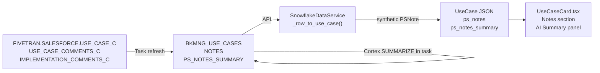

# Plan: Use Case Notes, Summary & Lead SE Filtering

## Context

### Data situation
- **Lead SE filter**: today `list_use_cases_for_account` filters by `ACE_ASSIGNED = user.email` only. Justin has 7 use cases as Lead SE that are hidden. Widening to `(LEAD_SE = email OR ACE_ASSIGNED = email)` adds those.
- **NOTES is all null**: The snapshot table column `NOTES` is NULL for all 1,320 rows despite 691 / 1,320 source use cases having `USE_CASE_COMMENTS_C` data in `FIVETRAN.SALESFORCE.USE_CASE_C`. The task SQL has a bug (likely positional mismatch in the INSERT/SELECT).
- **`ps_notes_summary` column doesn't exist**: `BKMNG_USE_CASES` has no summary column yet.
- **`UseCaseCard.tsx` is already built**: it renders `ps_notes[]` as individual note entries and `ps_notes_summary` in an AI summary panel — both are just empty/null today.

---

## Architecture



---

## Task 1 — Fix use case filter: Lead SE OR ACE

**File**: [`backend/app/services/snowflake_service.py`](backend/app/services/snowflake_service.py)

Change both `list_all_use_cases` and `list_use_cases_for_account`. When `ace_filter` is set, match either column:

```python
# list_all_use_cases
WHERE (ACE_ASSIGNED = %s OR LEAD_SE = %s)
# params: (ace_filter, ace_filter)

# list_use_cases_for_account
WHERE ACCOUNT_ID = %s AND (ACE_ASSIGNED = %s OR LEAD_SE = %s)
# params: (account_id, ace_filter, ace_filter)
```

---

## Task 2 — Fix NOTES population in Snowflake task

The bug is in `TASK_REFRESH_BKMNG_USE_CASES`. The INSERT column list and SELECT positional values are misaligned for the NOTES column. Fix by recreating the task with explicit column names in the SELECT (no positional ambiguity) and verifying the NOTES expression:

```sql
NULLIF(TRIM(CONCAT_WS(' | ',
    NULLIF(TRIM(uc.USE_CASE_COMMENTS_C), ''),
    NULLIF(TRIM(uc.IMPLEMENTATION_COMMENTS_C), '')
)), '')  AS NOTES
```

(Drop `SPECIALIST_COMMENTS_C` — it may not exist or be blank; the query above confirmed only the first two fields have data.)

Verify by running a direct SELECT against the task logic on a sample of IDs before committing.

---

## Task 3 — Add PS_NOTES_SUMMARY column + Cortex summarize

**Snowflake DDL**:
```sql
ALTER TABLE TEMP.JUSDAVIS.BKMNG_USE_CASES
    ADD COLUMN PS_NOTES_SUMMARY VARCHAR(4000);
```

In the task INSERT, add a Cortex-powered summary alongside NOTES:

```sql
IFF(
    NULLIF(TRIM(CONCAT_WS(' | ',
        NULLIF(TRIM(uc.USE_CASE_COMMENTS_C), ''),
        NULLIF(TRIM(uc.IMPLEMENTATION_COMMENTS_C), '')
    )), '') IS NOT NULL,
    SNOWFLAKE.CORTEX.SUMMARIZE(
        NULLIF(TRIM(CONCAT_WS(' | ',
            NULLIF(TRIM(uc.USE_CASE_COMMENTS_C), ''),
            NULLIF(TRIM(uc.IMPLEMENTATION_COMMENTS_C), '')
        )), '')
    ),
    NULL
)  AS PS_NOTES_SUMMARY
```

This pre-computes the summary at refresh time (every 4h) so the API adds zero latency.

---

## Task 4 — Wire notes → PSNote and summary in backend

**File**: [`backend/app/services/snowflake_service.py`](backend/app/services/snowflake_service.py)

In `_row_to_use_case`, populate `ps_notes` from the `NOTES` field and add `ps_notes_summary`:

```python
def _row_to_use_case(r: dict) -> UseCase:
    notes_text = r.get("NOTES")
    ps_notes = []
    if notes_text:
        ps_notes = [PSNote(
            note_id=r["USE_CASE_ID"] + "_note",
            use_case_id=r["USE_CASE_ID"],
            author="SE Team",
            content=notes_text,
            created_at=_dt(r.get("LAST_MODIFIED_DATE")) or datetime.utcnow(),
        )]
    return UseCase(
        ...
        ps_notes=ps_notes,
        ps_notes_summary=r.get("PS_NOTES_SUMMARY"),
        ...
    )
```

---

## Task 5 — Add missing fields to frontend UseCase type

**File**: [`frontend/src/types/index.ts`](frontend/src/types/index.ts)

The `UseCase` interface is missing MEDDPICC fields (present in the API response but silently dropped by TS). Add them so they're available for future rendering:

```typescript
export interface UseCase {
  // ... existing fields ...
  notes: string | null
  meddpicc_metrics: string | null
  meddpicc_economic_buyer: string | null
  meddpicc_decision_criteria: string | null
  meddpicc_decision_process: string | null
  meddpicc_identify_pain: string | null
  meddpicc_champion: string | null
  meddpicc_competitors: string | null
  // scores
  meddpicc_overall_score: number | null
  // ... other scores
}
```

No changes to `UseCaseCard.tsx` are needed — it already renders `ps_notes` and `ps_notes_summary` correctly.
