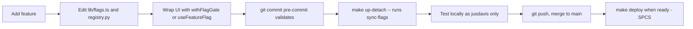
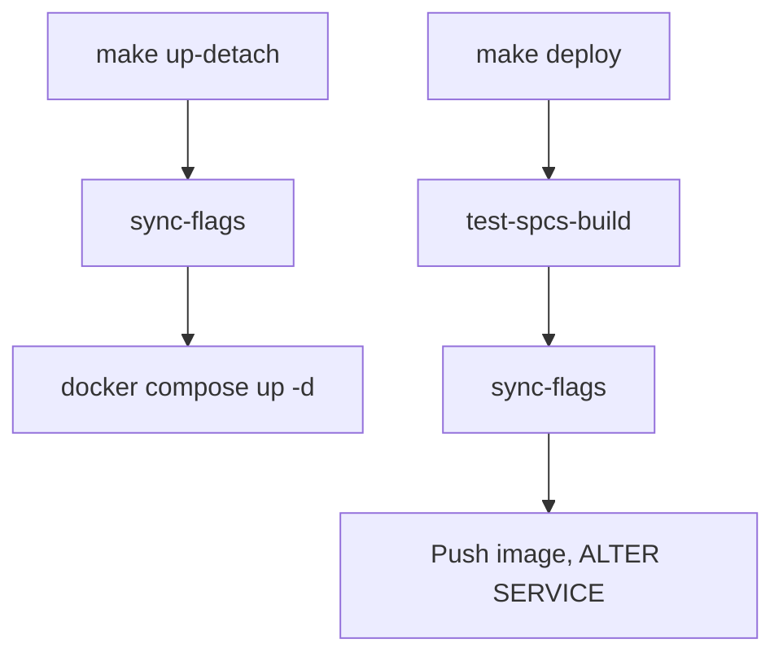

# Feature Flags

Feature flags are a **permanent part of the BookManager deployment pipeline**. Every new UI feature gets a flag, defaulting OFF for all users except `jusdavis` (primary dev). Pre-commit blocks commits that don't follow the rules.

Source of truth (code, in git):
- `bkmng-next/lib/flags.ts` — TypeScript registry, used by frontend
- `backend/app/feature_flags/registry.py` — Python registry, used by sync script

Runtime tables (in Snowflake):
- `TEMP.JUSDAVIS.BKMNG_FEATURE_FLAGS` — flag definitions (default_enabled)
- `TEMP.JUSDAVIS.BKMNG_FEATURE_FLAG_OVERRIDES` — per-user / per-role overrides

## Resolution Order
1. User-specific override (`target_type='user'`, `target_value=<user_id>`)
2. Role override (`target_type='role'`, `target_value='ace' | 'acem'`)
3. `default_enabled` from `BKMNG_FEATURE_FLAGS`

## Standard Workflow



### 1. Add a new feature

**Add registry entries (BOTH files, identical content):**

`bkmng-next/lib/flags.ts`:
```ts
my_new_panel: {
  description: "Short, plain-language description",
  category: "experimental",      // experimental | beta | admin | core
  default_enabled: false,        // REQUIRED: false for new flags
  enable_for_users: ["jusdavis"], // REQUIRED: must include jusdavis
},
```

`backend/app/feature_flags/registry.py`:
```python
"my_new_panel": {
  "description": "Short, plain-language description",
  "category": "experimental",
  "default_enabled": False,
  "enable_for_users": JUSDAVIS,
},
```

**Wrap your UI:**

For a whole page or component:
```tsx
import { withFlagGate } from "@/components/ui/flag-gate";

function MyPanel() { ... }
export default withFlagGate(MyPanel, "my_new_panel");
```

For a slice of JSX inside a larger component:
```tsx
import { FlagGate } from "@/components/ui/flag-gate";

<FlagGate flag="my_new_panel">
  <NewExperimentalSection />
</FlagGate>
```

For conditional logic (no early return):
```tsx
import { useFeatureFlag } from "@/context/FeatureFlagContext";
const enabled = useFeatureFlag("my_new_panel");
{enabled && <SomeExtra />}
```

### 2. Sync to Snowflake

```bash
make sync-flags                # explicit
make up-detach                 # auto-runs sync-flags as a step
```

### 3. Test locally

The flag is enabled only for `jusdavis`. Use the user switcher in the sidebar to confirm:
- jusdavis: feature visible
- any other user (e.g. aflors): feature hidden via `<FeatureDisabled/>`

### 4. Roll out

When ready for broader testing, use **Settings > Labs** (admin only) to add overrides, OR edit the registry and re-sync:

```ts
// Enable for all ACEs:
my_new_panel: {
  // ...
  enable_for_users: ["jusdavis"],
  enable_for_roles: ["ace"],   // additional override
}

// Or full rollout:
my_new_panel: {
  // ...
  default_enabled: true,
  // can keep or remove enable_for_users
}
```

Then `make sync-flags` (or `make up-detach` / `make deploy`).

### 5. Graduation

Once a feature is stable for ~30 days and fully rolled out:
1. Remove the entry from both registries
2. Remove the `useFeatureFlag` / `withFlagGate` calls
3. Commit (validator allows removal)
4. The orphaned row in Snowflake is reported as a warning by `sync-flags` but not deleted (manual cleanup once all envs are migrated)

## Pre-commit Enforcement (HARD)

`scripts/validate_flags.py` runs on every commit. It will BLOCK if:

- **Check A:** Any `useFeatureFlag('xxx')` references a key not in the TS registry, OR the TS registry and Python registry disagree.
- **Check B:** A newly-added file under `bkmng-next/app/**/page.tsx` or `bkmng-next/components/**/*.tsx` (excluding `components/ui/`) has no `useFeatureFlag(...)` call. Bypass with `// @flag-exempt: <reason>` near the top of the file (use sparingly — types/utilities only).
- **Check C:** A newly-added flag entry in `lib/flags.ts` has `default_enabled: true` OR doesn't include `"jusdavis"` in `enable_for_users`.

**To bypass enforcement temporarily**: don't. If the validator is wrong, fix the validator. `git commit --no-verify` is forbidden by AGENTS.md.

## Pipeline Integration

`make up-detach` and `make deploy` both run `make sync-flags` as a prerequisite. Sync is idempotent and best-effort (warns + exits 0 if Snowflake creds are unavailable).



## Current Inventory

See `bkmng-next/lib/flags.ts` for the canonical list. Categories:

- **experimental** — off by default, jusdavis-only. New / risky work.
- **beta** — on by default everywhere. Stable but recently shipped.
- **admin** — admin-only routes/panels.
- **core** — retroactive coverage of pages and major panels. Default on for everyone, jusdavis override exists for symmetry. Disabling these renders a `<FeatureDisabled/>` placeholder.

## Operational Notes

- Frontend cache: 60s `staleTime` in TanStack Query. Override changes propagate to a user within 60s OR on next page load.
- Connection: `SNOWHOUSE_AWS_US_WEST_2` (DB=`TEMP`, schema=`JUSDAVIS`).
- Warehouse: `SE_XS_WH` for the MERGEs (sync script uses default connection warehouse).
- Two registries (TS + Python) must stay in sync. The validator's check A enforces this on every commit.
- Panel-level flags (e.g. `panel_notes_timeline`) are registered but components are NOT yet HOC-wrapped — refactoring named exports to use `withFlagGate` is invasive due to React's rules-of-hooks. Wrap individual panels on demand using `withFlagGate` at the export site when behavior change is desired.

## Targeting Examples (raw SQL — usually use the Labs UI instead)

```sql
-- Enable timeline_v2 only for jusdavis
INSERT INTO TEMP.JUSDAVIS.BKMNG_FEATURE_FLAG_OVERRIDES VALUES
  ('timeline_v2', 'user', 'jusdavis', TRUE, CURRENT_TIMESTAMP());

-- Enable for all ACEMs
INSERT INTO TEMP.JUSDAVIS.BKMNG_FEATURE_FLAG_OVERRIDES VALUES
  ('meeting_prep_v2', 'role', 'acem', TRUE, CURRENT_TIMESTAMP());

-- Roll out globally
UPDATE TEMP.JUSDAVIS.BKMNG_FEATURE_FLAGS
   SET default_enabled = TRUE, updated_at = CURRENT_TIMESTAMP()
   WHERE flag_key = 'timeline_v2';
```
