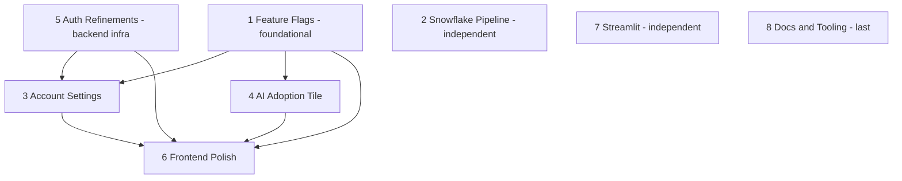

# Plan 2: Repo Cleanup

> **Status:** Pending execution
> **Risk:** HIGH (touches working code)
> **Prerequisite:** Plan 1 complete (CI exists, branch protection on)
> **Estimated time:** 4-8 hours spread over multiple sessions
> **Reversible?** Yes — `wip-snapshot-2026-05-12` branch is the rollback point

---

## Goal

Untangle the ~2,000 lines of uncommitted work currently piled on `main` and convert them into ~8 clean, reviewable, mergeable Pull Requests. Each PR is focused on one logical feature, validated by CI, smoke-tested locally, and merged sequentially.

---

## The Problem We're Solving

Right now, `main` is in this state:

```
main (working tree)
  +-- 32 modified files (mixed: backend, frontend, Snowflake DDL, Makefile, AGENTS.md)
  +-- 15 untracked items (whole new modules, docs, scripts, Streamlit code)
  +-- ~2,013 insertions / 336 deletions in tracked files
  +-- ~1,869 lines of brand-new untracked code
```

This is the "single-developer, no-process" anti-pattern. It violates:

- **Karpathy Principle 3 (Surgical Changes)** — changes are not traceable to specific user requests
- **AI-Dev Pattern 10 (PR-Based Review)** — there is no review surface
- **AI-Dev Pattern 4 (Feedback Loops)** — nothing has been validated against CI

We fix it by triaging the pile into 8 focused PRs.

---

## The Eight Buckets

Looking at the file list, the changes cluster naturally into eight feature groups:

| # | Bucket | Files | Why separate |
|---|--------|-------|--------------|
| 1 | **Feature Flags System** | `backend/app/feature_flags/`, `backend/app/routers/feature_flags.py`, `bkmng-next/lib/flags.ts`, `bkmng-next/context/FeatureFlagContext.tsx`, `bkmng-next/components/ui/flag-gate.tsx`, `bkmng-next/components/ui/feature-disabled.tsx`, `.pre-commit-config.yaml`, `scripts/sync_feature_flags.py`, `scripts/validate_flags.py` | Self-contained system; large surface area |
| 2 | **Snowflake Pipeline Refactor** | `snowflake/procedures/sp_bkmng_pipeline_health_check.sql`, `snowflake/procedures/sp_compute_account_briefings.sql`, `snowflake/procedures/sp_manual_refresh_for_account.sql`, `snowflake/procedures/sp_refresh_bkmng_ont_accounts.sql`, `snowflake/procedures/sp_bkmng_pipeline_inventory.sql`, `snowflake/tasks/task_refresh_bkmng_accounts.sql`, `snowflake/PIPELINE.md` | DDL changes warrant focused review |
| 3 | **Account Settings + Use Case Updates** | `snowflake/tables/bkmng_account_settings.sql`, `snowflake/tables/bkmng_use_case_updates.sql`, `bkmng-next/components/account-detail/UseCaseUpdatesPanel.tsx` | New feature surface |
| 4 | **AI Adoption Tile** | `bkmng-next/components/account-detail/health/AIAdoptionTile.tsx` | Single new widget |
| 5 | **Auth/Backend Refinements** | `backend/app/auth/dependencies.py`, `backend/app/main.py`, `backend/app/models/account.py`, `backend/app/routers/auth.py`, `backend/app/routers/user.py`, `backend/app/routers/accounts.py`, `backend/app/services/snowflake_service.py` | Backend infra changes |
| 6 | **Frontend UI Polish** | All `bkmng-next/app/**/page.tsx` modifications, `Sidebar.tsx`, `Providers.tsx`, `useApi.ts`, `bkmng-next/components/dashboard/ACEDashboard.tsx` | UI tweaks across many pages |
| 7 | **Streamlit Apps** | `snowflake/streamlit/` | New surface area, independent |
| 8 | **Docs + Tooling** | `AGENTS.md`, `Makefile`, `BookManager-SPCS.command`, `docs/` (untracked), the new `docs/workflow/` (this folder!) | Repo hygiene |

**Important:** before starting, regenerate this table from current state. Files may have shifted since this plan was authored. Use `git status --short` and bucket each line.

---

## PR Sequencing

Buckets are not independent. Some need to land first because others depend on them. Recommended order:



Suggested merge order:

1. Bucket 1 (Feature Flags) — many things will reference it
2. Bucket 5 (Auth/Backend) — backend foundations
3. Bucket 2 (Snowflake Pipeline) — independent, can go any time
4. Bucket 3 (Account Settings + Use Case Updates) — depends on 1, 5
5. Bucket 4 (AI Adoption Tile) — independent UI
6. Bucket 7 (Streamlit) — independent
7. Bucket 6 (Frontend UI Polish) — last because it touches many pages and risks conflicts with 3 and 4
8. Bucket 8 (Docs + Tooling) — wraps up

Do them sequentially. Don't open multiple PRs at once until you're comfortable.

---

## The Per-Bucket Recipe

For each bucket, follow this exact sequence. The recipe is intentionally repetitive — that's the point of a workflow.

### Step A: Sync main

```bash
cd ~/projects/BookManager
git checkout main
git pull origin main
```

### Step B: Create the feature branch

Pick a name from the bucket table. Format: `feat/<short-name>` or `chore/<short-name>` or `fix/<short-name>`.

```bash
git checkout -b feat/feature-flags-system   # example for Bucket 1
```

You're now on a fresh branch. The working tree may or may not still have WIP from previous buckets — depends on where you are in the process.

### Step C: Reset the working tree to match main

This is critical. Each bucket starts from a clean slate, and we cherry-pick ONLY the files for THIS bucket from the snapshot branch.

```bash
# Stash anything currently in the tree (will retrieve via snapshot)
git stash push -u -m "wip-during-cleanup"
git stash drop  # discard - we have wip-snapshot-2026-05-12 as backup
```

Now `git status` is clean.

### Step D: Pull this bucket's files from the snapshot

```bash
# For Bucket 1 (Feature Flags), pull these specific paths
git checkout wip-snapshot-2026-05-12 -- \
  backend/app/feature_flags/ \
  backend/app/routers/feature_flags.py \
  bkmng-next/lib/flags.ts \
  bkmng-next/context/FeatureFlagContext.tsx \
  bkmng-next/components/ui/flag-gate.tsx \
  bkmng-next/components/ui/feature-disabled.tsx \
  .pre-commit-config.yaml \
  scripts/sync_feature_flags.py \
  scripts/validate_flags.py
```

`git checkout <branch> -- <paths>` is the safest verb. It says "give me exactly these files from that branch, leave everything else alone."

### Step E: Inspect what came over

```bash
git status   # should show staged additions for the files above
git diff --cached | wc -l   # diff size sanity check
```

If unexpected files appeared, something went wrong — reset and try again.

### Step F: Smoke test locally

Per your "smoke test only" preference. The smoke test for each bucket:

| Bucket | Smoke test |
|--------|------------|
| 1 Feature Flags | `make up-detach`, log in, hit `/settings/labs`, see flags list |
| 2 Snowflake Pipeline | `snow sql -f snowflake/procedures/sp_*.sql -c JDAVIS_AWS1` compiles; do NOT run the SP yet |
| 3 Account Settings | `make up-detach`, navigate to an account, see settings panel |
| 4 AI Adoption Tile | `make up-detach`, navigate to account health, tile renders |
| 5 Auth Refinements | `make up-detach`, log in as different mock users, switch profiles |
| 6 Frontend UI Polish | `make up-detach`, click through every modified page, no console errors |
| 7 Streamlit | `streamlit run snowflake/streamlit/<file>.py`, app loads |
| 8 Docs + Tooling | `make up-detach` succeeds (Makefile changes work); `cat AGENTS.md` looks right |

If the smoke test fails, DO NOT commit. Investigate. Either:

- The bucket's files have a bug (fix on this branch)
- The bucket depends on another bucket not yet merged (reorder; come back to this one later)
- Something else surprising — surface it before proceeding

### Step G: Commit and push

```bash
git status   # confirm only this bucket's files are staged
git commit -m "feat: add feature flag system

- Backend registry, router, and validator
- Frontend FeatureFlagContext + FlagGate HOC
- Pre-commit hook validates new flags
- Sync script seeds Snowflake tables

See docs/FEATURE_FLAGS.md for usage."

git push -u origin feat/feature-flags-system
```

Commit message rules (Karpathy Principle 3 in action):
- Imperative mood, present tense
- Subject line under 72 chars, no period
- Blank line after subject
- Body explains "why" — what changed should be obvious from the diff

### Step H: Open the PR

```bash
gh pr create \
  --base main \
  --head feat/feature-flags-system \
  --title "feat: add feature flag system" \
  --body "## Description
Adds end-to-end feature flag system: backend registry, frontend HOC, sync script, pre-commit validation.

## Smoke Test Checklist
- [x] make up-detach succeeds
- [x] App loads at localhost:3001
- [x] /settings/labs renders flag list
- [x] No console errors

## Other
- [x] No secrets, tokens, or PATs committed
- [x] Linked plan: docs/workflow/plan-2-repo-cleanup.md (Bucket 1 of 8)

## Notes for Reviewer
First of 8 cleanup PRs. Foundational - other buckets reference this."
```

### Step I: Wait for CI, address failures, merge

```bash
gh pr checks --watch
```

If CI fails, READ the failure carefully. Common issues:
- Backend ruff violation → fix on the branch, push again
- Frontend tsc error → fix on the branch, push again
- Frontend build OOM → likely environment issue, retry once

When green:

```bash
gh pr merge --squash --delete-branch
git checkout main
git pull
```

### Step J: Update progress

Update the bucket status table at the top of this plan (or in a tracking issue) before starting the next bucket.

---

## Tracking Progress

Maintain a status table somewhere visible (this file's top, a GitHub issue, or a project board):

| Bucket | Branch | PR | Status |
|--------|--------|-----|--------|
| 1 Feature Flags | feat/feature-flags-system | #? | Not started |
| 2 Snowflake Pipeline | chore/snowflake-pipeline-refactor | #? | Not started |
| 3 Account Settings | feat/account-settings-uc-updates | #? | Not started |
| 4 AI Adoption Tile | feat/ai-adoption-tile | #? | Not started |
| 5 Auth Refinements | refactor/auth-backend | #? | Not started |
| 6 Frontend UI Polish | refactor/frontend-ui-polish | #? | Not started |
| 7 Streamlit | feat/streamlit-apps | #? | Not started |
| 8 Docs + Tooling | docs/repo-hygiene | #? | Not started |

---

## What If a Bucket Is Bigger Than I Thought?

Common case: you start Bucket 5 (Auth Refinements) and discover it touches 1,200 lines across 7 files. That's too big for one PR.

Split it. Two patterns:

**Pattern X — Split by file:**
- PR 5a: `dependencies.py` + `auth.py` + `user.py` (auth flow)
- PR 5b: `accounts.py` + `snowflake_service.py` (account data flow)
- PR 5c: `models/account.py` + `main.py` (model + wiring)

**Pattern Y — Split by feature:**
- PR 5a: just the type-safety improvements
- PR 5b: just the new endpoints
- PR 5c: just the bug fixes

The principle (Karpathy 3): every PR should answer "what did this change?" in one sentence.

---

## What If Two Buckets Conflict?

Example: Bucket 6 (Frontend UI Polish) modifies `app/accounts/[id]/page.tsx`. Bucket 4 (AI Adoption Tile) was supposed to be a clean addition, but its file was added INTO that same page.

Solution:
1. Merge Bucket 4 first
2. When you start Bucket 6, sync main → conflicts surface
3. Resolve by hand: keep both the AI Adoption Tile (already on main) and the polish changes
4. Commit the resolution, push, CI revalidates

This is normal. Not a sign anything went wrong.

---

## Rollback Procedure

If a merged PR causes problems in production / staging:

```bash
# Find the merge commit
git log main --oneline | head -10

# Revert it (creates a new commit that undoes the changes)
git checkout main
git pull
git checkout -b revert/feature-flags-system
git revert -m 1 <merge-commit-sha>
git push -u origin revert/feature-flags-system
gh pr create --title "revert: feature flag system" --body "Reverts #<PR-number> due to <reason>."
```

NEVER force-push to main. Always revert via a new commit through a PR.

---

## Definition of Done for Plan 2

- [ ] All 8 buckets have been triaged into PRs
- [ ] All PRs have been merged into main
- [ ] `git diff main wip-snapshot-2026-05-12` shows no unaccounted-for differences in source files (other than transient script-generated artifacts)
- [ ] `git status` on main is CLEAN — no modified files, no untracked files (except things that should be gitignored)
- [ ] Each PR's CI ran green
- [ ] Each PR's smoke test was performed and noted in the PR body
- [ ] `wip-snapshot-2026-05-12` branch can now be deleted (or kept as historical reference)

---

## Hand-off to Plan 3

After Plan 2, the repo is in a healthy state for the first time. Plan 3 codifies the daily working cadence so it stays that way.
