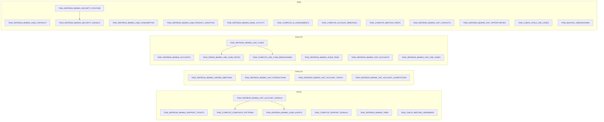

# BookManager Data Pipeline

Single source of truth for the BKMNG data refresh pipeline. Live state is queryable via two procedures:

```sql
CALL TEMP.JUSDAVIS.SP_BKMNG_PIPELINE_HEALTH_CHECK();   -- per-table freshness
CALL TEMP.JUSDAVIS.SP_BKMNG_PIPELINE_INVENTORY();      -- per-task DAG snapshot
```

Or run `make pipeline-status` for both.

## Live monitoring dashboard

A Streamlit-in-Snowflake app provides interactive monitoring with 5 tabs (Health, Freshness SLA, Task DAG, Cost/Credits, Run History):

- **Object**: `TEMP.JUSDAVIS.BKMNG_PIPELINE_MONITOR`
- **Open in Snowsight**: Projects → Streamlit → BKMNG_PIPELINE_MONITOR (account: `sfcogsops-snowhouse-aws-us-west-2`)
- **Source**: `snowflake/streamlit/pipeline_monitor/` (deploy via `make deploy-pipeline-monitor`)
- **Warehouse**: `SE_XS_WH`. Cache TTL: 5 min. ACCOUNT_USAGE views (cost tab) have ~45m–3h latency.

## Conventions

- **Schema**: `TEMP.JUSDAVIS` (writable). All tasks owned by role `SALES_ENGINEER`, executed on warehouse `SE_XS_WH`.
- **SP delimiter**: all SPs use `$$ ... $$`. Older `AS '...'` form is no longer reliable (Snowflake SQL Scripting now strictly requires `:var` bind syntax inside DML/SELECT).
- **CORTEX.COMPLETE**: string format only on this account (no messages array).
- **`SALES.RAVEN.*` access**: SPs that read RAVEN views must use `EXECUTE AS CALLER`.
- **Positional INSERTs**: when adding a column to a source table, recreate any downstream table that uses `INSERT INTO ... SELECT *` to keep column order. `ALTER TABLE ADD COLUMN` appends at the end and breaks positional inserts.
- **Health check SLA**: `STATUS=PASS` if `AGE_HOURS <= MAX_AGE_HOURS`, `WARN` if 1×–2×, `FAIL` if `>2×` or `ROW_COUNT=0`.

## Task DAG



## Task Inventory

| Task | Schedule (UTC) | Body | Predecessor | Target table | SLA (h) |
|---|---|---|---|---|---|
| TASK_REFRESH_BKMNG_ACCOUNTS | `0 */4 * * *` | inline | — | BKMNG_ACCOUNTS | 8 |
| TASK_REFRESH_BKMNG_ACEM_TEAM | `2 */4 * * *` | inline | — | BKMNG_ACEM_TEAM | 8 |
| TASK_REFRESH_BKMNG_USE_CASES | `5 */4 * * *` | inline | — | BKMNG_USE_CASES | 8 |
| TASK_PARSE_BKMNG_USE_CASE_NOTES | predecessor | SP_PARSE_BKMNG_USE_CASE_NOTES | TASK_REFRESH_BKMNG_USE_CASES | BKMNG_USE_CASE_NOTES | 8 |
| TASK_COMPUTE_USE_CASE_BREAKDOWNS | predecessor | SP_COMPUTE_USE_CASE_BREAKDOWNS(TRUE) | TASK_REFRESH_BKMNG_USE_CASES | BKMNG_USE_CASE_BREAKDOWNS | 8 |
| TASK_BACKFILL_BREAKDOWNS | `1440 MINUTE` | SP_COMPUTE_USE_CASE_BREAKDOWNS(FALSE) | — | (idempotent backfill) | n/a |
| TASK_REFRESH_BKMNG_UNIFIED_MEETINGS | `0 */2 * * *` | SP_REFRESH_BKMNG_UNIFIED_MEETINGS | — | BKMNG_UNIFIED_MEETINGS | 4 |
| TASK_REFRESH_BKMNG_TMRS | `30 * * * *` | inline | — | BKMNG_TMRS | 2 |
| TASK_REFRESH_BKMNG_SUPPORT_TICKETS | `45 * * * *` | SP_REFRESH_BKMNG_SUPPORT_TICKETS | — | BKMNG_SUPPORT_TICKETS | 2 |
| TASK_COMPUTE_SUPPORT_SIGNALS | `50 * * * *` | SP_COMPUTE_SUPPORT_SIGNALS | — | (signals into ONT_ACCOUNT_SIGNALS) | 2 |
| TASK_REFRESH_BKMNG_A360_CONTRACT | `0 4 * * *` | SP_REFRESH_BKMNG_A360_CONTRACT | — | BKMNG_A360_CONTRACT | 26 |
| TASK_REFRESH_BKMNG_A360_CONSUMPTION | `15 4 * * *` | SP_REFRESH_BKMNG_A360_CONSUMPTION | — | BKMNG_A360_CONSUMPTION | 26 |
| TASK_REFRESH_BKMNG_A360_PRODUCT_ADOPTION | `30 4 * * *` | SP_REFRESH_BKMNG_A360_PRODUCT_ADOPTION | — | BKMNG_A360_PRODUCT_ADOPTION | 26 |
| TASK_REFRESH_BKMNG_EMAIL_ACTIVITY | `0 2 * * *` | SP_REFRESH_BKMNG_EMAIL_ACTIVITY | — | BKMNG_EMAIL_ACTIVITY | 26 |
| TASK_REFRESH_BKMNG_ONT_INTERACTIONS | `15 */2 * * *` | SP_REFRESH_BKMNG_ONT_INTERACTIONS | — | BKMNG_ONT_INTERACTIONS | 4 |
| TASK_REFRESH_BKMNG_ONT_ACCOUNT_TOPICS | `20 */2 * * *` | SP_REFRESH_BKMNG_ONT_ACCOUNT_TOPICS | — | BKMNG_ONT_ACCOUNT_TOPICS | 4 |
| TASK_REFRESH_BKMNG_ONT_ACCOUNT_COMPETITORS | `20 */2 * * *` | SP_REFRESH_BKMNG_ONT_ACCOUNT_COMPETITORS | — | BKMNG_ONT_ACCOUNT_COMPETITORS | 4 |
| TASK_REFRESH_BKMNG_ONT_ACCOUNTS | `25 */4 * * *` | SP_REFRESH_BKMNG_ONT_ACCOUNTS | — | BKMNG_ONT_ACCOUNTS | 8 |
| TASK_REFRESH_BKMNG_ONT_USE_CASES | `30 */4 * * *` | SP_REFRESH_BKMNG_ONT_USE_CASES | — | BKMNG_ONT_USE_CASES | 8 |
| TASK_REFRESH_BKMNG_ONT_CONTACTS | `30 1 * * *` | SP_REFRESH_BKMNG_ONT_CONTACTS | — | BKMNG_ONT_CONTACTS | 26 |
| TASK_REFRESH_BKMNG_ONT_OPPORTUNITIES | `45 1 * * *` | SP_REFRESH_BKMNG_ONT_OPPORTUNITIES | — | BKMNG_ONT_OPPORTUNITIES | 26 |
| TASK_REFRESH_BKMNG_ONT_ACCOUNT_SIGNALS | `0 * * * *` | SP_REFRESH_BKMNG_ONT_ACCOUNT_SIGNALS | — | BKMNG_ONT_ACCOUNT_SIGNALS | 2 |
| TASK_COMPUTE_COMPOSITE_PATTERNS | predecessor | SP_COMPUTE_COMPOSITE_PATTERNS | TASK_REFRESH_BKMNG_ONT_ACCOUNT_SIGNALS | BKMNG_COMPOSITE_PATTERNS | 2 |
| TASK_REFRESH_BKMNG_USER_ALERTS | predecessor | SP_REFRESH_BKMNG_USER_ALERTS | TASK_REFRESH_BKMNG_ONT_ACCOUNT_SIGNALS | BKMNG_USER_ALERTS | 2 |
| TASK_COMPUTE_AI_ASSESSMENTS | `0 6 * * *` | SP_COMPUTE_AI_ASSESSMENTS | — | BKMNG_AI_ACCOUNT_ASSESSMENTS, BKMNG_AI_USE_CASE_ASSESSMENTS | 26 |
| TASK_COMPUTE_ACCOUNT_BRIEFINGS | `0 6 * * *` | SP_COMPUTE_ACCOUNT_BRIEFINGS | — | BKMNG_ACCOUNT_BRIEFINGS | 26 |
| TASK_COMPUTE_MEETING_PREPS | `0 7 * * *` | SP_COMPUTE_MEETING_PREPS | — | BKMNG_MEETING_PREPS | n/a (on-demand) |
| TASK_CHECK_MEETING_REMINDERS | `0 * * * *` | SP_CHECK_MEETING_REMINDERS | — | BKMNG_USER_ALERTS | (n/a) |
| TASK_CHECK_STALE_USE_CASES | `0 8 * * *` | SP_CHECK_STALE_USE_CASES | — | BKMNG_USER_ALERTS | (n/a) |
| TASK_REFRESH_BKMNG_SECURITY_POSTURE | `0 5 * * *` | SP_REFRESH_BKMNG_SECURITY_POSTURE | — | BKMNG_SECURITY_POSTURE | n/a |
| TASK_REFRESH_BKMNG_SECURITY_SIGNALS | predecessor | SP_REFRESH_BKMNG_SECURITY_SIGNALS | TASK_REFRESH_BKMNG_SECURITY_POSTURE | (signals) | n/a |

## On-demand tables (NOT task-scheduled)

Populated only when the API/UI calls them. Do not create scheduled tasks for these:

- `BKMNG_ACCOUNT_BRIEFINGS` — actually has scheduled task (above), but the API can also force-refresh
- `BKMNG_MEETING_PREPS` — generated when an SE clicks Meeting Prep
- `BKMNG_USE_CASE_UPDATES` — generated weekly per account on view
- `BKMNG_USER_PREFERENCES`, `BKMNG_USER_ALERT_PREFERENCES`, `BKMNG_USER_ACCOUNT_TRACKING`, `BKMNG_USER_CONTEXT`, `BKMNG_USER_CONTEXT_V2`, `BKMNG_ALERT_MUTES`, `BKMNG_MANUAL_MEETINGS`, `BKMNG_EVAL_FRAMEWORK`, `BKMNG_ACCOUNT_SETTINGS`

## Manual refresh recipes

Always use warehouse `SE_XS_WH`. Examples:

```sql
USE WAREHOUSE SE_XS_WH;
CALL TEMP.JUSDAVIS.SP_REFRESH_BKMNG_A360_CONTRACT();
CALL TEMP.JUSDAVIS.SP_REFRESH_BKMNG_A360_CONSUMPTION();
CALL TEMP.JUSDAVIS.SP_REFRESH_BKMNG_A360_PRODUCT_ADOPTION();
CALL TEMP.JUSDAVIS.SP_REFRESH_BKMNG_EMAIL_ACTIVITY();
CALL TEMP.JUSDAVIS.SP_COMPUTE_ACCOUNT_BRIEFINGS();   -- ~50 CORTEX.COMPLETE calls; ~5-10 min
```

Resume a suspended task (no predecessor chain):

```sql
ALTER TASK TEMP.JUSDAVIS.<TASK_NAME> RESUME;
```

For a predecessor chain: resume children first, briefly suspend root, then resume root. Snowflake requires the root suspended to modify child state.

## Mandatory rules for pipeline changes

1. Run `SP_BKMNG_PIPELINE_HEALTH_CHECK` before AND after any DDL on a `BKMNG_*` table or task. Zero FAIL rows required.
2. Adding a column to a source table → check downstream SPs. If any uses positional INSERT (no explicit column list), recreate the target table to match column order.
3. Suspend ordering: children → root. Resume ordering: children → (briefly suspend root) → root.
4. Ghost-started tasks (`state=started` with zero `TASK_HISTORY` rows) → `SUSPEND` then `RESUME`.
5. Never `CREATE OR REPLACE TASK` on a started task without first suspending it and its children.
6. After any change: re-run health check.

## Known gotchas

- `TASK_HISTORY()` must be called as `TEMP.INFORMATION_SCHEMA.TASK_HISTORY()` (max 7-day lookback).
- Snowflake `CONCAT_WS` returns NULL if any arg is NULL — use `ARRAY_TO_STRING(ARRAY_COMPACT(ARRAY_CONSTRUCT(...)))`.
- `SNOWFLAKE.CORTEX.SUMMARIZE()` can fail on very long text — `SP_REFRESH_BKMNG_USE_CASES` truncates to 8000 chars.
- `LISTAGG(<expr>, <sep>)`: separator must be a string literal, not `CHR(10)` or any function call. Use a literal newline embedded in the SQL string.
- SQL Scripting in 2026: bare local-variable references in DML/SELECT must use `:var_name` (colon prefix). Without colon you get `invalid identifier 'V_X'` at runtime.
- All SPs use `$$ ... $$` delimiter. Older `AS '...'` form requires `''` doubled-escaping and is deprecated in this codebase.

## Deprecated tasks (dropped May 11 2026)

| Task | Why dropped |
|---|---|
| TASK_REFRESH_BKMNG_GONG_CALLS | Replaced by `TASK_REFRESH_BKMNG_UNIFIED_MEETINGS` |
| TASK_REFRESH_BKMNG_MEETING_ACTIVITY | Replaced by `TASK_REFRESH_BKMNG_UNIFIED_MEETINGS` |
